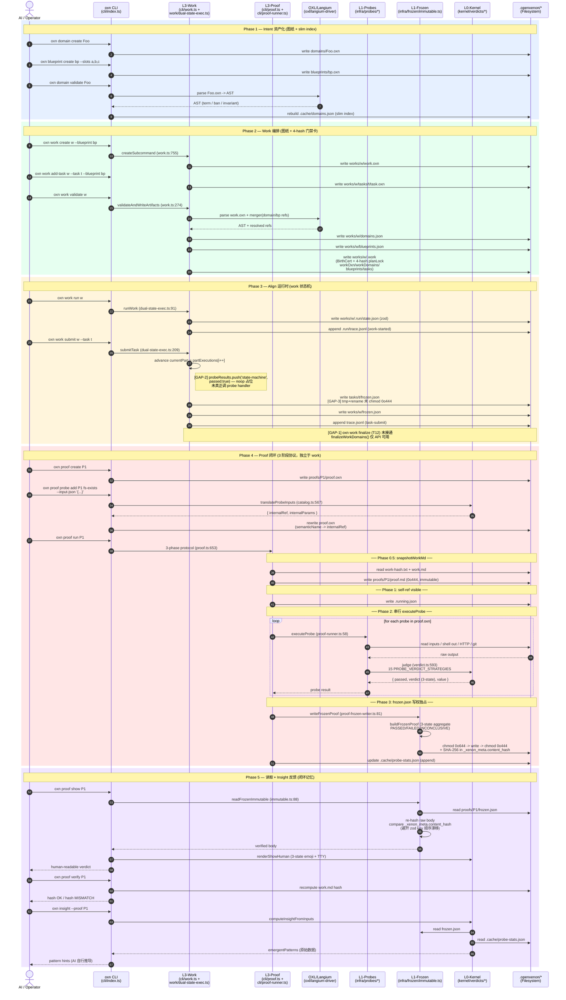

# Design: IAP 端到端时序图

> **设计**：从 Intent 资产化到 Proof 闭环的 5 阶段时序图
> **版本**：v0.2.0（main 分支快照）
> **日期**：2026-06-25
> **类型**：架构时序图（Mermaid）

---

## 1. 背景

本文是 `.openxenon/pools/audit/2026-06-25-iap-paradigm-compliance.md` 的姊妹篇。该审计报告给出"是否符合 IAP 范式"的文字结论；本文给出"如何跑完整个生命周期"的时序图。两者一起回答两个核心问题：

1. **是否真的按 IAP 范式运行？** → 见审计报告
2. **CLI 与内部代码如何跑完从 Intent 到 Proof 的全生命周期？** → 见本文

---

## 2. 端到端时序图

---

## 3. Phase 拆分说明

### Phase 1 — Intent 资产化（蓝）

- **入口**：`src/cli/domain.ts`、`src/cli/blueprint.ts`
- **关键调用**：`create` 子命令 + `validate` 子命令
- **产物**：`.oxn` 文件 + `.cache/domains.json` slim 索引
- **特性**：纯声明、纯解析，无 IO 执行器介入

### Phase 2 — Work 编排（绿）

- **入口**：`src/cli/work.ts`（3173 行单文件巨型命令，8 阶段中央调度器）
- **关键调用**：`createSubcommand` (line 755) / `addTaskSubcommand` (line 1087) / `validateAndWriteArtifacts` (line 274)
- **产物**：`work.oxn` + `task.oxn` + `.work`（BirthCert + 4-hash planLock）
- **关键 schema**：`src/work/birth-cert.ts:73-90` `BirthCertSchema`；`src/work/birth-cert.ts:59-71` `PlanLockSchema`
- **静态门禁**：`workOxnHash` / `workDomainsHash` / `blueprintsHash` / `tasksHash`（+ `allHash` PR-13 必填）

### Phase 3 — Align 运行时（橙）— [WARN]

- **入口**：`src/work/dual-state-exec.ts`（状态机执行器）
- **关键调用**：`runWork` (line 91) / `runTask` (line 130) / `submitTask` (line 209)
- **产物**：`.run/state.json` + `.run/trace.jsonl` + `frozen.json`（任务级 / work 级）
- **结构空缺**：
  - `submitTask` 的 `probeResults` 是 noop 占位（line 225-229）
  - `writeFrozen` 仅 `tmp+rename`，未 chmod 0o444（line 359-369）
  - `oxn work finalize` CLI 是 PoC 桩（`src/cli/work-finalize.ts:18-30`）
  - **状态机按数组下标推进，非 DAG 拓扑**（`L0-Processor/dag.ts` 未消费）

### Phase 4 — Proof 闭环（红）

- **入口**：`src/cli/proof.ts`（1070 行）+ `src/cli/proof-runner.ts`
- **关键调用**：3 阶段协议（`proof.ts:653-801`）
- **产物**：`proof.oxn` + `frozen.json`（0o444 + SHA-256 签名）+ `proof.md`（v0.3+ 模式 0o444）
- **写权独占**：`src/infra/frozen/immutable.ts:40-74` `writeFrozenImmutable`
- **判定三态**：`PASS` / `FAIL` / `INCONCLUSIVE`
- **特性**：独立于 work 模型——可绕过 work 直接跑

### Phase 5 — 读取 + Insight 反馈（紫）

- **入口**：`src/cli/proof.ts` show/verify + `src/cli/insight.ts`
- **关键调用**：`readFrozenImmutable`（immutable.ts:88-127）— 不用 zod result 防 key 顺序漂移
- **产物**：人类可读 verdict + emergent patterns
- **特性**：纯读取 + 派生计算，不写回 frozen

---

## 4. 图中 7 处结构空缺对照

| 标记 | 缺口 | 位置 |
|---|---|---|
| [GAP-1] | `oxn work finalize` 是 PoC 桩 | `src/cli/work-finalize.ts:18-30` |
| [GAP-2] | `submitTask` probeResults 是 noop | `src/work/dual-state-exec.ts:225-229` |
| [GAP-3] | work frozen 未走 immutable | `src/work/dual-state-exec.ts:359-369` |
| [GAP-4] | DAG 未拓扑解析 | `L0-Processor/dag.ts` 未消费 |
| [GAP-5] | daemon ↔ work 失联 | `src/daemon/ipc/handlers/` 旧 task 模型 |
| [GAP-6] | Hall 扫旧布局 | `src/hall/index.ts:60-85` |
| [GAP-7] | `workPrecheck` 未挂 CLI | `src/work/work-precheck.ts:18` 未被 CLI 调用 |

完整分析见同级审计文件。

---

## 5. 关键文件:行号速查

| 角色 | 路径 |
|---|---|
| CLI 主入口 | `src/cli/index.ts:145-178` |
| Work 8 阶段 | `src/cli/work.ts:274-409, 681-1232` |
| Work 状态机 | `src/work/dual-state-exec.ts:91-112, 209-328, 359-369` |
| Work 门禁卡 | `src/work/birth-cert.ts:59-71, 73-90` |
| Proof 3 阶段 | `src/cli/proof.ts:189-236, 653-801` |
| Probe 运行时 | `src/cli/proof-runner.ts:58-115` |
| Probe 翻译 | `src/kernel/verdicts/catalog.ts:567-657` |
| Verdict 策略 | `src/kernel/verdicts/verdict.ts:551-571` |
| Frozen 写权 | `src/infra/frozen/immutable.ts:40-74, 88-127` |
| Frozen 三态 | `src/cli/proof-frozen-writer.ts:45-79` |
| OXL 7 概念 | `src/oxl/langium-driver/oxn.langium:9-16` |
| 错误范式 | `src/kernel/contracts/iap-error.ts:50-64` |
| 4 档出口 | `src/cli/index.ts:71-139` |

---

## 6. 关联引用

- 审计报告：`.openxenon/pools/audit/2026-06-25-iap-paradigm-compliance.md`
- 上一份 v0.2.0 准备度审计：`.openxenon/pools/sprints/v0.3-md-ssot/audit/audit-v0.2.0-md-ssot-readiness.md`
- 路线图执行复盘：`.openxenon/pools/sprints/v0.3-md-ssot/audit/retro-v0.2.0-roadmap-execution.md`
- 总体路线图：根 `AGENTS.md`
- OXL 语法定义：`src/oxl/langium-driver/oxn.langium`
