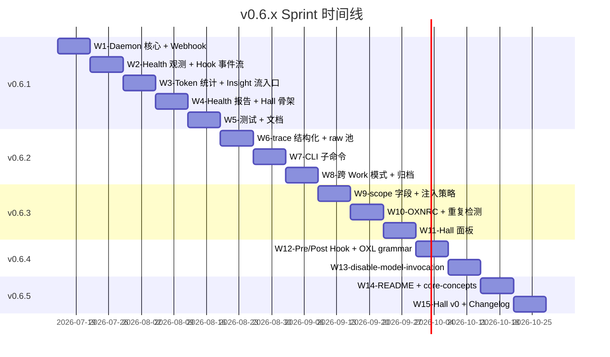

# v0.6.x Sprint 计划【SUPERSEDED 2026-07-10】

> **⚠ SUPERSEDED 状态**：本计划于 2026-07-10 经版本统一规划 RFC 废弃。
> **废弃原因**：版本号需重映射（v0.6.1→v0.6.2 等），时间线后移。
> **替代方案**：[版本统一规划 RFC](./version-unification-rfc.md)

---

# v0.6.x Sprint 计划（原文）（W1-W15）

> **总周期**：15 周（≈ 4 个月，2026-07-15 → 2026-10-22）
> **主分支**：`feat/v0.6.x-observability`（从 `dev` 派生）
> **子分支**：`feat/v0.6.<N>-<slug>` 与本文件 N 一一对应

---

## 1. 时间线



---

## 2. v0.6.1 — 完整 Daemon 雏形 + Hall 骨架

| Week | 任务 | 负责模块 | 验证 |
|---|---|---|---|
| **W1** | Daemon 核心（PID + 重启） | `src/daemon/supervisor.ts` | start/stop/status 三命令工作 |
| W1 | Webhook 通知（Slack/Discord/终端） | `src/daemon/webhook-notifier.ts` | mock 推送 7 类事件成功 |
| W1 | frozen.json 完整性 watch | `src/daemon/file-watcher.ts` | 篡改触发 drift 告警 |
| **W2** | Work 健康观测 | `src/daemon/health-aggregator.ts` | health.json 正确生成 |
| W2 | Hook 事件流（events.jsonl） | `src/daemon/event-recorder.ts` | 至少 1 个 hook 触发可记录 |
| **W3** | Token 消耗统计 | `src/daemon/token-recorder.ts` | tokens.jsonl 正确写入 |
| W3 | Insight 流入口（v0.6.1 部分） | `src/daemon/insight-sink.ts` | Work 完成 → raw 池自动落 |
| **W4** | `oxn daemon health` 命令 | `src/daemon/commands/health.ts` | 输出 7 天摘要 |
| W4 | Hall 骨架（VitePress health.md） | `docs/.vitepress/hall/health.md` | 运行时 fetch 成功 |
| W4 | Hall 骨架（works.md） | `docs/.vitepress/hall/works.md` | 列出所有 work |
| **W5** | 单元测试 34 个 | `src/daemon/__tests__/` | 34 cases pass |
| W5 | E2E 测试 5 个 | `src/daemon/__tests__/daemon-e2e.test.ts` | 5 cases pass |
| W5 | `.changes/0-6-1.md` + AGENTS.md 增章 | `.changes/` | changelog 写好 |
| W5 | 提交 + PR | GitHub | PR #N+1 合并 |

**验收门槛**：1,924 pass / typecheck / lint / build

---

## 3. v0.6.2 — Insight 收集层

| Week | 任务 | 负责模块 | 验证 |
|---|---|---|---|
| **W6** | trace.jsonl 结构化（asset.violation / intent.drift） | `packages/engine/src/Work/trace.ts` | 4 种新事件可记录 |
| W6 | insight-raw 池 + hash 链 | `packages/engine/src/Insight/insight-pool.ts` | 写入 + 校验通过 |
| W6 | Daemon 触发 Insight 提取 | `src/daemon/insight-sink.ts` 扩展 | Work failed 自动落 raw |
| **W7** | `oxn insight list/show` CLI | `packages/cli/src/commands/insight.ts` | 6 个子命令工作 |
| W7 | `oxn insight promote` | 同上 | promote → audit 池 |
| W7 | `oxn insight approve/reject` | 同上 | 强制人工 + 5s 警告 |
| W7 | Asset 草案生成（.oxn.draft） | `packages/cli/src/commands/insight.ts` | approve → draft 文件 |
| **W8** | 跨 Work 模式识别（同 Domain ≥ 3 次） | `packages/engine/src/Insight/cross-work.ts` | 模式正确识别 |
| W8 | 30 天自动归档 | `packages/engine/src/Insight/archiver.ts` | 归档正确 |
| W8 | 6 个错误码扩展 | `packages/cli/src/errors/iap-error.ts` | IAPError 抛出 |
| W8 | 单元 + E2E 28 个 | `__tests__/` | 28 cases pass |
| W8 | `.changes/0-6-2.md` | `.changes/` | changelog 写好 |
| W8 | 提交 + PR | GitHub | PR #N+2 合并 |

**验收门槛**：1,952 pass

---

## 4. v0.6.3 — Asset 分级 + Token 经济学

| Week | 任务 | 负责模块 | 验证 |
|---|---|---|---|
| **W9** | scope schema + OXL grammar | `packages/engine/src/kernel/schemas/asset-scope-schema.ts` + langium | 重新生成通过 |
| W9 | 15 个 builtin probe 模板迁移 scope | `src/oxl/builtin/*.oxn` | 兼容 |
| W9 | inject-strategy.ts | `packages/engine/src/Intent/inject-strategy.ts` | 注入计划正确 |
| W9 | lazy Asset query API | 同上 | LLM 可调用 |
| **W10** | OXNRC context 字段 | `packages/engine/src/kernel/schemas/oxnrc-context-schema.ts` | schema 校验通过 |
| W10 | `oxn config set context.*` | `packages/cli/src/commands/config.ts` | 6 个子命令工作 |
| W10 | `oxn config validate` | 同上 | 预算报告正确 |
| W10 | dup-detector | `packages/engine/src/Asset/dup-detector.ts` | 重复检测准确 |
| W10 | 启动期自动扫描 | `src/cli/init.ts` 扩展 | 警告输出 |
| **W11** | Hall tokens.md 面板 | `docs/.vitepress/hall/tokens.md` | 渲染 tokens.jsonl |
| W11 | Hall duplicates.md 面板 | `docs/.vitepress/hall/duplicates.md` | 渲染重复列表 |
| W11 | 单元 22 个 | `__tests__/` | 22 cases pass |
| W11 | `.changes/0-6-3.md` | `.changes/` | changelog 写好 |
| W11 | 提交 + PR | GitHub | PR #N+3 合并 |

**验收门槛**：1,974 pass

---

## 5. v0.6.4 — Hook 框架深化

| Week | 任务 | 负责模块 | 验证 |
|---|---|---|---|
| **W12** | OXL HookDeclaration grammar | `src/oxl/langium/oxn.langium` | 重新生成通过 |
| W12 | 15 个 builtin probe 模板迁移 hooks 段 | `src/oxl/builtin/*.oxn` | 兼容 |
| W12 | hook-runner.ts | `packages/engine/src/Work/hook-runner.ts` | 4 种类型执行 |
| W12 | Work run/submit/finalize 钩子点 | `packages/cli/src/commands/work.ts` | 3 钩子点触发 |
| **W13** | disable-model-invocation 路径 | 同上 | 跳过 LLM |
| W13 | 4 个错误码扩展 | `packages/cli/src/errors/iap-error.ts` | 抛出 |
| W13 | Hall hooks.md 面板 | `docs/.vitepress/hall/hooks.md` | 渲染 events.jsonl |
| W13 | 单元 16 个 | `__tests__/` | 16 cases pass |
| W13 | `.changes/0-6-4.md` | `.changes/` | changelog 写好 |
| W13 | 提交 + PR | GitHub | PR #N+4 合并 |

**验收门槛**：1,990 pass

---

## 6. v0.6.5 — 文档叙事统一 + Hall 完整化

| Week | 任务 | 负责模块 | 验证 |
|---|---|---|---|
| **W14** | README.md / README.en.md 改写 | `README.md` | 顶部叙事对齐 |
| W14 | core-concepts.md 重构（zh + en） | `docs/zh-cn/core-concepts.md` | What/Why/How 模板 |
| W14 | llm-prompt.md 改写（zh + en） | `docs/zh-cn/llm-prompt.md` | AI 入口清晰 |
| W14 | introduction.md 简化（zh + en） | `docs/zh-cn/introduction.md` | 简短 |
| **W15** | Hall health.md 增强（趋势图） | `docs/.vitepress/hall/health.md` | 实时 fetch + 趋势 |
| W15 | Hall insight.md 新增 | `docs/.vitepress/hall/insight.md` | 列表 + 详情 |
| W15 | Hall hooks.md 新增 | `docs/.vitepress/hall/hooks.md` | 流水 |
| W15 | check-docs-links 脚本 | `scripts/check-docs-links.ts` | 5 cases pass |
| W15 | 5 个 changelog 片段 | `.changes/0-6-{1,2,3,4,5}.md` | 全部写好 |
| W15 | 4 分钟视频脚本 | `scripts/video-script-v0.6.x.md` | 脚本完整 |
| W15 | 提交 + PR | GitHub | PR #N+5 合并 + v0.6.5 release |

**验收门槛**：1,996 pass

---

## 7. 跨 Sprint 依赖

```
v0.6.0 ──┬──> v0.6.1 (Daemon + Hall 骨架) ──┬──> v0.6.2 (Insight 收集)
         │                                  ├──> v0.6.3 (Token 经济学)
         │                                  └──> v0.6.4 (Hook 框架)
         │                                              │
         └──────────────────────────────────────────────┴──> v0.6.5 (叙事统一)
```

**关键路径**：
- v0.6.1 → 所有后续（提供 Daemon + 事件流 + 注入入口）
- v0.6.5 → 收官（依赖 v0.6.2-4 全部完成）

---

## 8. 资源需求

| 资源 | 数量 | 备注 |
|---|---|---|
| 工程师 | 1 全职 | 主开发者（issac） |
| AI Agent | OpenCode/Claude Code | `/oxn-work` Skill 自身使用 |
| 文档 | 4 份主文档（zh + en） | 改写 + 同步 |
| 设计稿 | 6 份 RFC | 已就绪（在 v0.6.x-observability-roadmap/） |
| 测试 | 累计 106 case | 1,890 → 1,996 |

**预算**：无需额外资源（v0.6.0 已就位）

---

## 9. 风险与缓解

| 风险 | 概率 | 影响 | 缓解 |
|---|---|---|---|
| v0.6.1 延期影响后续 | 中 | 高 | v0.6.1 是关键路径，W5 必须收口 |
| OXL grammar 破坏 v0.6 builtin | 低 | 高 | 兼容测试 + 旧文件不强制要求 hooks 段 |
| Hall VitePress 编译失败 | 低 | 中 | 独立 build，不阻塞主站 |
| 视频脚本质量不佳 | 中 | 低 | 工程师内部 review，v0.7 升级 |

---

## 10. 收官节点

**W15 末**：
- v0.6.5 release tag
- 5 个 PR 全部合并
- README 顶部叙事 100% 对齐
- Hall 三大面板可访问
- 准备 v0.7 分支派生

**v0.7 启动**（W16 起）：
- 详见 [v0.7 Emergence RFC](../v0.7-emergence/design/v0.7-emergence-rfc.md)
- 关键交付：Insight 审核闭环 + 跨 Work 模式 + Hall v0.5

---

## 11. 参考

- [v0.6.x Roadmap RFC](./design/v0.6.x-roadmap-rfc.md) — 总览
- [v0.6.1 Daemon Design](./design/v0.6.1-daemon-design.md)
- [v0.6.2 Insight Design](./design/v0.6.2-insight-design.md)
- [v0.6.3 Token Economics](./design/v0.6.3-token-economics.md)
- [v0.6.4 Hook Framework](./design/v0.6.4-hook-framework.md)
- [v0.6.5 Hall Narrative](./design/v0.6.5-hall-narrative.md)
