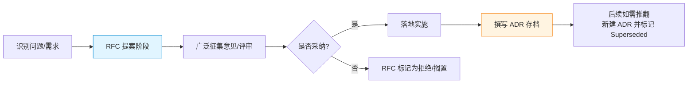
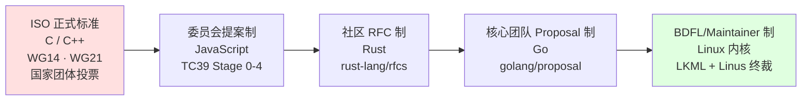
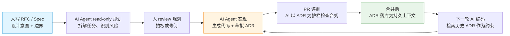

问：

RFC 是什么文档
跟 ADR 区别是什么。

答：

**RFC 偏"提案讨论"——在动手前广泛征求意见；ADR 偏"决策存档"——在拍板后留下不可篡改的记录。** 前者是"我们要不要这么做？大家来评评理"，后者是"我们已经这么定了，原因是这些，以后别再反复问"。两者在软件工程里常常前后衔接、互为补充。
下面这张图可以直观看出两者在决策生命周期中的定位差异：

## RFC：Request for Comments（征求意见稿）
RFC 最早由 IETF（互联网工程任务组）于 1969 年发起，最初是 ARPANET 研究者之间流通的非正式备忘录，第一份 RFC 1 由 Stephen D. Crocker 撰写，后来逐步演变为记录互联网规范、协议、过程的正式标准文件，TCP、IP、HTTP 等基础协议都由 RFC 定义。
在互联网标准语境下，RFC 有几个关键特征：编号唯一且只增不改、新的 RFC 可以声明"取代（Obsoletes）"旧的 RFC、纯 ASCII 文本格式、由 Internet Society 赞助发行。
后来这个概念被很多技术社区和工程团队借鉴，泛化为"在正式实施一项较大的技术变更前，先写一份提案文档供团队/社区讨论"。例如 Rust 社区就用 RFC 流程来讨论语言新特性，一份典型 RFC 包含：提案、动机、设计、后果、未解决问题等部分，经社区讨论审查后才决定是否接受。在企业内部，RFC 也常被用作"大特性设计文档"，用于在设计阶段拉齐认知、暴露风险。
## ADR：Architecture Decision Record（架构决策记录）
ADR 由 Michael Nygard 倡导，是一种轻量级文档，专门用于记录软件架构层面的关键决策——决策背景、所选方案、选择理由以及后续影响，核心目标是解决"架构决策的追溯性"问题，避免团队因人员变动或时间推移而遗忘"当初为什么这么选"。
一份规范的 ADR 通常包含这几个核心模块，且单份文档一般不超过两页：
- **标题**：编号 + 简短决策描述（如 `ADR 01. 订单服务与履约服务间采用异步消息`）
- **状态**：提议 / 已接受 / 已弃用 / 已取代（Superseded）
- **背景（Context）**：遇到了什么问题、有什么约束
- **决策（Decision）**：最终怎么定的，用肯定式陈述
- **理由（Reason）**：考虑过哪些备选方案、各自优劣、基于什么标准取舍
- **后果（Consequences）**：积极影响、消极影响/风险、后续要做的事
ADR 强调"关注 Why 而非 How"，并且一旦写入就不再修改原文——若决策被推翻，就新建一份 ADR 并把旧的状态改为"被取代"，从而形成一条可追溯的决策演进链。
## RFC 与 ADR 的核心区别
| 维度 | RFC | ADR |
|------|-----|-----|
| **全称** | Request for Comments（征求意见稿） | Architecture Decision Record（架构决策记录） |
| **本质定位** | 提案/讨论文档 | 决策存档文档 |
| **出现时机** | 决策**之前**，方案还在酝酿 | 决策**之后**，结论已经确定 |
| **核心目的** | 广泛征求意见、暴露风险、拉齐认知 | 留下不可篡改的决策记录与理由 |
| **内容重点** | 动机、设计、备选方案、未解决问题 | 背景、决策、理由、后果 |
| **目标读者** | 评审者/相关方，等待他们反馈 | 未来的自己、新成员、维护者 |
| **修改性** | 讨论阶段可反复修改 | 写定后不改正文，只改状态；推翻则新建 |
| **篇幅** | 通常较长，几页到几十页 | 轻量，一般 1–2 页 |
| **生命周期** | 草案 → 讨论 → 接受/拒绝 | 提议 → 已接受 →（可能）被取代 |
| **典型场景** | 新协议制定、大特性设计、语言新特性 | 技术选型、架构风格、跨模块决策 |
一个常被提及的实践要点：**RFC 是"讨论载体"，ADR 是"结论载体"**。很多团队会让一份 RFC 在讨论结束后"沉淀"出一份 ADR——RFC 里记录了讨论过程和被否决的方案，ADR 则只留下最终结论和核心理由。
## 什么场景用哪个
- **写 RFC**：当你准备引入一个影响面较大的新方案（比如更换主数据库、改造服务间通信、引入新中间件），需要在动手前让相关方充分讨论、暴露风险时。
- **写 ADR**：当一个架构决策已经拍板（无论是否经过 RFC 流程），你需要把它和"为什么"固化下来，给未来的团队成员一个权威参考时。
- **两者配合**：大型变更可以先用 RFC 收集意见，定稿后提炼为 ADR 存档；小型、明确的决策则可直接写 ADR，无需走完整 RFC 流程。
简而言之，RFC 解决的是"这个决定对不对、该不该做"的共识问题，ADR 解决的是"这个决定是什么、为什么、以后别再问"的传承问题。

----

问：

1、除了 RFC 跟 ADR 还有哪些能作为软件工程的文档架构。
2、我看很多软件技术都只采用 RFC 而不是 ADR作为标准。（还是说有跟 RFC 相似的）。

答：

针对您的两个问题，下面分别展开。
## 一、除了 RFC 和 ADR，软件工程还有哪些文档类型
软件工程文档可大致分为"需求 / 设计 / 架构 / 接口 / 运维"几大类，RFC 和 ADR 只覆盖了其中"提案讨论"和"决策存档"两个细分定位。以下是更完整的全景对比：
| 文档类型 | 全称 / 来源 | 核心用途 | 典型内容 | 出现阶段 | 与 RFC/ADR 的区别 |
|---------|------------|---------|---------|---------|------------------|
| **SRS** | Software Requirements Specification（ISO/IEC/IEEE 29148） | 需求契约 | 功能/非功能需求、接口约束、用例、验收准则 | 需求冻结前后 | 描述"系统要做什么"，而非"要不要这么做" |
| **SDD** | Software Design Description（IEEE 1016-2009） | 设计蓝图 | 系统架构、模块分解、数据设计、算法、设计理由 | 设计阶段 | 描述"怎么实现"，而非决策讨论 |
| **PRD / BRD** | Product / Business Requirements Document | 产品/业务需求 | 用户场景、功能边界、商业目标、成功指标 | 立项/规划 | 面向产品与业务，技术细节弱 |
| **Vision Document** | 产品愿景文档 | 方向对齐 | 目标、范围、干系人、关键约束 | 立项早期 | 比 PRD 更轻量、更战略层 |
| **C4 Model** | Context-Container-Component-Code（Simon Brown） | 架构可视化 | 四层 abstraction 的架构图 | 设计/沟通 | 是"画图方法"，不是"决策记录" |
| **arc42** | 开源架构文档模板（Starke & Hruschka） | 架构文档骨架 | 12 章：目标、约束、上下文、方案策略、构建块、运行视图、部署、横切概念、决策、质量、风险、术语表 | 设计-运维全程 | 是"完整文档模板"，ADR 只是其中第 9 章 |
| **4+1 View Model** | Kruchten 1995 | 多视角架构描述 | 逻辑/进程/开发/物理视图 + 场景 | 设计阶段 | 提供"看架构的多个视角"，不涉及决策流程 |
| **ISO/IEC/IEEE 42010** | 架构描述国际标准 | 合规性架构描述 | 视点、视图、利益相关者关注点 | 大型/合规项目 | 最正式的标准框架，通常通过 arc42/4+1 落地 |
| **OpenAPI / Swagger** | API 描述规范 | 接口契约 | 端点、参数、响应、错误码 | 接口设计/集成 | 机器可读的接口规范，可自动生成文档与代码 |
| **UML** | Unified Modeling Language | 建模语言 | 类图、序列图、状态图等 | 设计/分析 | 是"建模语言"，不是"文档流程" |
| **Runbook / SOP** | 运维手册/标准操作流程 | 运维执行 | 拓扑、脚本、回滚、告警阈值 | 交付/运维 | 面向"怎么操作"，非"为什么这么设计" |
| **Release Notes / Changelog** | 发布说明/变更日志 | 外部透明 | 新功能、修复、兼容性、迁移 | 每次发布 | 面向用户/集成方，记录"变了什么" |
| **Test Plan** | 测试计划 | 质量保障 | 范围、策略、用例、通过准则 | 验证阶段 | 面向 QA，记录"怎么验证" |
从"文档生命周期"看，它们的衔接关系如下：

简言之：**RFC/ADR 是"决策类"文档，而 SRS/SDD/arc42/C4/OpenAPI 等是"描述类"文档**，前者管"为什么这么定"，后者管"系统长什么样"。
## 二、为什么很多软件技术只采用 RFC 而不是 ADR 作为标准
这个现象的本质在于：**RFC 和 ADR 的设计目标不同——RFC 面向"开放社区的标准制定"，ADR 面向"封闭团队的决策留痕"。** 技术标准需要前者而非后者。
### RFC 适合做公开标准的四个结构性原因
**1. RFC 自带"公开、开放、社区驱动"的治理基因。** RFC 体系由 IETF 于 1969 年建立，其核心信条是 "rough consensus and running code"（粗略共识与可运行代码）——任何人都可以提交 Internet-Draft，经过工作组讨论和广泛评审后成为 RFC。这种开放治理正是跨组织协作的协议/规范所需要的。
**2. RFC 有完整的成熟度演进机制。** IETF 标准轨道分两级：Proposed Standard（提案标准，稳定且经社区评审）→ Internet Standard（互联网标准，经多实现验证）。新 RFC 可声明"取代（Obsoletes）"旧 RFC，形成规范的版本化演进链。ADR 没有这套机制——它只记录"一次性决策"，不支持"规范成熟度升级"。
**3. RFC 是"规范本身"，而不仅仅是决策记录。** 一份 RFC（如 HTTP/1.1、TLS 1.3）就是协议的权威定义，实现者直接照它编码。ADR 记录的是"为什么选 A 不选 B"，并不构成可实施的技术规范。
**4. RFC 的"不可变性"服务于规范稳定性。** RFC 一旦发布编号即冻结，要修订必须发新 RFC 并标记取代关系，这保证了引用的稳定性和可追溯性。ADR 也强调不可变，但其目的是"决策不被悄悄改写"，而非"规范版本可追溯"。
### ADR 不适合做公开标准的原因
- **私有性强**：ADR 通常存在代码仓库的 `docs/adr/` 目录下，面向团队内部，不天然具备公开评审流程。
- **缺乏社区治理**：ADR 没有"提案→讨论→共识→采纳"的流程，只是事后记录。
- **不产出规范文本**：ADR 的核心是 Context/Decision/Consequences，而不是可被第三方实现的技术规格。
- **篇幅与粒度不匹配**：ADR 一般 1-2 页，适合单个决策；标准文档动辄几十上百页，需要 RFC 这种长篇正式格式。
一句话概括：**RFC 是"标准制定流程的产物"，ADR 是"工程决策的记账本"——前者面向社区产出规范，后者面向团队沉淀理由。**
### 与 RFC 相似的"提案-标准"机制
很多技术生态并没有直接复用 IETF 的 RFC，而是设计了机制相似、命名各异的提案流程。它们的共同模式都是：**草案 → 社区讨论 → 分阶段评审 → 成为正式规范**。
| 机制 | 所属社区 | 文档名 | 阶段/特点 |
|------|---------|--------|----------|
| **RFC** | IETF（互联网协议） | RFC 编号 | Internet-Draft → Proposed Standard → Internet Standard |
| **PEP** | Python | Python Enhancement Proposal | 草案 → 已接受/最终版；PEP 1 定义流程 |
| **TC39 Proposal** | ECMAScript/JavaScript | Stage 0-4 | 0:strawperson → 1:proposal → 2:draft → 3:candidate → 4:finished |
| **KEEP** | Kotlin | Kotlin Evolution & Enhancement Process | 提案 → 评审 → 进入语言规范 |
| **W3C Recommendation** | Web 标准 | W3C TR | Working Draft → Candidate Recommendation → Recommendation |
| **Rust RFC** | Rust | rust-lang/rfcs | 提案 PR → 讨论 → 合并进 RFC Book；Rust 还另起 spec 工作 |
这些机制与 IETF RFC 的关系是"同构不同名"——都遵循"提案驱动 + 社区共识 + 阶段晋升"的范式，只是治理主体和阶段命名不同。它们与 ADR 的根本区别在于：**前者是"前置讨论 + 产出规范"，后者是"事后记录 + 不产出规范"。**
### 选型建议
- **要做跨组织/跨团队的开放技术规范** → 用 RFC 或类似的 PEP/TC39/W3C 流程。
- **要记录企业内部某次架构决策的理由** → 用 ADR。
- **要描述系统整体架构** → 用 arc42 + C4。
- **要定义 API 契约** → 用 OpenAPI。
- **要描述需求** → 用 SRS/PRD。
很多成熟团队的实践是"双轨制"：重大技术变更走 RFC 流程讨论定案，定案后提炼为 ADR 存档，日常架构描述用 arc42/C4 维护——三者各司其职、互不替代。

----

问：

1、那像 C 语言、Linux操作系统、Rust、Go、JS 这些编程语言是否都采用 RFC 作为统一标准规范呢？
是否它们都不使用 ADR。

答：

**并不是。** C/C++ 走 ISO 国际标准（WG14/WG21），Rust 用 RFC，Go 用自己的 Proposal 流程，JS 用 TC39 提案机制，Linux 内核则完全是邮件列表 + 补丁评审——它们的标准治理机制各不相同，"RFC" 只是其中一种范式，并非统一规范。至于 ADR，这五者确实都不拿它当语言/项目的标准治理工具，原因在文末统一解释。
## 各语言/项目的标准机制对比
| 对象 | 标准机制名称 | 治理主体 | 产出物 | 是否叫"RFC" | 关键特征 |
|------|------------|---------|--------|-----------|---------|
| **C** | ISO/IEC 9899（C89/C99/C11/C17/C23） | ISO/IEC JTC1/SC22/WG14 | 正式 ISO 标准文本 | 否 | 国家团体投票、周期数年、付费获取 |
| **C++** | ISO/IEC 14882 | WG21 委员会 | 正式 ISO 标准文本 | 否 | 同 C，每三年一版（C++17/20/23） |
| **Rust** | Rust RFC 流程 + 规范（建设中） | Rust 项目各子团队 | RFC 文档 + Rust Reference + 规范 | 是 | RFC 是变更入口；2022 年起通过 RFC 3355 启动官方规范工作 |
| **Go** | Go Proposal Process + 语言规范 | Go 团队（Google 主导） | Proposal issue + Design Doc + Go Spec | 否 | issue 三分类（接受/拒绝/要设计文档），Russ Cox 等主导评审 |
| **JavaScript** | TC39 提案流程 + ECMA-262 | Ecma TC39 委员会 | ECMA-262 标准（ES 规范） | 否 | Stage 0→4 五阶段晋升，Stage 4 才进规范 |
| **Linux 内核** | LKML 邮件列表 + 补丁评审 + Maintainer 树 | 维护者层级，Linus 终裁 | 合入源码 + kernel-doc 文档 | 否（"[RFC]"只是补丁前缀） | 纯邮件、patch review、无独立规范文档 |
需要特别澄清两点容易混淆的地方：
**第一，Linux 内核里的 "[RFC]" 不是 RFC 文档体系。** 内核开发者发补丁时会在邮件标题加 `[RFC]` 前缀，意思是"这只是个草稿，请大家提意见"，它和 `[PATCH v2]`、`[RESEND]` 一样是补丁状态标签，并不对应一套独立的提案文档库，也不会被编号归档成"RFC xxxx"。内核真正的决策机制是 maintainer 层级评审 + Linus 的 pull request 终裁。
**第二，Rust 是这几者里唯一把"RFC"作为正式流程命名的。** 它的 RFC 流程定义在 rust-lang/rfcs 仓库，"substantial" 变更必须先走 RFC、经相关子团队共识后才能实施。但 Rust 长期没有正式规范，直到 2022 年 RFC 3355 才启动官方规范工作，目前以 Rust Reference 为事实来源、逐步演化为 spec。
## 治理范式的光谱
这些语言/项目虽然机制名称各异，但可以沿"治理开放度"排成一条光谱：

从左到右：**正式度递减、社区开放度先升后降、决策速度递增**。ISO 标准最正式但最慢（C23 从立项到发布耗时数年）；TC39 和 Rust RFC 是开放社区提案制；Go 介于社区与公司主导之间；Linux 内核最"人治"，靠 maintainer 信誉和 Linus 一锤定音。
## 为什么这些语言/项目都不用 ADR 做标准
**结论：RFC 类机制产出的是"面向未来的开放规范"，ADR 记录的是"面向过去的内部决策"——语言标准化需要前者，不需要后者。** 具体有三层原因：
**1. 治理范围不匹配。** ADR 是单个团队/仓库内部的决策记账本，典型场景是"我们这个服务为什么选 Postgres 而不是 MySQL"。而语言标准要解决的是跨组织、跨实现、跨年代的共识问题——C 有 gcc/clang/MSVC 等多实现，JS 有 V8/SpiderMonkey/JSC 等，需要一份所有实现者都遵守的权威文本。ADR 既没有跨组织的评审流程，也不产出可被第三方实现引用的规范条款。
**2. 产出物性质不同。** RFC/ISO/TC39 产出的最终是"规范本身"（C 标准、ECMA-262、Rust Reference），实现者照着编码。ADR 产出的是"决策理由"（Context/Decision/Consequences），它解释 why，不定义 what。你可以写一份 ADR 说"我们决定让 Go 支持泛型"，但这无法替代类型系统、约束求解等几百页规范文本。
**3. 版本演进机制不同。** ISO 标准有明确的版本号（C11/C17/C23），TC39 有 Stage 晋升，Rust RFC 有"取代"关系——它们都支持规范的迭代与回溯。ADR 的"不可变 + Superseded"机制只适合单点决策的沉淀，无法承载一个持续演进的规范体系。
需要补充的是：**"不把 ADR 当标准"不等于"完全不用 ADR"。** 这些项目的工具链、CI 基础设施、内部子系统有时会借鉴 ADR 思路记录设计决策（例如 Rust 社区里就有用 Rust 写的 `adrs` 命令行工具），但这属于工程实践层面的零星使用，与"语言标准治理"是两回事。换句话说，ADR 在这些项目里是"可选的工程笔记"，而 RFC/ISO/Proposal 才是"必需的治理流程"。

----

问：

1、对于个人项目，是否 RFC 足以。通过 status 作为区分。
2、对于 AI 软件工程来说，RFC 和 ADR 都需要么。

答：

## 问题一：个人项目 RFC 足矣吗？用 status 区分是否可行
**可行，且推荐。** 个人项目的本质是"单人决策、无共识构建需求"——RFC 的核心价值（多利益方异步评审、拉齐认知）在此场景几乎失效，ADR 的决策留痕价值也大打折扣，因为决策者和未来读者是同一个人。用一份带 `status` 字段的轻量设计文档统一管理，是最务实的做法。
具体判断依据：
- **RFC 的评审价值消失**：没有同事需要"征求评论"，自我讨论写在文档里即可。
- **ADR 的 archival 价值减弱**：你不会遗忘自己三个月前为什么选 SQLite——但"不可逆决策"是例外。
- **status 字段足以承载生命周期**：单字段即可区分"还在想 / 已定了 / 已实现 / 已废弃"。
建议的 status 取值（个人项目够用即可，不必照搬 IETF 全套）：
| Status | 含义 | 触发时机 |
|--------|------|---------|
| `Draft` | 还在构思，方案未定 | 刚开始写 |
| `Proposed` | 方案成形，待自己拍板 | 写完待冷静期 |
| `Accepted` | 已决定要做 | 拍板后 |
| `Implemented` | 已落地 | 代码合并后 |
| `Deprecated` | 不再适用 | 方案被放弃 |
| `Superseded` | 被新文档取代 | 新决策推翻旧决策，新建文档并链接 |
**唯一的例外**：当某个决策"不可逆或难以逆转"（如选了某云厂商、定了数据 schema、选了某框架且已深度耦合）时，值得在该设计文档里补一小段"为什么选 A 不选 B"——这其实是 ADR 的 Context/Decision/Consequences 三段式的精简版，但不必单独立文件，嵌在设计文档里即可。
一句话：**个人项目用"单文件设计文档 + status 字段"统一管理 RFC 与 ADR 的职能；只有不可逆决策才额外补一段决策理由。**
## 问题二：AI 软件工程中，RFC 和 ADR 都需要吗
**都需要，但两者的角色发生了显著重构——RFC 仍是人侧的设计意图载体，而 ADR 的权重不降反升，因为它从"团队留痕笔记"升级为"AI agent 的机器可读上下文与代码评审护栏"。**
AI 工程带来的根本变化是：**AI 编码 agent 会在几秒内做出大量隐式架构决策——选框架、搭脚手架、接依赖、定 schema——而这些决策几乎无人评审。** 学术研究把这一现象命名为 "vibe architecting"（凭感觉架构）：架构由 prompt 而非刻意设计塑造。这恰恰是 ADR 在 AI 时代"回潮"的根本原因——当一半代码作者不是人时，决策记录从锦上添花变成了"承重基础设施"。
两者在 AI 语境下的角色对比：
| 维度 | RFC 在 AI 工程中的角色 | ADR 在 AI 工程中的角色 |
|------|---------------------|----------------------|
| **谁写** | 人（在动手前） | 人定方向 + AI 可辅助生成草稿 |
| **核心职能** | 把人的设计意图写成 spec，再交给 AI 实现 | 作为机器可读上下文喂给 agent，并作为 PR 评审的硬约束 |
| **对 AI 的价值** | 提供任务级 spec（read-only 规划模式） | 提供持久化的"为什么这么定"，弥补 agent 跨会话失忆 |
| **在代码库中的位置** | 可在 issue / 文档库 | 必须落在 `docs/adr/`，与代码同仓库，AI 才读得到 |
| **与代码评审关系** | 弱相关 | 强相关：ADR 成为 agent 不可随意违反的护栏 |
| **AI 时代的新形态** | 规格驱动开发（spec-driven） | Agent Decision Record（AgDR）——扩展 ADR 记录 AI 自主做的决策 |
关键的新增逻辑链：**ADR 从"人给人看的备忘录"变成了"人给 AI 看的约束文件"。** 研究与实践都指向同一个结论——当 ADR 存放在代码仓库内时，它成为 AI agent 的一等公民：既能在编码时被检索进上下文窗口，也能在 code review 阶段作为合规判据，甚至让"文档化架构"变成连项目主都不可随意推翻的约束。与此同时，AGENTS.md / CLAUDE.md 这类专门面向 agent 的上下文文件正在兴起，成为"给 AI 的 README"，但它们更偏操作约定（构建命令、编码规范），与 ADR 的"决策理由"是互补而非替代关系。
一个典型的 AI 工程文档工作流如下：

这个闭环里有两点值得强调：第一，**RFC 仍是起点**——AI agent 直接从 spec 实现比从模糊 prompt 实现质量高得多，spec 过大才会撑爆上下文窗口，因此 RFC 要"写得克制"；第二，**ADR 形成正向循环**——历史 ADR 越完整，下一轮 AI 编码的约束越清晰，"vibe architecting"的失控风险越低。
**轻量化建议**：
- **RFC 侧**：保留为短 spec（目标 + 方案 + 边界 + 验收标准），不必套用 IETF 全套模板；在交给 AI 实现前以 read-only 模式让它先做规划评审。
- **ADR 侧**：务必放在代码仓库 `docs/adr/` 内而非 Confluence/Notion——这是 AI 能否检索到的硬前提；对 AI 自主做出的决策，可引入 AgDR 格式记录决策主体是哪个 agent、基于什么 prompt。
- **新增项**：维护一份 AGENTS.md / CLAUDE.md 承载操作约定，与 ADR 分工——前者管"怎么干"，后者管"为什么这么干"。
**核心观点**：AI 不会让 RFC 和 ADR 变得多余，反而让两者的分工更清晰——RFC 管住"设计意图不被 vibe 化"，ADR 管住"AI 的隐式决策可追溯、可审计"。在 AI 工程里，ADR 的地位实际上比传统软件工程更高。

----

问：

答：

----

问：

答：

----

问：

答：

----

问：

答：

----

问：

答：

----

问：

答：

----

问：

答：

----

问：

答：

----

问：

答：

----

问：

答：

----

问：

答：

----

问：

答：

----

问：

答：

----

问：

答：

----

问：

答：

----

问：

答：

----
