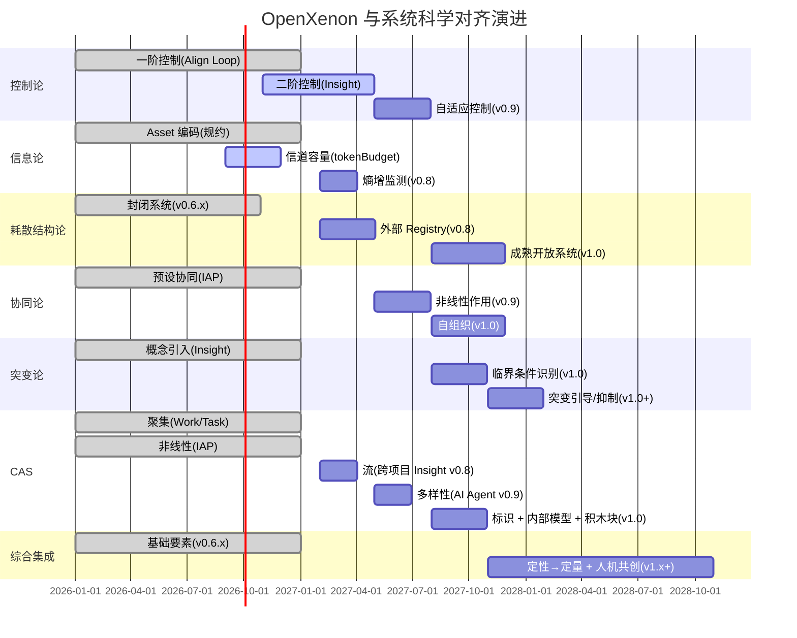

# OpenXenon 与系统科学理论对齐（内部使用）

> **重要声明**：本文档**仅供内部演进参考**，**不**入对外文档。
> v1.x 之前不在产品文档中引入"系统科学"学术叙事。
> 工程师从工具使用层面感受到的是"自然涌现"的效果，而非"系统科学"的术语堆砌。

---

## 0. 为什么需要这份文档

OpenXenon 的设计哲学与系统科学理论存在深层对齐，但**不应过早引入学术概念**：

1. **工具定位**：OpenXenon 是工具，不是"系统科学演示项目"
2. **工程师视角**：工程师关心"怎么用"，不关心"对应什么理论"
3. **避免过度设计**：每引入一个理论就可能产生过度工程的诱惑

但**在内部**，我们需要这张对齐表来：
- 识别当前的实现程度
- 找出缺失的环节
- 指导 v0.7+ 的演进路径
- 避免重蹈"理论正确但工程无用"的覆辙

---

## 1. 系统科学理论框架与 OpenXenon 的对齐表

| 系统科学理论 | 核心思想 | OpenXenon 对应实现 | v0.6.x | v0.7 | v0.8 | v0.9 | v1.0 | v1.x+ |
|---|---|---|---|---|---|---|---|---|
| **系统论** | 整体性、关联性、层次性、动态开放性 | IAP 范式构建了工程师-AI-OXN 的有机整体；E1-E4 体现层次性 | ★★★★☆ | ★★★★☆ | ★★★★★ | ★★★★★ | ★★★★★ | ★★★★★ |
| **控制论** | 反馈控制、一阶/二阶控制 | Align 阶段一阶控制（Loop）；Insight 机制是二阶控制雏形 | ★★★☆☆ | ★★★★☆ | ★★★★☆ | ★★★★★ | ★★★★★ | ★★★★★ |
| **信息论** | 信息获取、传输、处理、消除不确定性 | Asset 编码信息；AI 处理上下文；Proof 生成确定性证明 | ★★★★☆ | ★★★★☆ | ★★★★★ | ★★★★★ | ★★★★★ | ★★★★★ |
| **耗散结构论** | 远离平衡态的开放系统通过能量交换形成有序结构 | 当前系统相对封闭；v0.8 引入外部 Registry | ★★☆☆☆ | ★★☆☆☆ | ★★★☆☆ | ★★★☆☆ | ★★★★☆ | ★★★★★ |
| **协同论** | 子系统通过非线性相互作用形成自组织结构 | 工程师-AI-OXN 通过预设规则协同；自组织性不足 | ★★☆☆☆ | ★★☆☆☆ | ★★☆☆☆ | ★★★☆☆ | ★★★★☆ | ★★★★★ |
| **突变论** | 系统在临界点的突变行为 | Insight 的涌现是一种突变现象；触发机制不明确 | ★★☆☆☆ | ★★☆☆☆ | ★★☆☆☆ | ★★☆☆☆ | ★★★☆☆ | ★★★★☆ |
| **复杂适应系统(CAS)理论** | 适应性主体通过学习和交互涌现复杂性 | AI Agent 作为适应性主体；学习能力不足 | ★★☆☆☆ | ★★☆☆☆ | ★★★☆☆ | ★★★☆☆ | ★★★★☆ | ★★★★★ |
| **综合集成方法论** | 定性到定量的综合集成（钱学森） | 工程师定性意图 + AI 定量执行；v1.x 引入转换 | ★★☆☆☆ | ★★☆☆☆ | ★★☆☆☆ | ★★☆☆☆ | ★★★☆☆ | ★★★★☆ |

---

## 2. 各理论对齐详细分析

### 2.1 系统论（最高对齐 ★★★★☆）

**核心**：整体性、关联性、层次性、动态开放性

**OpenXenon 实现**：

| 维度 | 实现 |
|---|---|
| **整体性** | IAP 范式将工程师 / AI / OXN 视为有机整体（不是孤立组件） |
| **关联性** | 工程师意图（Asset）→ AI 执行（Work）→ OXN 验证（Proof）→ Insight 反哺 → 工程师 |
| **层次性** | L0 Kernel / L1 OXL+Infra / L2 Engine / L3 Tools + E1 Asset / E2 Work / E3 Engine / E4 Insight |
| **动态开放性** | IAP 持续运转；Round 多轮循环；v0.8 引入外部 Registry |

**v0.6.x 收官时**：★★★★☆
**v0.7 目标**：★★★★☆（保持）
**v0.8 目标**：★★★★★（外部信息流补齐"开放性"）
**v1.0 目标**：★★★★★

**待完善**：
- 跨项目 / 跨组织的整体性
- 真正的"动态开放"（目前主要是工程师手动开启）

### 2.2 控制论（★★★☆☆ → ★★★★☆）

**核心**：反馈控制，区分一阶控制（行为调整）和二阶控制（学习如何学习）

**OpenXenon 实现**：

| 维度 | 实现 | 阶段 |
|---|---|---|
| **一阶控制** | Align 阶段通过 Loop 机制拿当前状态与 Intent 对比，差值驱动下一轮修正 | v0.6.0 |
| **二阶控制（雏形）** | Insight 机制让系统"学习如何学习"——发现某类意图频繁失败时，AI 调整策略 | v0.6.3 + v0.7 |
| **预测模型** | 未充分利用历史数据预测 | v0.9+ 计划 |
| **自适应控制** | 控制策略的自动调整能力不足 | v0.9+ 计划 |

**v0.6.x 收官时**：★★★☆☆
**v0.7 目标**：★★★★☆（Insight 工程化）
**v0.9 目标**：★★★★★（自适应控制）
**v1.0 目标**：★★★★★

**待完善**：
- 基于历史的预测模型
- 真正的"学习如何学习"——AI Agent 自身的策略优化

### 2.3 信息论（★★★★☆ → ★★★★★）

**核心**：信息获取、传输、处理、消除不确定性

**OpenXenon 实现**：

| 维度 | 实现 | 阶段 |
|---|---|---|
| **信息编码** | Asset（规约、蓝图）作为信息载体，编码工程师意图 | v0.6.0 |
| **信息传输** | CLI + Skill 协议；v0.6.4 引入 scope 字段优化传输 | v0.6.0 + v0.6.4 |
| **信息处理** | AI 处理上下文；OXN 处理 Proof | v0.6.0 |
| **不确定性消除** | Proof 生成确定性证明（frozen.json + hash） | v0.6.0 |
| **信道容量** | v0.6.4 引入 tokenBudget + cacheStrategy | v0.6.4 |
| **熵增监测** | v0.8 计划引入 | v0.8 |

**v0.6.x 收官时**：★★★★☆
**v0.7 目标**：★★★★☆
**v0.8 目标**：★★★★★（熵增监测）
**v1.0 目标**：★★★★★

**待完善**：
- 自适应压缩（基于 LLM 实际响应）
- 跨项目信息熵监测

### 2.4 耗散结构论（★★☆☆☆ → ★★★★☆）

**核心**：远离平衡态的开放系统通过持续能量交换形成有序结构

**OpenXenon 现状**：

| 维度 | 实现 | 阶段 |
|---|---|---|
| **开放系统** | 当前相对封闭，缺少与外部环境的持续信息交换 | v0.6.x |
| **远离平衡态** | IAP 持续运转 + Round 多轮循环 | v0.6.0 |
| **负熵流** | v0.8 计划：Skill Registry + Asset 知识库 + Probe 生态市场 | v0.8 |
| **熵增监测** | v0.8 计划：Daemon 监测混乱度 | v0.8 |
| **持续演化** | 模式库 + 自适应 Blueprint | v0.7-0.9 |

**v0.6.x 收官时**：★★☆☆☆
**v0.7 目标**：★★☆☆☆
**v0.8 目标**：★★★☆☆（外部 Registry + 知识库）
**v0.9 目标**：★★★☆☆
**v1.0 目标**：★★★★☆（成熟开放系统）
**v1.x+ 目标**：★★★★★

**待完善**：
- 与外部代码库、文档、社区的持续信息交换
- 真正的"自组织"（目前主要靠工程师手动开启）
- 系统的"远离平衡态"——避免陷入过度有序的僵化

### 2.5 协同论（★★☆☆☆ → ★★★★☆）

**核心**：子系统通过非线性相互作用形成自组织结构

**OpenXenon 现状**：

| 维度 | 实现 | 阶段 |
|---|---|---|
| **预设协同** | 工程师-AI-OXN 通过 IAP 范式协同 | v0.6.0 |
| **非线性作用** | v0.9 计划：Proof 同时驱动 Asset 调整 + AI 提示词 | v0.9 |
| **自组织** | 缺失 | v1.0+ 计划 |
| **协同健康度** | v0.9 计划：综合评分 | v0.9 |

**v0.6.x 收官时**：★★☆☆☆
**v0.7 目标**：★★☆☆☆
**v0.9 目标**：★★★☆☆（自适应 Blueprint + AI Agent 多样性）
**v1.0 目标**：★★★★☆（成熟自组织）
**v1.x+ 目标**：★★★★★

**待完善**：
- 子系统的"非线性相互作用"——目前主要线性依赖
- 真正的"自组织"——协同规则自演化
- 系统的"涌现"——宏观行为不能从子系统简单推导

### 2.6 突变论（★★☆☆☆ → ★★★☆☆）

**核心**：系统在临界点的突变行为

**OpenXenon 现状**：

| 维度 | 实现 | 阶段 |
|---|---|---|
| **突变识别** | 缺失 | v1.0 计划 |
| **临界条件** | 缺失 | v1.0 计划 |
| **突变引导** | 缺失 | v1.0 计划 |
| **突变抑制** | 缺失 | v1.0 计划 |

**v0.6.x 收官时**：★★☆☆☆
**v0.7 目标**：★★☆☆☆
**v1.0 目标**：★★★☆☆（临界条件识别 + 引导/抑制）
**v1.x+ 目标**：★★★★☆

**待完善**：
- **临界条件识别**：通过数据分析明确触发 Insight 涌现的特征组合
- **突变引导**：系统接近临界点时主动注入扰动
- **突变抑制**：低质量 Insight 自动降权
- **临界点理论**：复杂系统中的相变类比

### 2.7 CAS 理论（★★☆☆☆ → ★★★★☆）

**核心**：适应性主体通过学习和交互涌现复杂性

**OpenXenon 现状**：

| CAS 七要素 | 实现 | 阶段 |
|---|---|---|
| **聚集** | Work / Task / Part 的分层聚集 | v0.6.0 |
| **非线性** | IAP 的反馈回路是非线性 | v0.6.0 |
| **流** | 缺失（v0.8 引入跨项目 Insight 流） | v0.8 |
| **多样性** | v0.9 计划：AI Agent 多样性 | v0.9 |
| **标识** | 缺失 | v0.9 计划 |
| **内部模型** | 缺失 | v1.0 计划 |
| **积木块** | 缺失 | v1.0 计划 |

**v0.6.x 收官时**：★★☆☆☆
**v0.7 目标**：★★☆☆☆
**v0.8 目标**：★★★☆☆（流）
**v0.9 目标**：★★★☆☆（多样性 + 标识）
**v1.0 目标**：★★★★☆（内部模型 + 积木块）
**v1.x+ 目标**：★★★★★

**待完善**：
- **流机制**：跨项目 Insight + 远程 Skill Registry
- **多样性**：多种 AI Agent / Probe 策略 / Asset 格式
- **标识机制**：为系统各组件和产物建立明确标识
- **内部模型**：OXN Engine 预测行为效果
- **积木块机制**：常用 Asset / Work 模式封装为可重用积木

### 2.8 综合集成方法论（钱学森）★★☆☆☆ → ★★★★☆

**核心**：从定性到定量的综合集成，专家智慧 + 数据信息 + 计算机能力

**OpenXenon 现状**：

| 维度 | 实现 | 阶段 |
|---|---|---|
| **专家智慧** | 工程师通过 Asset 表达经验 | v0.6.0 |
| **数据信息** | Daemon 收集事件流 | v0.6.2 |
| **计算机能力** | OXN Engine 自动化验证 | v0.6.0 |
| **定性到定量** | 缺失 | v1.x+ 计划 |
| **人机共创** | 缺失 | v1.x+ 计划 |

**v0.6.x 收官时**：★★☆☆☆
**v1.x+ 目标**：★★★★☆

**待完善**：
- **定性→定量转换**：把"代码风格偏好"等定性描述自动转化为可度量规则集
- **专家知识显式化**：通过对话提取工程师经验，自动生成 Asset 模板
- **人机共创空间**：工程师在 AI 执行过程中实时干预意图/规则

---

## 3. 整体对齐度演进

```
v0.6.x:    整体 ★★☆☆☆ - ★★★☆☆  夯实一阶道
v0.7:      整体 ★★★☆☆              涌现层骨架
v0.8:      整体 ★★★☆☆              外部信息流
v0.9:      整体 ★★★☆☆              自组织协同
v1.0:      整体 ★★★★☆              临界点 + CAS
v1.x+:     整体 ★★★★★              综合集成
```

---

## 4. 关键设计原则（每阶段必守）

### 4.1 不引入学术概念

| 阶段 | 学术概念 | 工程师视角表达 |
|---|---|---|
| v0.6.x | 控制论一阶/二阶 | "Loop 机制 + Insight 收集" |
| v0.7 | 涌现 | "跨 Work 模式 + 关系图" |
| v0.8 | 耗散结构 | "外部 Registry + 知识库" |
| v0.9 | 协同论 | "自适应 Blueprint" |
| v1.0 | 突变论 | "临界点识别 + 智能建议" |
| v1.x+ | 综合集成 | "人机共创" |

**核心**：**理论是内部参考，对外用工程语言**。

### 4.2 避免过度工程

| 风险 | 缓解 |
|---|---|
| 引入"涌现"概念后无实际机制 | v0.7 强制有 Insight apply 闭环 |
| 引入"耗散结构"后无外部信息流 | v0.8 强制有 Registry 实现 |
| 引入"突变论"后无临界点识别 | v1.0 强制有数据驱动阈值识别 |
| 引入"综合集成"后无转换机制 | v1.x+ 强制有定性→定量算法 |

### 4.3 工程师主权不动

无论引入什么理论，**工程师仍是最终决策者**：
- AI 不直接写 Asset
- 不自动 apply Insight
- 不自动 promote 模式
- 不自动演进 Blueprint

---

## 5. 演进时间线



---

## 6. 风险与缓解

| 风险 | 概率 | 影响 | 缓解 |
|---|---|---|---|
| 学术化偏离工具定位 | 中 | 高 | 严格区分内部参考 vs 对外文档 |
| 过度工程（为理论而理论） | 中 | 高 | 每阶段必须有实际机制落地 |
| 理论超前于实现 | 中 | 中 | 内部对齐表持续更新 |
| 工程师被理论吓跑 | 中 | 高 | 对外仅用工程语言 |

---

## 7. 结论

OpenXenon 在 v0.6.x 已经在"控制论一阶 + 信息论"上达到较高对齐。v0.7+ 的演进将逐步补齐"二阶控制 + 耗散结构 + 协同论 + 突变论 + CAS"。

**关键哲学约束**：
1. 理论是内部参考，**不**入对外文档
2. 每阶段必须有实际工程机制落地（**不**空谈理论）
3. 工程师主权不动（AI 不自主决策）
4. 工具定位不动（OpenXenon 不是"系统科学演示"）

**长期愿景**：
- v0.6.x：夯实一阶道（控制论 + 信息论）
- v0.7-0.8：补齐二阶道（耗散结构雏形）
- v0.9-v1.0：引入突变论 + CAS
- v1.x+：综合集成（钱学森"从定性到定量"）

---

## 8. 参考

- [v0.7+ Roadmap Overview](./overview.md) — 整体路线
- [v0.6.x Roadmap RFC](../v0.6.x-observability-roadmap/design/v0.6.x-roadmap-rfc.md) — 前置
- [v0.7 Emergence RFC](../v0.7-emergence/design/v0.7-emergence-rfc.md) — v0.7 详细
- [Harness Engineering](https://mp.weixin.qq.com/s/nBtSvz9PruWe8R2UXUwQwA) — Token 经济学参考
- 钱学森《工程控制论》《论系统工程》— 系统科学基础

---

**内部文档**，不入对外发布。
