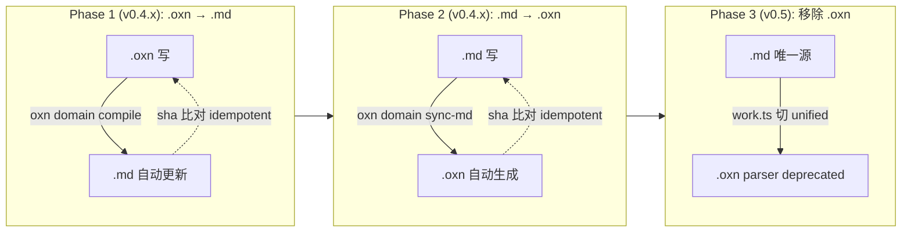

# .oxn ↔ .md 双向同步 RFC（v0.4 Phase 1+2 设计稿）

> **日期**：2026-06-25
> **状态**：🟡 **RFC 待 user 拍板**（v1.0 设计稿，Phase 1+2 实现前确认）
> **基础**：[v0.4-unify-md-rfc.md](./v0.4-unify-md-rfc.md) §3.1 · [work.md canonical 范式](#)
> **作者**：opencode（与 user 协作，2026-06-25）
> **范围**：Phase 1+2 命令骨架 + 冲突策略；Phase 3 仅规划（v0.5）

---

## 0. 摘要（TL;DR）

**当前**：`.oxn`（langium 源）+ `.md`（canonical 视图）双轨并存，**容易漂移**。

**提案**：
- **Phase 1**（现在）：`.oxn` 写 → 自动更新 `.md`（已有 decompiler，加 watch/sync 命令）
- **Phase 2**（现在做）：`.md` 写 → 自动同步 `.oxn`（新增 sync-md 命令 + IR 反向编译）
- **冲突策略**：`.md` 优先（Q2 决策 B）—— `.md` 是 user-facing source of truth
- **Phase 3**（v0.5）：移除 `.oxn`，`.md` 唯一源

**关键决策**：
- **Q1 决策 A**：用 IR 编译回 `.oxn`（md-pipeline `extractXxxIR` → langium serializer），不改 langium grammar
- **Q2 决策 B**：`.md` 优先 —— `.oxn` 是派生 view，`.md` 是 source

---

## 1. 三阶段路线



---

## 2. Phase 1 — `.oxn` 写 → 自动更新 `.md`

### 2.1 现状

v0.3 PR-B 的 `oxl-md-decompiler.ts` 已能编译 `.oxn` → `.md`。`migration-stamp.json` 记录了 v0.3 一次性迁移 14 个 domain 的元数据。

**缺的机制**：
- ❌ `.oxn` 改动后不会自动重编译 `.md`
- ❌ 没有 `.md` vs `.oxn` 一致性校验

### 2.2 新增命令

```bash
oxn domain sync <name>           # 单个: 比 sha, 不一致则重 compile
oxn domain sync --all            # 批量: 所有 domain
oxn blueprint sync <name>        # 同上 (blueprint)
oxn blueprint sync --all
```

### 2.3 算法（`oxn domain sync <name>`）

```
1. 读 .openxenon/domains/<name>.oxn
   - SHA-256 → sha_oxn_current
   - sha_oxn_prev = 从 frontmatter.oxn-source-sha 读
2. 读 .openxenon/domains-md/.cache/<name>.hash
   - sha_md_prev = 文件内容
3. 编译 .oxn → .md (用 oxl-md-decompiler)
   - SHA-256 → sha_md_new
4. 比对:
   - 如果 sha_oxn_current == sha_oxn_prev AND sha_md_new == sha_md_prev → no-op
   - 如果 sha_oxn_current != sha_oxn_prev → 重 compile, 更新 .cache/<name>.hash, 更新 .md frontmatter.oxn-source-sha
5. 输出来源 vs 派生 hash, 报告 status
```

### 2.4 文件 frontmatter schema（Phase 1 引入）

```yaml
---
entity: domain
version: 0.3.0
name: CodeQualityContext
oxn-source-sha: 6dd568a3b2d456813ac9a329cd91dae414c5b00d4ba1b186f8eb42b83b8e5648
---
```

`oxn-source-sha` 由 `oxn domain sync` 写入，记录最近一次 `.oxn` 来源的 SHA-256。

### 2.5 Watcher（可选实现）

如果需要编辑器实时同步，添加 chokidar watcher：
```typescript
// src/infra/watcher/domain-sync-watcher.ts
watch('.openxenon/domains/*.oxn').on('change', async (path) => {
  const name = path.basename(path, '.oxn')
  await syncDomain(name)
})
```

Phase 1 MVP 不实现 watcher，仅提供 CLI 命令手动触发。

---

## 3. Phase 2 — `.md` 写 → 自动同步 `.oxn`

### 3.1 算法（`oxn domain sync-md <name>`）

```
1. 读 .openxenon/domains-md/<name>.md
   - SHA-256 → sha_md_current
   - sha_md_prev = 从 frontmatter.oxn-source-sha 读
2. 读 .openxenon/domains/<name>.oxn
   - SHA-256 → sha_oxn_current
3. 解析 .md (用 md-pipeline + extractDomainIR)
   - 输出 DomainIR { terms, bans, invariants, stack }
4. 反向编译 DomainIR → langium AST → .oxn
   - SHA-256 → sha_oxn_new
5. 比对 (冲突策略: .md 优先):
   - 如果 sha_md_current == sha_md_prev → no-op (md 未变)
   - 如果 sha_md_current != sha_md_prev → 重生成 .oxn
6. 写 .oxn (chmod 0o644 临时 → 写入 → chmod 0o444 可选)
7. 触发 Phase 1: oxn domain sync (确保 .md 也更新到 .cache)
```

### 3.2 反向编译（IR → langium AST → .oxn 文本）

新增文件：`src/oxl/langium-driver/decompiler/oxn-serializer.ts`

```typescript
export function serializeDomainToOxn(ir: DomainIR): string {
  const lines: string[] = []
  // header comment
  lines.push(`// Domain: ${ir.name}`)
  lines.push(`// Generated by oxn domain sync-md ${new Date().toISOString()}`)
  lines.push('')
  // domain block
  lines.push(`domain "${ir.name}" {`)
  lines.push(`  description = "${escapeStr(ir.description ?? '')}"`)
  lines.push('')
  lines.push('  term {')
  for (const t of ir.terms) {
    lines.push(`    "${t.name}": "${escapeStr(t.desc)}"`)
  }
  lines.push('  }')
  lines.push('')
  lines.push(`  ban { ${ir.bans.flatMap(b => b.items.map(i => `"${i}"`)).join(', ')} }`)
  lines.push('')
  lines.push('  invariant {')
  for (const inv of ir.invariants) {
    lines.push(`    "${escapeStr(inv.value)}"`)
  }
  lines.push('  }')
  lines.push('}')
  return lines.join('\n')
}
```

**关键不变量**：
- 序列化必须 round-trip：`extractDomainIR(parse(s)) ≈ ir`（容许字段顺序差异）
- ID 字段（`id: term-intent`）必须稳定（不依赖生成顺序）
- 注释（`// ...`）丢失可接受（生成时不带原始注释）
- 复杂字段（`h4Sections`, `probes`）丢失时报警

### 3.3 冲突策略（`.md` 优先）

| `.oxn` 改 | `.md` 改 | 默认行为 | 可选 flag |
|---|---|---|---|
| ❌ | ❌ | no-op（idempotent） | — |
| ✅ | ❌ | Phase 1: 重生成 `.md` | — |
| ❌ | ✅ | Phase 2: 重生成 `.oxn` | — |
| ✅ | ✅ | **`.md` 优先**：Phase 2 重生成 `.oxn`，再 Phase 1 重生成 `.md` | `--oxn-priority` 反转 |

**默认 `.md` 优先的理由**（Q2 决策）：
- `.md` 是人类阅读友好的视图（GitHub / Obsidian / Typora）
- AI 工具更容易改 `.md`（无 langium parser 介入）
- `.oxn` 是编译产物（langium 序列化 + 强类型）

---

## 4. 跨 Phase 数据流

### 4.1 单次 sync (Phase 2) 数据流

```
.openxenon/domains-md/CodeQualityContext.md
  ↓ parseMarkdown (md-pipeline/unified)
mdast Root
  ↓ extractDomainIR (md-pipeline/transformers/domain)
DomainIR { terms, bans, invariants, stack }
  ↓ serializeDomainToOxn (新)
  ↓ langium writeString (现有)
.openxenon/domains/CodeQualityContext.oxn (重写)
  ↓ Phase 1 触发: oxn domain sync
.openxenon/domains-md/CodeQualityContext.md (重写)
.openxenon/domains-md/.cache/CodeQualityContext.hash (更新)
```

### 4.2 Hash 链

```
oxn-source-sha: <sha_oxn_at_sync_time>   # 在 .md frontmatter
.oxn 文件:      <sha_oxn_current>
.md 文件:      <sha_md_current>
.cache/hash:    <sha_md_at_sync_time>
```

**强不变量**：
- `sha_md_current == .cache/<name>.hash`（每次 Phase 1 sync 后）
- `.md frontmatter.oxn-source-sha == sha_oxn_at_sync_time`（sync 触发时）

---

## 5. 新增命令清单

### 5.1 Phase 1（命令骨架）

| 命令 | 用途 |
|---|---|
| `oxn domain sync <name>` | 单个 domain: .oxn → .md + hash 缓存 |
| `oxn domain sync --all` | 批量同步所有 domain |
| `oxn blueprint sync <name>` | 同上 (blueprint) |
| `oxn blueprint sync --all` | 同上 (批量) |
| `oxn work sync <name>` | work.md canonical 形式重生成（已有 compile，但加 sync 包装） |
| `oxn work sync --all` | 批量 work |

### 5.2 Phase 2（新增反向）

| 命令 | 用途 |
|---|---|
| `oxn domain sync-md <name>` | 单个: .md → .oxn |
| `oxn domain sync-md --all` | 批量 |
| `oxn blueprint sync-md <name>` | 同上 (blueprint) |
| `oxn blueprint sync-md --all` | 同上 (批量) |
| `--oxn-priority` | 冲突反转（Q2 决策 B 默认 .md 优先） |
| `--dry-run` | 模拟运行，不写文件 |

### 5.3 CI 集成

`scripts/check-md-canonical.ts` 扩展为 `scripts/sync-md-canonical.ts`：
- 在 CI 中跑 `oxn domain sync --all --dry-run`
- 比对 .md SHA-256 与 .cache/<name>.hash
- 不一致 → CI fail，提示跑 `oxn domain sync --all`

---

## 6. 文件 / 模块设计

### 6.1 新增文件

```
src/cli/domain-sync.ts                 # oxn domain sync 命令
src/cli/domain-sync-md.ts              # oxn domain sync-md 命令 (Phase 2)
src/cli/blueprint-sync.ts              # oxn blueprint sync 命令
src/cli/work-sync.ts                   # oxn work sync 命令
src/oxl/langium-driver/decompiler/
  oxn-serializer.ts                    # IR → langium AST → .oxn 文本
src/oxl/md-pipeline/sync-hash.ts       # 共享 hash 计算 + cache 工具
scripts/sync-md-canonical.ts           # CI 检查 (扩展 check-md-canonical.ts)
src/oxl/md-pipeline/__tests__/sync-hash.test.ts
src/cli/__tests__/domain-sync.e2e.test.ts
```

### 6.2 共享数据结构

```typescript
// src/oxl/md-pipeline/sync-hash.ts
export interface SyncMetadata {
  /** 最近一次 sync 时 .oxn 的 SHA-256 (写 .md frontmatter) */
  oxnSourceSha: string
  /** 最近一次 sync 时 .md 的 SHA-256 (写 .cache) */
  mdSha: string
  /** 最近 sync 时间 (ISO) */
  syncedAt: string
}

export function computeSha256(content: string): string { ... }
export function readSyncMetadata(mdPath: string): SyncMetadata | null { ... }
export function writeSyncMetadata(mdPath: string, meta: SyncMetadata): void { ... }
```

### 6.3 错误码（v0.4 新增）

| 错误码 | 触发 |
|---|---|
| `E_SYNC_SOURCE_DRIFT` | .oxn 和 .md 都改，但用户未指定 `--oxn-priority` |
| `E_SYNC_LANGIUM_VALIDATION_FAILED` | 反向编译出的 .oxn 不能通过 langium parser |
| `E_SYNC_ROUND_TRIP_LOSS` | `extractDomainIR(parse(syncMd(syncOxn(ir))))` 不等于 ir（数据丢失警告） |

---

## 7. 测试计划

### 7.1 单元测试

| 测试 | 覆盖 |
|---|---|
| `serializeDomainToOxn(roundtrip)` | IR → .oxn → IR 字段一致 |
| `computeSha256` | 稳定 hash |
| `parseProofMetadata` | 解析 `oxn-source-sha` field |

### 7.2 e2e 测试

| 测试 | 流程 |
|---|---|
| `e2e/domain-sync-basic` | 写 .oxn → `oxn domain sync` → .md 更新 |
| `e2e/domain-sync-md-basic` | 写 .md → `oxn domain sync-md` → .oxn 更新 |
| `e2e/domain-sync-bidirectional` | 写 → sync → 改另一源 → sync → 闭环 |
| `e2e/domain-sync-conflict` | 两源都改 → 默认 `.md` 优先 + `--oxn-priority` 反转 |
| `e2e/domain-sync-idempotent` | 连续两次 sync, 第二无变化 |
| `e2e/domain-sync-roundtrip-loss` | 故意丢失字段 → 报警但不 fail |

### 7.3 CI 集成测试

```yaml
# .github/workflows/ci.yml 新增
sync-check:
  runs-on: ubuntu-latest
  steps:
    - uses: actions/checkout@v4
    - run: bun install --frozen-lockfile
    - run: oxn domain sync --all --dry-run
      # CI fail if any .md hash != .cache/<name>.hash
```

---

## 8. Phase 3 — 移除 `.oxn`（v0.5 范围）

### 8.1 前提条件

- Phase 2 稳定运行 ≥1 月
- 14 domain + 12 blueprint + 28 work 已通过 sync-md 切换到 `.md` 唯一源
- 全仓库 grep `\.oxn` 仅出现在历史示例

### 8.2 v0.5 改动点

| 文件 | 改动 |
|---|---|
| `src/cli/work.ts` | `getWorkOxnPath()` → `getWorkMdPath()` |
| `src/cli/domain.ts` | `getDomainOxnPath()` → `getDomainMdPath()` |
| `src/cli/blueprint.ts` | 同上 |
| `src/cli/proof.ts` | `proof.oxn` → `proof.md` (含 PR-B Q4-A snapshot 适配) |
| `src/oxl/langium-driver/` | parser 保留（仅用于 legacy import），不删除 |
| `src/oxl/md-bridge/oxl-md-{compiler,decompiler}.ts` | 删除（Phase 1+2 已不依赖） |

### 8.3 迁移脚本

```bash
oxn migrate-to-md --all
  # 对每个 .oxn:
  #   1. 解析 .oxn → IR
  #   2. IR → .md (用 decompiler, 但反着)
  #   3. 备份 .oxn 到 .migrated-v0.5/
  #   4. 删除 .oxn
```

---

## 9. 风险与缓解

| 风险 | 缓解 |
|---|---|
| **R1**: langium parser 拒绝某些复杂字段（如 `task.body[].probes`） | Phase 2 序列化器只支持 `term/ban/invariant/stack`（核心 4 字段），其他字段报错让用户手动 |
| **R2**: 序列化 round-trip 数据丢失 | 每次 sync 写 `_oxn_round_trip_loss.json` warning 文件，CI 显示 |
| **R3**: 14 个旧 .md 文件格式不规范（v0.3 PR-B 编译产物） | Phase 2 第一周做一次 `oxn domain sync-md --all` 重新规范化 |
| **R4**: 用户手动改 `.md` 后忘跑 sync-md，`.oxn` 过时 | CI `sync-check` step 检测，PR fail |
| **R5**: Phase 2 + Phase 1 互相触发死循环（sync 触发 sync） | 用 `oxn-source-sha` 比对，sha 一致 no-op |

---

## 10. 决策记录

| # | 决策 | 选项 | 理由 |
|---|---|---|---|
| D1 | Q1 反向编译方式 | **A**：IR 编译回 .oxn（md-pipeline）| 改动小，保持 langium 稳定；md-pipeline 已就位 |
| D2 | Q2 冲突优先源 | **B**：`.md` 优先 | `.md` 是人类/GitHub/AI 友好的 source；`.oxn` 是编译产物 |
| D3 | Phase 1 watcher | 暂不实现 | Phase 1 仅 CLI 命令 + CI，避免 dev-time 复杂度 |
| D4 | Phase 3 触发条件 | 全仓库 `.oxn` 全部可 sync-md 闭环 + 稳定 1 月 | 避免过早迁移破坏现有 .oxn parser |
| D5 | hash 算法 | SHA-256 hex（统一） | 与现有 `work-hash.txt` / `frozen.json` 一致 |
| D6 | error code 命名 | `E_SYNC_*` 前缀 | 与 `E_PROOF_*` / `E_MD_*` 风格一致 |
| D7 | .oxn parser 保留 | 保留为 deprecated 入口 | v0.5 完全切到 .md 前 import 兼容 |

---

## 11. 范围之外

下列功能在 Phase 1+2 不实施：

- ❌ **Watcher 模式实时同步**：editor save 自动 sync。Phase 1 仅 CLI 命令
- ❌ **三路冲突解决（user / oxn / md 各自独立改动）**：Phase 1+2 仅二元冲突
- ❌ **自动 git commit**：每次 sync 后自动 commit。不在范围内（OXN 哲学：永不替人 commit）
- ❌ **冲突 UI / TUI**：错误信息 CLI 输出，无交互界面
- ❌ **跨项目 sync**：仅当前 `.openxenon/`，不跨多项目
- ❌ **Phase 3（移除 .oxn）**：v0.5 范围，本 RFC 仅规划

---

## 12. 后续

实施完成后（Phase 1+2）：
- Phase 3 详细 RFC（v0.5 移除 .oxn 完整路径）
- v0.4.1 发布（Phase 1+2 命令）
- 监控 14 domain 的 sync 行为，收集 edge case

---

## 参考

- [v0.4-unify-md-rfc.md](./v0.4-unify-md-rfc.md) — 主 RFC（md-pipeline / unified-native 路径）
- [v0.3 MD-Native Grammar RFC](../v0.3-md-ssot/design/md-native-grammar-rfc.md) — v0.3 引入 ## Terms / ## Bans 范式
- `src/oxl/md-bridge/oxl-md-decompiler.ts` — 已有的 `.oxn` → `.md` 编译器（Phase 1 基础）
- `src/oxl/md-pipeline/transformers/domain.ts` — 已有的 `extractDomainIR`（Phase 2 反向编译输入）
- `src/cli/proof.ts` — `snapshotWorkMd` 的 hash 模式可参考