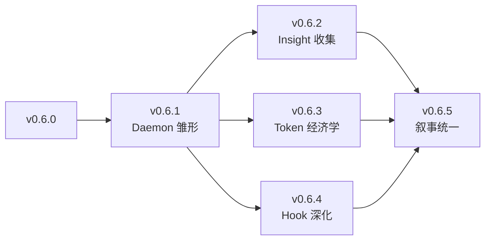

# v0.6.x 路线图 RFC — 可观测性 + Token 经济学 + 涌现雏形

> **RFC 状态**：✅ Approved（2026-07-01）
> **作者**：OpenXenon 维护者
> **目标版本**：v0.6.1 → v0.6.5（5 个 minor release，跨度 5 个月）
> **前置依赖**：v0.6.0 已发布（E1-E4 + L0-L3 + Monorepo 双包）

---

## 0. 背景与动机

v0.6.0 完成了**架构重构**——从 IAP 三轴叙事收敛到 E1-E4 四结构实体 + L0-L3 工程分层 + Monorepo 双包布局。1890 个测试通过，CLI 单文件 3.35MB，架构守卫 24/24 通过。

但 v0.6.0 仍然存在**三个可观测的痛点**：

### 痛点 1：看不见（Lack of Observability）

工程师运行 `oxn work` 后，只能通过返回值判断成功失败，**没有持续的过程证据**：
- Work 跑了多久？轮次几次？哪一步慢？
- frozen.json 是否被外部工具篡改？
- AI 在 Align 阶段触发了哪些边界冲突？

### 痛点 2：Token 黑盒（Token Economics Blindness）

v0.6 的 OXN Engine 没有 Token 消耗统计：
- 每次 Skill 调用消耗多少？
- 哪个 Asset 注入最贵？
- KV Cache 命中率如何？

参考 [Harness Engineering](https://mp.weixin.qq.com/s/nBtSvz9PruWe8R2UXUwQwA) 文章的 Token 经济学分析，**基础开销可控制在 ~15K tokens**，但需要精细化的可观测性支撑。

### 痛点 3：Insight 缺位（Insight Gap）

v0.6 把 Insight 升为 E4 涌现层（顶层实体），但**仅停留在哲学占位**：
- 没有任何收集机制
- 没有任何展示界面
- AI 涌现的"发现/建议"无处可放

---

## 1. 哲学锚定

v0.6.x 不引入新的架构概念，**仅在 v0.6 已收敛的 E1-E4 骨架上做"短板补齐 + 体验优化"**。

### 1.1 三层能力定位

| 能力层 | 范畴 | v0.6.0 状态 | v0.6.x 目标 |
|---|---|---|---|
| **术** | Hook / Probe / CLI | 已实现 | **深化**（Pre/Post Hook 框架） |
| **一阶道** | IAP 范式（静态） | 已落地 | **可观测**（Daemon + Token 统计） |
| **二阶道** | Insight（动态） | 哲学占位 | **收集层落地**（v0.6.2 引入 insight-raw 池） |

### 1.2 核心约束（每 PR 必守）

| 约束 | 含义 | 检验方式 |
|---|---|---|
| **三轴主导权不交叉** | 工程师 / AI / OXN 各司其职 | ESLint `no-restricted-imports` |
| **Proof 不可绕过** | Daemon 硬阻断 + 无 `--force` | 单元测试覆盖 |
| **AI 不直接反写 Asset** | Insight 反哺必须人工 `approve` | code review |
| **轻量级工程边界** | 不破坏 v0.6 收敛的 E1-E4 | architecture-guard |
| **零新 npm 依赖** | Hall 复用 VitePress（已是 docs 依赖） | package.json diff |

### 1.3 5 个 Sprint 的统一主题

```
v0.6.1 → v0.6.5: "夯实一阶道，补齐术，为二阶道铺路"
```

每个 Sprint 都是这个主题的局部展开。

---

## 2. 5 个 Sprint 概览

| Sprint | 主题 | 核心交付 | 周期 | 依赖 |
|---|---|---|---|---|
| **v0.6.1** | 完整 Daemon 雏形 + Hall 骨架 | Daemon start/stop + Webhook + Health + Hook 事件流 + Token 统计 + Insight 流入口 + Hall VitePress 静态版 | 5 周 | v0.6.0 |
| **v0.6.2** | Insight 收集层 | trace 结构化 + insight-raw 池 + 强制人工审核 + 跨 Work 模式初探 | 3 周 | v0.6.1 |
| **v0.6.3** | Asset 分级 + Token 经济学 | scope 字段 + 上下文注入策略 + OXNRC 配置 + 重复检测 | 3 周 | v0.6.1 |
| **v0.6.4** | Hook 框架深化 | Pre/Post Hook 钩子点 + OXL hook 语法 + disable-model-invocation | 2 周 | v0.6.1 |
| **v0.6.5** | 文档叙事统一 + Hall v0 完整化 | README 改写 + core-concepts 重构 + Hall v0 三大面板 | 2 周 | v0.6.2-4 |

**总周期**：15 周（≈ 4 个月）

### 2.1 依赖关系



**v0.6.1 是所有后续 Sprint 的前置**——它交付 Daemon、Insight 流入口、Hall 骨架，这些基础设施被 v0.6.2-4 复用。

---

## 3. 详细规划

### 3.1 v0.6.1 — 完整 Daemon 雏形（5 周）

**目标**：把"看不见"痛点一次性解决。

| 模块 | 任务 | 周期 | 架构层 |
|---|---|---|---|
| Daemon 核心 | `oxn daemon start/stop/status` + 进程监督（PID file + 自动重启） | W1 | L3 (src/daemon/) |
| Webhook 通知 | Work 状态变更 → Slack/Discord/终端 | W1 | L3 |
| frozen.json 完整性 watch | SHA-256 校验 + 篡改告警 | W1 | L1-Infra |
| Work 健康观测 | 执行时长 / 轮次 / 失败模式 → health.json | W2 | L1-Infra |
| Hook 事件流 | Pre/Post Hook 触发 → events.jsonl | W2 | L2-Work |
| Token 消耗统计 | asset/proof/insight 各类 token 成本 | W3 | L2 |
| Insight 流入口 | Daemon 监听 Work 完成 → 自动落 insight-raw 池 | W3 | L2-Insight |
| Health 报告 | `oxn daemon health` 输出 7 天摘要 | W4 | L3 |
| **Hall 骨架** | VitePress 静态站（health + work list 两个面板） | W4-5 | L3 |
| 测试 | 单元 + E2E（10 daemon + 5 health + 5 hall） | W5 | — |

**关键命令**：
```bash
oxn daemon start                  # 启动守护进程（后台）
oxn daemon stop                   # 停止
oxn daemon status                 # 查看状态（PID / 运行时间 / 已处理事件数）
oxn daemon health                 # 输出 health.json 摘要
oxn daemon notify <event>         # 手动触发通知（测试用）
```

**Hall 访问**：开发态 http://localhost:5173/hall/（复用 docs VitePress）

详细设计见 [v0.6.1-daemon-design.md](./v0.6.1-daemon-design.md)。

### 3.2 v0.6.2 — Insight 收集层（3 周）

**目标**：从原始信号到结构化 Insight 的最弱链路落地。

| 模块 | 任务 | 周期 | 架构层 |
|---|---|---|---|
| 执行轨迹结构化 | `trace.jsonl` 增加 `intent_drift` / `proof_attempts` / `asset_violations` 字段 | W1 | L2-Work |
| Insight 原始池 | `.openxenon/pools/insight-raw/` + hash 链保证不可篡改 | W1 | L2-Insight |
| CLI 子命令 | `oxn insight list/show/promote`（promote 仅写 audit pool） | W2 | L3 |
| 单 Work 摘要 | `oxn insight --work <name>` 输出 Round 序列 + 失败模式 | W2 | L2 |
| 跨 Work 模式初探 | 同 Domain ≥ 3 次 fail → 自动建议加 invariant（仅 audit） | W3 | L2 |
| 测试 | ≥ 15 case | W3 | — |

**关键命令**：
```bash
oxn insight list                  # 列出所有原始 Insight
oxn insight show <id>             # 展示详情（含源头 trace 引用）
oxn insight promote <id>          # 提升到 audit pool（仍需人工 approve）
oxn insight approve <id>          # 人工审核通过（写 Asset 草案）
oxn insight reject <id>           # 拒绝
```

**强约束**：**强制人工审核**——AI 不直接覆盖 Asset，必须经 `oxn insight approve`。

详细设计见 [v0.6.2-insight-design.md](./v0.6.2-insight-design.md)。

### 3.3 v0.6.3 — Asset 分级 + Token 经济学（3 周）

**目标**：让 Asset 加载策略可配置，Token 消耗可观测。

| 模块 | 任务 | 周期 |
|---|---|---|
| Asset scope 字段 | Domain/Blueprint 加 `scope: 'always' \| 'context' \| 'lazy'` | W1 |
| 上下文注入策略 | Skill 调用时按 scope 加载 | W1-2 |
| OXNRC 配置 | `context.tokenBudget` / `context.cacheStrategy` | W2 |
| Token 观测面板 | Hall 渲染 token 消耗分布 + KV 缓存命中率 | W2-3 |
| Asset 重复检测 | 启动期扫描冲突 term/ban/invariant | W3 |
| 测试 | ≥ 12 case | W3 |

**OXL 语法扩展**：
```oxl
domain "MemberContext" {
  scope: always                # 默认全量注入
  term { ... }
  ban { ... }
  invariant { ... }
}

blueprint "dev-workflow" {
  scope: context              # 关键词触发加载
  slot "build" { ... }
}
```

详细设计见 [v0.6.3-token-economics.md](./v0.6.3-token-economics.md)。

### 3.4 v0.6.4 — Hook 框架深化（2 周）

**目标**：把"硬阻断"从事后扩展到事中。

| 模块 | 任务 | 周期 |
|---|---|---|
| Pre/Post Hook 钩子点 | 在 Work run/submit/finalize 前置 / 后置插入点 | W1 |
| Hook DSL 增量 | OXL grammar 加 `hook` 语法 | W1 |
| disable-model-invocation | Probe 标记后跳过 LLM 直接调脚本 | W2 |
| Hook 可视化 | Hall 展示 Hook 触发流水 | W2 |
| 测试 | ≥ 10 case | W2 |

**OXL hook 语法**：
```oxl
blueprint "dev-workflow" {
  pre-hook "verify-asset-lock" {
    type: shell
    script: "oxn work validate"
  }
  post-hook "impact-analysis" {
    type: probe
    scheme: "git-diff-stats"
  }
}
```

详细设计见 [v0.6.4-hook-framework.md](./v0.6.4-hook-framework.md)。

### 3.5 v0.6.5 — 文档叙事统一 + Hall v0 完整化（2 周）

**目标**：把"工程师定意图，AI 跑对齐，OXN 出证明"作为对外统一叙事。

| 模块 | 任务 | 周期 |
|---|---|---|
| README 改写 | 顶部叙事全部对齐新 Slogan | W1 |
| core-concepts 重构 | 产物驱动叙事 | W1 |
| llm-prompt.md 更新 | 强调"轻量工具 + 工程师主权" | W1 |
| Hall v0 完整化 | VitePress 三大面板（health + insight + hook） | W2 |
| Changelog + 视频脚本 | `.changes/0-6-x.md` 扩增 | W2 |

详细设计见 [v0.6.5-hall-narrative.md](./v0.6.5-hall-narrative.md)。

---

## 4. 验收标准（v0.6.x 整体）

| 维度 | v0.6.0 现状 | v0.6.x 目标 |
|---|---|---|
| 测试 | 1,890 pass | ≥ 2,000 pass（增量 ≥ 110） |
| Token 经济学 | 黑盒 | Skill 基础开销压缩至 ~15K |
| 可观测性 | 无 | Daemon 通知覆盖 ≥ 7 类关键事件 |
| Insight 池 | 不存在 | 至少支持收集 + 列表 + 审核（不能直接覆盖） |
| Hall | 不存在 | VitePress 静态版可访问 health/insight/hook 三个面板 |
| 文档 | 三权分立叙事 | 100% 对齐"工程师定意图，AI 跑对齐，OXN 出证明" |

---

## 5. 风险与缓解

| 风险 | 影响 | 缓解 |
|---|---|---|
| Daemon 进程稳定性 | 中 | PID file + 自动重启 + 优雅退出 |
| VitePress 复用复杂度 | 低 | 仅消费 docs 已有 vitepress，零新依赖 |
| Hall 静态站与 docs 站点冲突 | 低 | docs 站点加 `/hall/` 子路由，不影响主站 |
| Token 统计精度 | 中 | 第一版按调用次数估算，v0.7+ 引入 LLM SDK token 计数 |
| Insight 强制人工审核拖慢迭代 | 低 | 审核 CLI 一键完成（`oxn insight approve <id>`），不增加流程 |

---

## 6. 后续路线（v0.7+ 预告）

| 版本 | 主题 | 关键交付 |
|---|---|---|
| **v0.7** | 涌现层骨架 | Insight 审核队列 + 强制人工 approve + 跨 Work 模式 + Insight 可视化 + Hall v0.5（Vue 组件化） |
| **v0.8** | 外部信息流 | Skill 远程 Registry + Asset 知识库 + Probe 生态市场 + Hall v1（WebSocket 实时推送） |
| **v0.9** | 自组织协同 | 自适应 Blueprint + AI Agent 多样性 + 非线性反馈回路 |
| **v1.0** | 临界点 + CAS 完整化 | 临界条件识别 + 突变引导/抑制 + CAS 七要素 + Engine 独立发布 |

详见 [v0.7-emergence RFC](../v0.7-emergence/design/v0.7-emergence-rfc.md) 与 [v0.7-plus-roadmap overview](../v0.7-plus-roadmap/overview.md)。

---

## 7. 参考

- [v0.6 IAP Refactor RFC](../v0.6-iap-refactor/design/v0.6-iap-refactor-rfc.md) — v0.6.0 架构主 RFC
- [Harness Engineering 文章](https://mp.weixin.qq.com/s/nBtSvz9PruWe8R2UXUwQwA) — Token 经济学参考
- [OXN 四结构实体](../../../../docs/zh-cn/core-concepts.md) — E1-E4 哲学基础
- [.changes/0-6-x.md](./changelog.md) — 变更日志片段
- [sprint-plan.md](./sprint-plan.md) — sprint 任务时间线

---

**批准状态**：✅ Approved by issac @ 2026-07-01
**下次评审**：v0.6.1 完成后（≈ 2026-08-15）
