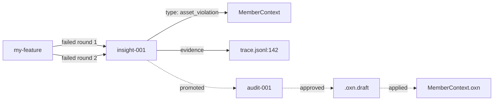

# v0.7 Emergence RFC — 涌现层骨架（Insight 工程化 + Hall v0.5）

> **RFC 状态**：✅ Approved（2026-07-01）
> **作者**：OpenXenon 维护者
> **目标版本**：v0.7.1（Insight apply 闭环 + 模式库 + Mermaid；v0.7.0 现为 Daemon + Insight 自动收集 + Hall v0.5）
> **前置依赖**：v0.6.1（信任链就位；原 v0.6.5 已并入 v0.7，见 version-unification-rfc.md）
> **核心交付**：Insight 审核闭环 + 跨 Work 模式深化 + Insight 可视化 + Hall v0.5（Vue 组件化）

---

## 0. 背景与动机

v0.6.x 已经把 Insight 收集层（v0.6.2）和可观测性（v0.6.1/3/4/5）落地，但**仍是"信号 → 池"的最弱形式**：

1. **审核链路断裂**：raw → audit → Asset 草案已经走通，但 Asset 草案到正式入库需要手动 `oxn domain validate`，没有一站式闭环
2. **跨 Work 模式利用率低**：v0.6.2 识别了模式，但没有"模式库"概念，工程师每次都要重新 promote
3. **Insight 不可视化**：Hall 只列出 insight 文件名，看不出 Insight 与 Work / Probe / Asset 的关系图
4. **Hall 静态站局限**：v0.6.5 是 VitePress 静态页 + 运行时 fetch，交互能力受限

v0.7 一次性解决这四个问题，把 Insight 从"收集"提升到"工程化"。

### 关键决策

| 决策点 | 选择 | 理由 |
|---|---|---|
| 审核闭环 | `oxn insight apply <id>` 一键应用草案 + 自动 validate | 工程师一键完成 |
| 模式库 | `.openxenon/pools/insight-patterns/` 持久化模式 | 不重复计算 |
| Insight 可视化 | DOT / Mermaid 渲染（Hall 端） | 零运行时依赖 |
| Hall v0.5 | Vue 组件化（替换 VitePress 内嵌） | 交互能力 |
| Insight 仍强制人工 | **永不**自动应用 | 工程师主权 |

---

## 1. 架构总览

```
┌─────────────────────────────────────────────────────────┐
│                    Insight Lifecycle                     │
│                                                          │
│  Raw 池 ──promote──→  Audit 池 ──approve──→  草案  ──apply──→  Asset（正式）│
│   (v0.6.1)            (v0.6.2)             (.oxn.draft)              │
│                                              │                          │
│                                              └───── 自动 validate ─────┘│
└─────────────────────────────────────────────────────────┘

┌─────────────────────────────────────────────────────────┐
│                    Hall v0.5 (Vue 组件)                   │
│                                                          │
│  /hall/health/    实时 fetch health.json                  │
│  /hall/insight/   列表 + 详情 + 模式图（DOT）             │
│  /hall/hooks/     流水 + 过滤 + 失败率                    │
│  /hall/patterns/  (v0.7 新增) 模式库浏览                  │
│  /hall/assets/    (v0.7 新增) Asset 影响图                │
└─────────────────────────────────────────────────────────┘
```

---

## 2. 模块详细设计

### 2.1 Insight 审核闭环（`packages/cli/src/commands/insight.ts` 扩展）

**新增子命令**：

```bash
# 一键应用 Insight 草案
oxn insight apply <id>
  # 1. 读取 audit 池条目
  # 2. 检查 Asset 草案存在（.oxn.draft）
  # 3. 自动 oxn domain validate <name>（或 blueprint/work/proof validate）
  # 4. 触发 planLock 重算
  # 5. Insight 状态 → applied
  # 6. 写 events.jsonl
```

**流程示意**：
```
$ oxn insight apply insight-2026-07-15-001
# → Reading audit entry ...
# → Asset draft found: .openxenon/assets/domain/MemberContext.oxn.draft
# → Running: oxn domain validate MemberContext
#   → ✓ Invariant added
#   → ✓ planLock recomputed
# → ✓ Insight applied
# → Asset updated: .openxenon/assets/domain/MemberContext.oxn
```

**错误处理**：
- 草案不存在 → `OXNI_INSIGHT_DRAFT_NOT_FOUND`
- validate 失败 → `OXNI_INSIGHT_VALIDATE_FAILED`（不应用，状态保持 approved）
- planLock 冲突 → `IAP_ALIGN_LOCK_HASH_MISMATCH`（提示 unlock）

**强约束**：
- `oxn insight apply` 仍是显式命令（**不**自动触发）
- 仍可单独 `oxn insight approve` 不 apply

### 2.2 模式库（`packages/engine/src/Insight/pattern-library.ts`）

**位置**：`.openxenon/pools/insight-patterns/`

**存储格式**：
```json
{
  "id": "pattern-2026-07-15-C1",
  "createdAt": "2026-07-15T10:00:00Z",
  "domain": "CodeQualityContext",
  "pattern": "C1: ESM project forbids require()",
  "occurrences": 5,
  "firstSeen": "2026-06-15T...",
  "lastSeen": "2026-07-15T...",
  "suggestedInvariant": "...",
  "confidence": 0.78,
  "status": "open" | "promoted" | "archived",
  "sourceInsights": ["insight-001", "insight-002", ...]
}
```

**机制**：
- 每次 `oxn insight list --type cross_work_pattern` 时，检查是否已存在相同模式
- 已存在 → 更新 occurrences / lastSeen / confidence
- 新模式 → 创建新 pattern 记录
- 模式被 promote 到 audit → status = "promoted"
- 模式被 apply → status = "applied"（如新 Insight 来自相同模式，自动跳过 promote）

**CLI**：
```bash
oxn insight patterns list              # 列出所有模式
oxn insight patterns show <id>         # 详情 + 源头 Insight 列表
oxn insight patterns promote <id>      # 提升到 audit（直接进 audit 池）
oxn insight patterns archive <id>      # 归档
```

### 2.3 Insight 可视化（Hall v0.5）

**位置**：`/hall/insight/<id>/graph`

**渲染方式**：客户端 Mermaid 渲染

**图结构**：


**实现**：
- 后端：纯函数 `buildInsightGraph(insightId) → DOT string`
- 前端：Mermaid.js 渲染（VitePress 内置 markdown-it-mermaid）
- 零 npm 新依赖

### 2.4 Hall v0.5 Vue 组件化

**技术决策**：
- v0.6.5 VitePress 静态页 + 运行时 fetch（read-only）
- v0.7 升级为 Vue 组件（交互式）

**架构**：
```
docs/.vitepress/
├── theme/
│   ├── components/
│   │   ├── HealthPanel.vue       # health 数据展示
│   │   ├── InsightPanel.vue      # insight 列表 + 详情
│   │   ├── InsightGraph.vue      # Mermaid 渲染
│   │   ├── HooksPanel.vue        # events.jsonl 流水
│   │   ├── PatternsPanel.vue     # 模式库（v0.7 新增）
│   │   └── AssetsPanel.vue       # Asset 影响图（v0.7 新增）
│   └── index.ts                  # VitePress 主题注册
└── hall/
    ├── index.md
    ├── health.md                 # 使用 HealthPanel
    ├── insight/                  # 使用 InsightPanel + InsightGraph
    ├── hooks.md
    ├── patterns.md
    └── assets.md
```

**关键能力**：
- 客户端状态管理（Pinia，可选 v0.7.5）
- 路由（VitePress 内置）
- 数据获取（`useFetch` 或 `fetch`）
- Mermaid 渲染（`mermaid` 包，**v0.7 新增**——这是 v0.6.x 期间唯一允许的新依赖）

**v0.7 不做**（v0.8 WebSocket）：
- 实时刷新
- 按钮触发 CLI（approve / reject 仍走 CLI）
- 多用户协作

### 2.5 模式库可视化（Hall）

**位置**：`/hall/patterns/`

**展示内容**：
- 模式列表（按 confidence 排序）
- 模式详情页：源头 Insight 时间线 / 涉及 Work 列表 / 建议 invariant 预览
- 模式图：Insight 时间线 + 涉及 Work 关系图

### 2.6 Asset 影响图（Hall）

**位置**：`/hall/assets/`

**展示内容**：
- Asset 列表（Domain / Blueprint / Stack）
- Asset 详情页：
  - 哪些 Insight 反哺过此 Asset
  - 哪些 Work 引用此 Asset
  - Asset 变更历史（planLock 演进）

**v0.7 范围**：read-only，v0.8 引入交互。

---

## 3. 错误码扩展

```typescript
// packages/cli/src/errors/iap-error.ts
export const ExecErrorCode = {
  // ... v0.6.x 已有
  OXNI_INSIGHT_DRAFT_NOT_FOUND: 'OXNI_INSIGHT_DRAFT_NOT_FOUND',
  OXNI_INSIGHT_VALIDATE_FAILED: 'OXNI_INSIGHT_VALIDATE_FAILED',
  OXNI_PATTERN_NOT_FOUND: 'OXNI_PATTERN_NOT_FOUND',
  OXNI_PATTERN_ALREADY_PROMOTED: 'OXNI_PATTERN_ALREADY_PROMOTED',
  OXNI_PATTERN_DUPLICATE: 'OXNI_PATTERN_DUPLICATE',
  HALL_RENDER_FAILED: 'HALL_RENDER_FAILED',
} as const
```

---

## 4. 物理布局（v0.7 新增/修改）

### 4.1 新增文件

```
packages/engine/src/Insight/
├── pattern-library.ts             # 模式库持久化
├── apply-draft.ts                 # Insight 草案应用
├── graph-builder.ts               # L0 关系图构建（DOT 字符串）
└── __tests__/
    ├── pattern-library.test.ts    # 8 cases
    ├── apply-draft.test.ts        # 5 cases
    └── graph-builder.test.ts      # 5 cases

packages/cli/src/commands/
├── insight-apply.ts               # oxn insight apply
├── insight-patterns.ts            # oxn insight patterns
└── __tests__/
    ├── insight-apply-e2e.test.ts  # 4 cases
    └── insight-patterns-e2e.test.ts  # 4 cases

docs/.vitepress/
├── theme/
│   ├── components/
│   │   ├── HealthPanel.vue
│   │   ├── InsightPanel.vue
│   │   ├── InsightGraph.vue
│   │   ├── HooksPanel.vue
│   │   ├── PatternsPanel.vue
│   │   └── AssetsPanel.vue
│   └── index.ts
└── hall/
    ├── index.md
    ├── health.md
    ├── insight/
    │   ├── index.md
    │   └── [id]/graph.md
    ├── hooks.md
    ├── patterns.md
    └── assets.md
```

### 4.2 修改文件

- `packages/cli/src/index.ts` — 注册 `insight apply` + `insight patterns` 子命令
- `packages/cli/src/commands/insight.ts` — 重构为 barrel
- `package.json` — 加 `mermaid` 依赖（**v0.7 唯一新依赖**）
- `docs/.vitepress/config.ts` — Hall 路由扩展
- `AGENTS.md` — 加 v0.7 章节

### 4.3 运行时产物

```
.openxenon/pools/insight-patterns/    # v0.7 新增
├── pattern-2026-07-15-C1.json
├── pattern-2026-07-15-C2.json
└── ...
```

### 4.4 测试统计

| 类型 | 文件 | 数量 |
|---|---|---|
| 单元 | pattern-library | 8 |
| 单元 | apply-draft | 5 |
| 单元 | graph-builder | 5 |
| E2E | insight-apply | 4 |
| E2E | insight-patterns | 4 |
| 集成 | Hall Vue 组件 | 5 |
| **合计** | — | **31** |

**v0.7 验收门槛**：≥ 2,027 pass（1,996 + 31）

---

## 5. 关键代码片段

### 5.1 oxn insight apply

```typescript
// packages/cli/src/commands/insight-apply.ts
export async function applyInsight(id: string): Promise<ApplyResult> {
  // 1. 读取 audit 池
  const audit = await readInsightAudit(id)
  if (!audit) throw new IAPError('OXNI_INSIGHT_NOT_FOUND', { id })
  if (audit.status !== 'approved') {
    throw new IAPError('OXNI_INSIGHT_APPROVE_REQUIRES_MANUAL', {
      message: 'Must approve before apply'
    })
  }

  // 2. 找 Asset 草案
  const targetKind = audit.targetKind  // 'domain' | 'blueprint' | 'stack'
  const targetAsset = audit.targetAsset
  const draftPath = resolveAssetDraftPath(targetKind, targetAsset)
  if (!(await exists(draftPath))) {
    throw new IAPError('OXNI_INSIGHT_DRAFT_NOT_FOUND', {
      path: draftPath
    })
  }

  // 3. 应用草案（覆盖正式 .oxn）
  const finalPath = resolveAssetPath(targetKind, targetAsset)
  await copyFile(draftPath, finalPath)
  await chmod(finalPath, 0o444)
  await unlink(draftPath)  // 删除草案

  // 4. 触发 validate（重新算 planLock）
  try {
    await execOxn(`${targetKind} validate ${targetAsset}`)
  } catch (err) {
    // validate 失败：回滚
    await copyFile(`${finalPath}.bak`, finalPath)
    throw new IAPError('OXNI_INSIGHT_VALIDATE_FAILED', {
      asset: targetAsset,
      error: (err as Error).message
    })
  }

  // 5. 更新 audit 状态
  await updateInsightAuditStatus(id, 'applied')

  // 6. 写 events.jsonl
  await logInsightEvent('insight.applied', {
    insightId: id,
    targetAsset,
    targetKind
  })

  return {
    success: true,
    assetPath: finalPath,
    planLockRecomputed: true
  }
}
```

### 5.2 模式库持久化

```typescript
// packages/engine/src/Insight/pattern-library.ts
const PATTERN_DIR = join('.openxenon', 'pools', 'insight-patterns')

export async function upsertPattern(
  detected: CrossWorkPattern
): Promise<string> {
  await ensureDir(PATTERN_DIR)

  // 1. 检查是否已存在
  const existing = await findPatternByKey(detected.domain, detected.pattern)

  if (existing) {
    // 2. 更新
    const updated: PatternRecord = {
      ...existing,
      occurrences: existing.occurrences + detected.occurrences,
      lastSeen: detected.lastSeen,
      confidence: Math.max(existing.confidence, detected.confidence),
      sourceInsights: [
        ...new Set([...existing.sourceInsights, ...detected.workNames])
      ]
    }
    await writeJson(existing.path, updated)
    return existing.id
  }

  // 3. 新建
  const id = `pattern-${Date.now()}-${slug(detected.pattern.slice(0, 30))}`
  const record: PatternRecord = {
    id,
    createdAt: new Date().toISOString(),
    ...detected,
    status: 'open',
    sourceInsights: detected.workNames
  }
  const path = join(PATTERN_DIR, `${id}.json`)
  await writeJson(path, record)
  return id
}
```

### 5.3 graph-builder

```typescript
// packages/engine/src/Insight/graph-builder.ts (L0 纯函数)
export function buildInsightGraph(insightId: string, data: GraphData): string {
  const { insight, audit, draft, asset, traces, work } = data

  const lines: string[] = ['graph LR']
  lines.push(`  W[${work.name}]`)
  lines.push(`  I[${insight.id}<br/>${insight.type}]`)
  lines.push(`  W -->|failed| I`)
  lines.push(`  I -->|violation| D[${asset.name}]`)
  for (const t of traces) {
    lines.push(`  I -.->|evidence| T[${t}]`)
  }
  if (audit) {
    lines.push(`  I -.->|promoted| A[audit:${audit.id}]`)
  }
  if (draft) {
    lines.push(`  A -.->|approved| DR[draft:${draft}]`)
  }
  if (asset) {
    lines.push(`  DR -.->|applied| AS[${asset.name}.oxn]`)
  }
  return lines.join('\n')
}
```

### 5.4 Hall InsightPanel.vue

```vue
<!-- docs/.vitepress/theme/components/InsightPanel.vue -->
<script setup lang="ts">
import { onMounted, ref, computed } from 'vue'

interface InsightRaw {
  id: string
  type: string
  summary: string
  workName: string
  status: 'raw' | 'audit' | 'archived'
  createdAt: string
}

const insights = ref<InsightRaw[]>([])
const filter = ref<{ status: string; type: string }>({ status: 'all', type: 'all' })

onMounted(async () => {
  const res = await fetch('/hall/insights/index.json', { cache: 'no-store' })
  insights.value = await res.json()
})

const filtered = computed(() => insights.value.filter(i =>
  (filter.value.status === 'all' || i.status === filter.value.status) &&
  (filter.value.type === 'all' || i.type === filter.value.type)
))
</script>

<template>
  <div class="insight-panel">
    <div class="filters">
      <select v-model="filter.status">
        <option value="all">All Status</option>
        <option value="raw">Raw</option>
        <option value="audit">Audit</option>
        <option value="archived">Archived</option>
      </select>
      <select v-model="filter.type">
        <option value="all">All Types</option>
        <option value="asset_violation">Asset Violation</option>
        <option value="round_failure">Round Failure</option>
        <option value="cross_work_pattern">Cross-Work Pattern</option>
      </select>
    </div>
    <table>
      <thead>
        <tr><th>ID</th><th>Type</th><th>Work</th><th>Summary</th><th>Status</th></tr>
      </thead>
      <tbody>
        <tr v-for="i in filtered" :key="i.id">
          <td><a :href="`/hall/insight/${i.id}/graph`">{{ i.id }}</a></td>
          <td>{{ i.type }}</td>
          <td>{{ i.workName }}</td>
          <td>{{ i.summary }}</td>
          <td>{{ i.status }}</td>
        </tr>
      </tbody>
    </table>
  </div>
</template>
```

---

## 6. 用户体验

### 6.1 典型流程：完整 Insight 反哺闭环

```bash
# 1. 工程师在 Hall 看到 raw Insight
$ open http://localhost:5173/hall/insight/
# 列出所有 raw / audit / archived

# 2. 查看详情 + 关系图
$ open http://localhost:5173/hall/insight/insight-001/graph
# 看到 Insight → Trace → Asset 的关系

# 3. 提升到 audit
$ oxn insight promote insight-001 \
    --target-asset MemberContext --target-kind invariant
# → ✓ Promoted

# 4. 审核
$ oxn insight approve insight-001
# → ✓ Asset draft written

# 5. 一键应用（v0.7 新增）
$ oxn insight apply insight-001
# → Reading audit entry ...
# → Asset draft found
# → Running: oxn domain validate MemberContext
#   → ✓ Invariant added
#   → ✓ planLock recomputed
# → ✓ Insight applied
```

### 6.2 典型流程：跨 Work 模式利用

```bash
# 1. 看到模式库
$ oxn insight patterns list
# 1. pattern-2026-07-15-C1   CodeQualityContext   open   confidence=0.78
# 2. pattern-2026-07-15-C2   SecurityContext      open   confidence=0.65

# 2. 详情
$ oxn insight patterns show pattern-2026-07-15-C1
# Pattern: C1: ESM project forbids require()
# Occurrences: 5
# Source Insights: insight-001, insight-002, insight-003, insight-004, insight-005
# Suggested invariant: "C1: ESM project forbids require() (observed 5 times..."

# 3. 直接提升到 audit
$ oxn insight patterns promote pattern-2026-07-15-C1 \
    --target-asset CodeQualityContext --target-kind invariant
# → ✓ Pattern promoted (skips individual Insight promote)

# 4. 审核 + 应用
$ oxn insight apply pattern-2026-07-15-C1
# → ✓ Applied
```

### 6.3 Hall Insight 关系图

```
http://localhost:5173/hall/insight/insight-001/graph

┌──────────────────────────────────────────┐
│  my-feature                              │
│       │                                   │
│       │ failed                            │
│       ▼                                   │
│  insight-001                             │
│  type: asset_violation                   │
│       │                                   │
│       ├─ violation → MemberContext        │
│       │                                   │
│       ├─ evidence → trace.jsonl:142       │
│       │                                   │
│       └─ promoted → audit-001             │
│              │                            │
│              └─ approved → draft          │
│                     │                     │
│                     └─ applied → MemberContext.oxn │
└──────────────────────────────────────────┘
```

---

## 7. 风险与缓解

| 风险 | 概率 | 影响 | 缓解 |
|---|---|---|---|
| apply 失败导致 Asset 损坏 | 低 | 高 | 备份 .bak 文件 + 回滚机制 |
| 模式库膨胀 | 中 | 低 | 30 天归档（复用 v0.6.2 策略） |
| Hall Vue 组件构建失败 | 中 | 中 | 降级到 v0.6.5 静态站 |
| Mermaid 渲染性能 | 中 | 低 | 仅在 detail 页加载 |
| 强制人工被 env var 绕过 | 低 | 中 | v0.7 引入 audit log |
| apply 后未触发 planLock 重新算 | 低 | 中 | apply 内显式调用 validate |

---

## 8. 验收清单

- [ ] `bun run typecheck` 通过
- [ ] `bun run lint` 通过
- [ ] `bun test` ≥ 2,027 pass
- [ ] `oxn insight apply <id>` 一键应用草案成功
- [ ] 模式库持久化（新增 / 更新 / 归档）
- [ ] Insight 关系图可渲染（Mermaid）
- [ ] Hall v0.5 三大面板（health / insight / hooks）正常运行
- [ ] Hall 新增 patterns / assets 面板
- [ ] `bun run docs:build` 成功（含 Vue 组件）
- [ ] `.changes/0-7-0.md` 写好 changelog

---

## 9. v0.7 不做（明确推迟到 v0.8+）

| 功能 | 推迟到 | 原因 |
|---|---|---|
| Hall 实时刷新（WebSocket） | v0.8 | 实时通信基础设施 |
| Hall 按钮触发 CLI | v0.8 | 安全考虑（按钮误触） |
| Insight 自动 apply | **永不** | 强制人工 |
| 模式自动 promote | **永不** | 强制人工 |
| Insight 模式机器学习 | v0.9 | 自组织协同 |

---

## 10. 参考

- [v0.6.x Roadmap RFC](../v0.6.x-observability-roadmap/design/v0.6.x-roadmap-rfc.md) — 前置
- [v0.6.2 Insight Design](../v0.6.x-observability-roadmap/design/v0.6.2-insight-design.md) — 基础
- [v0.7+ Roadmap Overview](../v0.7-plus-roadmap/overview.md) — 后续
- [Harness Engineering](https://mp.weixin.qq.com/s/nBtSvz9PruWe8R2UXUwQwA) — 强制人工审核参考

---

**批准状态**：✅ Approved by issac @ 2026-07-01
**目标发布**：2026-11-15
