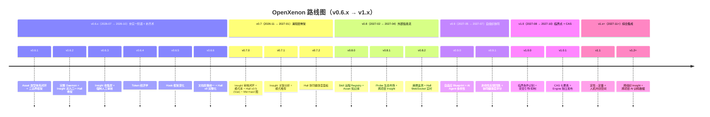

# v0.7+ 路线图总览（v0.7 → v1.x）

> **范围**：v0.7.0 之后的所有 major minor 演进（2026-11 → 2027-12）
> **目标**：从"夯实一阶道"演化到"涌现二阶道"，最终到"系统科学完整化"
> **核心约束**：所有演进都服务于"OpenXenon 帮助人机共同进化"，**不**让 OpenXenon 自身成为"自我意识"

---

## 0. 哲学锚定

### 0.1 核心命题

> **OpenXenon 是轻量级人机协作工具**。
> 它通过 IAP 范式构建的 OXN Engine 驱动，让协作"跑起来"。
> 它通过 Insight 机制捕获二阶涌现信号，赋能工程师与 AI Agent 在协作中共同成长。
> 它本身不是生命体。它是工程师手里的放大镜、安全带和进化催化剂。

### 0.2 三层能力定位

| 能力层 | 范畴 | 工具定位 | v0.6.x 状态 | v0.7+ 目标 |
|---|---|---|---|---|
| **术** | Hook / Probe / CLI | 静态能力点 | 已实现 + 深化 | 持续优化 |
| **一阶道** | IAP 范式 | 低阶、静态 | 已落地 | 可观测（v0.6.x 完） |
| **二阶道** | Insight（涌现） | 高阶、动态 | 收集层（v0.6.3） | 工程化（v0.7）→ 涌现推理（v0.9+） |

### 0.3 与系统科学的对应

> **重要声明**：v1.x 之前**不在对外文档中引入"系统科学"学术叙事**，仅在内部机制层对齐。
> 工程师从工具使用层面感受到的是"自然涌现"的效果，而非"系统科学"的术语堆砌。

| 系统科学理论 | v0.6.x 对齐 | v0.7+ 目标 |
|---|---|---|
| 系统论 | ★★★★☆ | ★★★★★ |
| 控制论 | ★★★☆☆ | ★★★★☆ |
| 信息论 | ★★★★☆ | ★★★★★ |
| 耗散结构论 | ★★☆☆☆ | ★★★☆☆ (v0.8) → ★★★★☆ (v1.0) |
| 协同论 | ★★☆☆☆ | ★★★☆☆ (v0.9) → ★★★★☆ (v1.0) |
| 突变论 | ★★☆☆☆ | ★★★☆☆ (v1.0) |
| CAS 理论 | ★★☆☆☆ | ★★★☆☆ (v1.0) |

详见 [system-science-alignment.md](./system-science-alignment.md)。

---

## 1. 整体时间线

---

## 2. v0.7 阶段：涌现层骨架（2026-11 → 2027-01）

**主题**：把"信号 → 池"升级为"信号 → 审核 → 应用"完整闭环

### 关键交付

| 交付 | 描述 | 周期 |
|---|---|---|
| **Insight 审核闭环** | `oxn insight apply <id>` 一键应用 + 自动 validate + 错误回滚 | W1-3 |
| **模式库** | `.openxenon/pools/insight-patterns/` 持久化跨 Work 模式 | W4-5 |
| **Insight 可视化** | Mermaid 关系图（Work → Insight → Asset） | W6-7 |
| **Hall v0.5** | Vue 组件化（6 大面板） | W8-10 |
| **Asset 影响图** | Hall 端展示 Insight → Asset 链路 | W11-12 |

### 不做（明确推迟）

- Hall 实时刷新（WebSocket）→ v0.8
- Hall 按钮触发 CLI → v0.8
- 模式自动 promote → **永不**

详见 [v0.7 Emergence RFC](../v0.7-emergence/design/v0.7-emergence-rfc.md)。

---

## 3. v0.8 阶段：外部信息流（2027-02 → 2027-04）

**主题**：OpenXenon 从封闭工具走向"开放协作系统"（耗散结构雏形）

### 关键交付

| 交付 | 描述 | 对应理论 |
|---|---|---|
| **Skill 远程 Registry** | `oxn skill registry <name>` 拉取社区共享 Skill/Asset/Probe | 耗散结构（负熵流） |
| **Asset 知识库** | 从 GitHub/GitLab URL 拉取 Domain 模板 | 耗散结构 |
| **Probe 生态市场** | `oxn probe search` 接入公开 Probe 仓库 | 耗散结构 |
| **跨项目 Insight 共享** | 同源 Domain 跨项目触发 Insight 共享（opt-in） | CAS（流） |
| **熵增监测** | Daemon 输出 .openxenon 体积 / Asset 冲突数 / 未 review Insight 数 | 信息论（信道容量） |
| **Hall v1（WebSocket 实时）** | 独立 Vue 组件 + 自定义路由 + WebSocket 实时推送 | 控制论（实时反馈） |

### 约束

- 所有外部拉取必须经 Proof 验证，**不可绕过 IAP**
- opt-in 机制：默认关闭，工程师显式启用

### 不做

- 远程 Asset 自动同步（v1.0+）
- 跨组织 Insight 共享（v1.x+）

---

## 4. v0.9 阶段：自组织协同（2027-05 → 2027-07）

**主题**：协同规则从"写死"到"自演化"（协同论落地）

### 关键交付

| 交付 | 描述 | 对应理论 |
|---|---|---|
| **自适应 Blueprint** | 高频 fail slot 自动生成"预 lint"建议 | 协同论 |
| **AI Agent 多样性** | OpenCode/Claude Code/Codex/Cursor 通过 Skill 协议对接 | CAS（多样性） |
| **非线性反馈回路** | Proof 同时驱动 Asset 调整 + AI 提示词（不只线性驱动下一轮） | 控制论 |
| **协同健康指标** | Daemon 输出协同健康度评分 | 协同论 |
| **Hall v1.5** | 协同健康度面板 | — |

### 关键算法

- **自适应 Blueprint**：统计 slot 历史 fail rate，> 60% 时建议增加 pre-lint 钩子
- **AI Agent 多样性**：定义 SkillAdapterId 协议，允许接入任意 AI Agent
- **协同健康评分**：综合 Round 数 / fail 率 / 平均收敛时间 / Asset 冲突数

### 不做

- AI Agent 自学习（v1.0+）
- Blueprint 自动演进（v1.0+）

---

## 5. v1.0 阶段：临界点 + CAS 完整化（2027-08 → 2027-10）

**主题**：识别"什么时候 Insight 会涌现"，并主动引导/抑制突变

### 关键交付

| 交付 | 描述 | 对应理论 |
|---|---|---|
| **临界条件识别** | 数据驱动：识别触发 Insight 涌现的"复杂度 × 失败率 × 历史"组合阈值 | 突变论 |
| **突变引导机制** | 系统接近临界点时主动注入扰动（如"试试用 invariant X 校验"） | 突变论 |
| **突变抑制机制** | 低质量 Insight 自动降权；高风险 Insight 需双重审核 | 突变论 |
| **CAS 七要素** | 多样性 / 流 / 标识 / 内部模型 / 积木块 / 聚集 / 非线性 | CAS |
| **Engine 独立发布** | `@openxenon/engine` 单独发包，支持第三方工具集成 | — |
| **Hall v2** | 完整 Web Dashboard（独立 package） | — |

### 临界点识别算法

- **特征工程**：
  - `complexity` = Asset 总 token 数 / Work 数
  - `failure_rate` = failed_rounds / total_rounds
  - `history_depth` = 同 Domain 历史 Work 数
- **阈值识别**：
  - 数据驱动：观察历史涌现时刻的特征分布
  - 机器学习：聚类 + 异常检测
- **触发**：
  - 当 (complexity, failure_rate, history_depth) 进入"涌现区"时，主动注入扰动

### 不做

- 完全自动化（人工仍是最终决策者）
- AI Agent 自演化（v1.x+）

---

## 6. v1.x+ 阶段：综合集成（2027-11+）

> **明示约束**：v1.x 之前不引入"系统科学"学术叙事，仅在内部机制层对齐。
> v1.x 开始，文档可适度提及"涌现 / 临界点 / 自组织"等概念，但仍以工程语言为主。

### 关键交付

| 交付 | 描述 | 对应理论 |
|---|---|---|
| **定性→定量转换** | "代码风格偏好"等定性描述自动转化为可度量规则集 | 综合集成方法论 |
| **专家知识显式化** | 通过对话提取工程师经验，自动生成 Asset 模板 | 综合集成方法论 |
| **人机共创空间** | 工程师在 AI 执行过程中实时干预意图/规则 | 综合集成方法论 |
| **跨组织 Insight** | 多团队 Insight 聚合（需隐私协议） | 耗散结构（开放） |
| **跨项目 AI 训练数据** | Insight 反哺后形成行业级 AI 训练数据集 | 涌现（整体论） |

### 长期愿景

- OpenXenon 从"工具"演进为"基础设施"
- 支持跨组织、跨项目的人机协作
- 工程师通过 OXN 形成"工程智慧沉淀平台"

---

## 7. 风险与缓解（整体）

| 风险 | 概率 | 影响 | 缓解 |
|---|---|---|---|
| 工程师主权被稀释 | 中 | 高 | 强制人工审核 + AI 不直接写 Asset |
| v0.7 引入 mermaid 依赖增大 | 低 | 低 | 仅 1 个，scope 限制在 Hall |
| v0.8 外部 Registry 引入恶意 Skill | 中 | 高 | Proof 验证 + opt-in |
| v0.9 自适应 Blueprint 误建议 | 中 | 中 | 工程师 approve 后才生效 |
| v1.0 临界点识别 false positive | 中 | 中 | 多维度 + 数据驱动 |
| v1.x 综合集成复杂度爆炸 | 中 | 高 | 渐进式 + 文档先行 |

---

## 8. 关键约束（每阶段必守）

| 约束 | 含义 | 检验方式 |
|---|---|---|
| **三轴主导权不交叉** | 工程师 / AI / OXN 各司其职 | ESLint |
| **Proof 不可绕过** | Daemon 硬阻断 + 无 `--force` | 单元测试 |
| **AI 不直接反写 Asset** | Insight 反哺必须人工 `apply` | code review |
| **轻量级工程边界** | 不破坏 v0.6 收敛的 E1-E4 | architecture-guard |
| **强制人工审核** | 永不自动 apply/promote | 错误码 + 警告 |
| **依赖数量控制** | v0.6.x: 0 / v0.7: +1 (mermaid) / v0.8: +2 (registry) | package.json diff |
| **对外叙事不引系统科学** | 工程师视角，不学术化 | 文档 review |

---

## 9. 资源规划

| 资源 | v0.6.x | v0.7 | v0.8 | v0.9 | v1.0 | v1.x+ |
|---|---|---|---|---|---|---|
| 工程师 | 1 全职 | 1 全职 | 1 全职 | 1 全职 | 1 全职 + 1 兼职 | 1 全职 + 2 兼职 |
| AI Agent 消耗 | 中 | 中 | 中-高 | 高 | 高 | 高 |
| 文档 | 4 份 | 4 份 | 6 份 | 6 份 | 8 份 | 10 份 |
| 设计稿 | 6 份 | 1 份 | 3 份 | 3 份 | 3 份 | 5 份 |
| 测试增量 | +106 | +31 | +50 | +50 | +80 | +100 |

---

## 10. 与系统科学理论的对应

详见 [system-science-alignment.md](./system-science-alignment.md)。

**核心论断**：
- v0.6.x 夯实一阶道（控制论一阶控制 + 信息论）
- v0.7-0.8 补齐二阶道（耗散结构雏形）
- v0.9-v1.0 引入突变论 + CAS
- v1.x+ 综合集成

---

## 11. 不在任何阶段范围（明确不做）

| 功能 | 理由 |
|---|---|
| OpenXenon 自我意识 | 工具定位 |
| AI 自主反写 Asset | 工程师主权 |
| 取代工程师做决策 | 工具定位 |
| 大模型训练数据收集（默认） | 隐私 |
| 跨组织 Insight 共享（默认） | 隐私 + opt-in |
| 实时多人协作（多工程师同时编辑） | 复杂度过高，v2.0+ 考虑 |

---

## 12. 参考

- [system-science-alignment.md](./system-science-alignment.md) — 7 大系统科学理论对齐
- [v0.6.x Roadmap RFC](../v0.6.x-observability-roadmap/design/v0.6.x-roadmap-rfc.md) — 前置
- [v0.7 Emergence RFC](../v0.7-emergence/design/v0.7-emergence-rfc.md) — v0.7 详细
- [Harness Engineering](https://mp.weixin.qq.com/s/nBtSvz9PruWe8R2UXUwQwA) — Token 经济学参考
