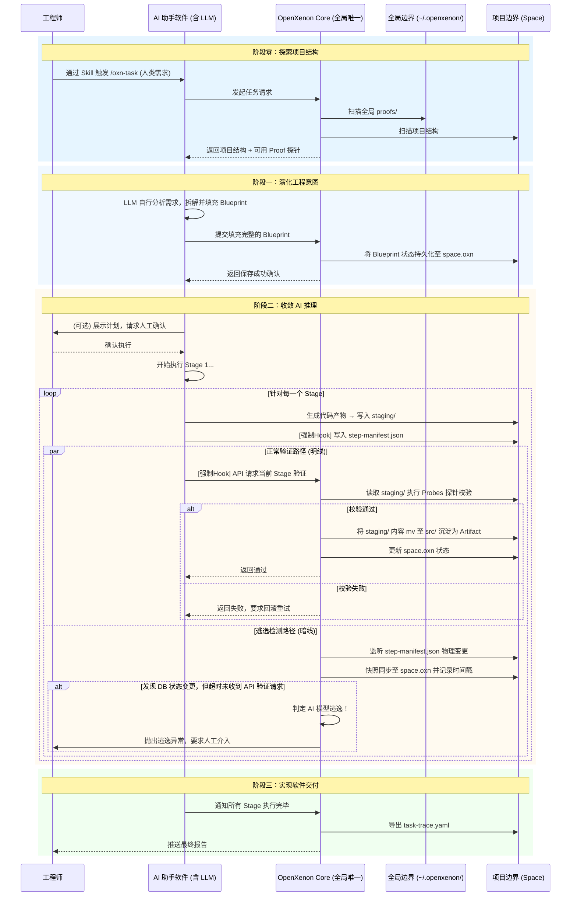

# OpenXenon

> 演化工程意图，收敛 AI 推理，实现软件交付。
>
> * 从人类需求到结构化目标
> * 从发散推理到边界约束
> * 从输出产物到工程实体

OpenXenon 是一个面向大语言模型的工程化控制引擎。它摒弃了"直接让 AI 写代码"的盲目模式，通过将宏观意图解构为拓扑蓝图、对推理过程施加物理约束、对最终产物进行机械验证，将不可靠的 AI 能力转化为可靠、可追溯的软件实体。

> **一句话定义**：轻量级、语言无关的确定性状态机引擎。将 AI 模型视为不可信的算力输出端，通过外部状态机施加物理约束，将软件工程转化为高信噪比的资产沉淀过程。

---

## 核心架构：四层拓扑

OpenXenon 的运转围绕 **Task → Blueprint → Stage → Proof** 四层架构展开：

```
┌─────────────────────────────────────────────────────────────────┐
│                     四层架构层级关系                              │
├─────────────────────────────────────────────────────────────────┤
│                                                                 │
│   Task（进行时）                                                 │
│   ├── 工程师意图的运行时容器                                     │
│   ├── 1 Task = 选择 1 Blueprint 并实例化执行                     │
│   └── AI 模型选择 Blueprint 或改进 Blueprint 来执行             │
│        │                                                         │
│        ▼                                                         │
│   Blueprint（拓扑蓝图）                                          │
│   ├── 静态拓扑定义，由 Stage 组成的有序集合                      │
│   ├── 1 个 Blueprint 实例 = 1 次 Task 的执行计划                 │
│   ├── AI 可调整 Stage 的执行顺序                                 │
│   └── AI 不可增删 Stage 结构（需走演化提案流程）                 │
│        │                                                         │
│        ▼                                                         │
│   Stage（工序节点）                                              │
│   ├── Blueprint 的最小执行单元                                   │
│   ├── 绑定固定的 Proof 组合                                      │
│   └── Stage 可变更，但需通过 Sample 机制验证后沉淀               │
│        │                                                         │
│        ▼                                                         │
│   Proof（验证闭环单元）                                          │
│   ├── 最小防线单元，包含四元组                                   │
│   │   ├── Target（目标态）：执行完毕后系统应达到的物理状态         │
│   │   ├── Spec（约束规范）：AI 必须遵守的规则红线                 │
│   │   ├── Action（执行指令）：AI 应该如何执行的提示（非必填）      │
│   │   └── Probes（探针阵列）：Core 持有的机械校验程序             │
│   └── Proof 支持参数注入                                         │
│                                                                 │
└─────────────────────────────────────────────────────────────────┘
```

### AI 模型的权限边界

| 层级 | AI 能做 | AI 不能做 |
|------|---------|-----------|
| **Task** | 选择 Blueprint、调整 Stage 顺序、注入参数 | 直接修改 Blueprint 定义 |
| **Blueprint** | 提议改进（走提案流程） | 增删 Stage |
| **Stage** | 提议新增 Proof（走 Sample 流程） | 替换绑定的 Proof |
| **Proof** | 接收参数注入、自建新 Proof（走 Sample） | 修改已有 Proof 的 Target/Spec |

---

## 核心原语

### 1. Task（工程任务）—— 进行时

工程师通过 Skill 触发的宏观业务意图的**运行时容器**。

- 每一次 `/oxn-task` 都会产生一个唯一的 Task 实例
- Task **不包含任何拓扑定义**，它只做一件事：**选择一个 Blueprint 并驱动其执行**
- Task 结束时，Core 导出 `task-trace.yaml` 作为工程案卷

```yaml
# Task 是运行时概念，只存在于 Core 内存和 space.oxn 中
task:
  id: "task_a1b2c3"
  name: "实现 RBAC 权限校验"
  status: "RUNNING"
  blueprint_id: "bp_x1y2z3"
```

### 2. Blueprint（拓扑蓝图）—— 静态定义

由多个 Stage 组成的**有序拓扑结构**，是项目中的**可复用静态资产**。

- 1 Task = 1 Blueprint 实例
- Blueprint 中的 Stage 列表是**工程师预设的固定结构**
- AI 模型**不能增删 Stage**，但可以调整执行顺序

```yaml
# .openxenon/arsenal/active/blueprints/standard-crud.yaml
blueprint:
  name: "standard_crud"
  description: "标准 CRUD 模块脚手架"
  stages:
    - "create_migration"
    - "create_model"
    - "create_controller"
    - "create_tests"
```

### 3. Stage（工序节点）—— 固定验证组合

Blueprint 中的**原子执行槽位**，一个 Stage 绑定**一组固定的 Proof**。

- 1 Blueprint → N 个 Stage
- Stage 的核心职责：**声明"这一步需要通过哪些验证"**
- 每个 Stage 关联的 Proof 组合是**固定的**

```yaml
# .openxenon/arsenal/active/stages/create-migration.yaml
stage:
  name: "create_migration"
  description: "创建数据库迁移文件"
  proofs:
    - "migration_file_exists"
    - "migration_syntax_valid"
```

### 4. Proof（验证闭环单元）—— 最小防线

最小验证闭环单元，包含四元组：

```yaml
# .openxenon/arsenal/active/proofs/migration-file-exists.yaml
proof:
  name: "migration_file_exists"
  # Target：目标态声明
  target:
    description: "迁移文件必须存在于 database/migrations/ 目录下"
    glob: "database/migrations/*_create_*.php"
  # Spec：约束规范
  spec:
    description: "必须使用 Laravel schema builder，禁止原生 SQL"
    constraints:
      - "MUST use Schema::create()"
      - "MUST NOT contain DB::raw()"
  # Action：执行指令（可选）
  action:
    instruction: "使用 php artisan make:migration 命令生成"
  # Probes：探针阵列
  probes:
    - type: "glob_match"
      pattern: "database/migrations/*_{table_name}.php"
    - type: "file_contains"
      pattern: "Schema::create"
    - type: "file_forbids"
      patterns: ["DB::raw", "DB::statement"]
```

### 5. Sample（受控样本分支）

动态逃生机制。当 AI 在 Stage 中受挫，且无法通过重试解决时，允许生成一个 Sample。

---

## 三种水流

```
正常流（确定性）
  Task 选择已有 Blueprint → 按固定 Stage + Proof 顺序执行 → 沉淀 Artifact

偏差流（微观自愈）
  Stage → Proof 校验失败 → AI 在 Stage 内部通过 Sample 生成探索性变体
  → 严格沙箱验证 → 通过则回注 Stage → 失败则丢弃

演化流（宏观涌现）
  现有 Blueprint 不满足 Task → AI 生成新的 Blueprint 结构
  → 走提案流程（Draft → Proposed → Candidate → Canonical）
  → 人工审核 → 沉淀为新的 Blueprint 资产
```

---

## 系统架构：全局/项目双层边界

```
┌─────────────────────────────────────────────────────────────────┐
│                    全局物理边界 (~/.openxenon/)                  │
├─────────────────────────────────────────────────────────────────┤
│  ~/.openxenon/                                                  │
│  ├── core.oxn            # 全局元数据                            │
│  ├── proofs/             # 全局探针库（通用验证脚本）             │
│  └── daemon.sock         # Core 进程的本地通信 Socket             │
└─────────────────────────────────────────────────────────────────┘

┌─────────────────────────────────────────────────────────────────┐
│                    项目物理边界 (<project>/.openxenon/)          │
├─────────────────────────────────────────────────────────────────┤
│  <project>/.openxenon/                                           │
│  ├── space.oxn             # [唯一真理源] 状态机 + 逃逸时间戳     │
│  │                                                                  │
│  ├── arsenal/              # [工程师武库] 静态资产定义            │
│  │   │                                                              │
│  │   ├── active/           # [绝对安全区] Core 引擎只读取此目录    │
│  │   │   ├── blueprints/   # 拓扑蓝图                             │
│  │   │   ├── stages/       # 工序节点                              │
│  │   │   └── proofs/       # 验证闭环（四元组）                    │
│  │   │                                                              │
│  │   ├── draft/            # [隔离实验区] AI 自建资产的暂存地       │
│  │   │   ├── blueprints/                                           │
│  │   │   └── proofs/                                               │
│  │   │                                                              │
│  │   └── archive/          # [历史坟场] 被废弃或淘汰的法则          │
│  │       └── blueprints/                                           │
│  │                                                                      │
│  └── tasks/                 # [运行时沙箱] 动态轨迹，随用随弃        │
│      └── <task_id>/                                                 │
│          ├── instance.json    # 正典实例化（AI 选择的顺序与参数）   │
│          ├── step-manifest.json # [单向管道] AI 写入，Core 监听       │
│          ├── params.json       # 注入参数                            │
│          ├── staging/          # [代码缓冲] AI 生成代码的暂存区      │
│          │   └── ...                                                   │
│          ├── samples/           # [临时资产] AI 自建的实验性 Proof    │
│          └── task-trace.yaml   # [交付案卷] 最终工程证明             │
└─────────────────────────────────────────────────────────────────┘
```

### 存储边界原则

> **"静态的工程定义属于文件系统（面向人类与 Git），动态的运行状态属于数据库（面向 Core 引擎）。"**

| 存储位置 | 职责 | AI 权限 |
|----------|------|---------|
| `space.oxn` (DB) | Task 状态机、逃逸时间戳、Stage 执行进度 | 只读 |
| `arsenal/active/` | Blueprint、Stage、Proof 的正式定义 | 零写权限 |
| `arsenal/draft/` | AI 提案的暂存地 | 可写（需走提案流程） |
| `tasks/<id>/` | 运行时实例化文本、参数注入、进度舱单 | 可读写 |

---

## 核心运转机制

### 探索项目结构：AI 分析现状

工程师在 AI 助手软件中通过 Skill（如输入 `/oxn-task`）触发任务并描述宏观需求。AI 首先探索当前 Space 的项目结构。

### 演化工程意图：从人类需求到结构化目标

在了解项目现状后，AI 将宏观需求转化为结构化的 `Blueprint`。Core 提供当前上下文可用的 `Proof`（验证探针）和 Blueprint 模板。真正的拆解由 AI 模型自行完成。

### 收敛 AI 推理：从发散推理到边界约束

AI 助手在执行每个具体的 `Stage` 时，被底层 Prompt 强制要求将进度写入 `step-manifest.json`。系统采用"双轨并行"机制对发散的推理进行强制收敛：

- **明线（正常约束）**：AI 完成 Stage 后主动通过 API 请求 Core 验证。Core 调用绑定的 `Spec` 规范和 `Proof` 探针进行机械校验。
- **暗线（逃逸兜底）**：Core 后台的雷达实时监听 `step-manifest.json` 的物理变更。一旦捕获变更，立即同步至 `space.oxn` 并打上时间戳。若发现状态已变更但 AI 超时未通过 API 发起验证请求，Core 直接判定 **"AI 模型逃逸"**，立刻剥夺其执行权。

### 实现软件交付：从输出产物到工程实体

软件交付并非最后一步才发生，而是伴随每个 Stage 验证通过，合规的 `Artifact`（代码文件、配置等）逐步落盘。当所有 Stage 执行完毕，Core 输出一份包含所有验证记录的 `task-trace.yaml`。

---

## OpenXenon 术语词典

### 一、系统角色

| 中文术语 | 英文标识 | 定义 |
|----------|----------|------|
| **工程师** | `Engineer` | 系统的唯一负熵源。只负责输入宏观需求和最终的异常兜底。 |
| **工作空间** | `Space` | 项目目录的物理边界。每个 Space 对应一个 `.openxenon/` 目录及 `space.oxn` 数据库。 |
| **AI 助手** | `AI Assistant` | 被降维的受控执行器。 |
| **Core 引擎** | `OpenXenon Core` | 全局唯一的二阶控制中枢。不直接生成代码，负责挂载 Space 上下文、下发边界约束、执行机械验证、检测逃逸。 |

### 二、四层架构实体

| 中文术语 | 英文标识 | 层级 | 定义 |
|----------|----------|------|------|
| **任务** | `Task` | L1 | 工程师意图的运行时容器。1 个 Task 对应 1 个活跃 Blueprint。 |
| **蓝图** | `Blueprint` | L2 | Task 的执行计划，由 Stage 组成的有序集合。 |
| **工序** | `Stage` | L3 | Blueprint 的最小执行节点。绑定固定的 Proof。 |
| **校验单元** | `Proof` | L4 | 包含 Target、Spec、Action、Probes 四元组的完整校验定义。 |

### 三、Proof 子域

| 中文术语 | 英文标识 | 定义 |
|----------|----------|------|
| **目标态** | `Target` | 声明执行完毕后系统应达到的精确物理状态 |
| **约束规范** | `Spec` | AI 在该 Proof 中必须遵守的规则红线，参数不可注入 |
| **执行指令** | `Action` | 给 AI 的执行提示，支持参数注入 |
| **探针阵列** | `Probes` | Core 持有的机械校验程序，零 AI 权限 |

### 四、存储结构

| 中文术语 | 英文标识 | 存储位置 | 定义 |
|----------|----------|----------|------|
| **武库** | `Arsenal` | `.openxenon/arsenal/` | 静态的工程法律。面向 Git 版本控制，AI 零写权限。 |
| **任务沙箱** | `Task Sandbox` | `.openxenon/tasks/<id>/` | 动态的执行隔离区。随取随用，用后即焚。 |

### 五、核心控制机制

| 中文术语 | 英文标识 | 定义 |
|----------|----------|------|
| **明线验证** | `Active Verification` | AI 主动发起的 Stage→Proof 校验路径 |
| **逃逸检测** | `Escape Detection` | Core 暗线监听 step-manifest.json 的兜底机制 |
| **模型逃逸** | `AI Escape` | AI 绕过验证网关的失控状态 |
| **样本分支** | `Sample` | AI 自建 Proof/Stage/Blueprint 时的隔离沙箱出口 |

---

## 提案流程（演化流）

参考 ECMAScript 标准提案流程，OpenXenon 的资产演化经历四个阶段：

| 阶段 | 状态名 | 物理边界 | 谁主导 |
|------|--------|----------|--------|
| **Strawman** | `DRAFT` | `arsenal/draft/` | 纯 AI |
| **Proposal** | `PROPOSED` | `arsenal/draft/` | AI 提交 |
| **Candidate** | `CANDIDATE` | 高隔离沙箱测试 | 工程师测试 |
| **Standard** | `CANONICAL` | `arsenal/active/` | 工程师确权 |

**状态作为父目录的设计**确保了 Core 引擎的纯粹白名单机制：启动时，Core 直接将 `arsenal/active/` 挂载为上下文根目录，`draft` 和 `archive` 在物理层面上根本不存在于运行时。

---

## 系统交互流程



---

## 数据结构示例

### Blueprint（聚合文件）

```yaml
# .openxenon/tasks/task_001/bp_v1.json
{
  "id": "bp_v1",
  "status": "CANONICAL",
  "stages": [
    {
      "id": "s1",
      "name": "创建用户模型",
      "validator": {
        "target": "User 模型文件存在于 app/Models/",
        "spec": "必须使用 Prisma ORM，禁止 NoSQL",
        "action": "使用 TypeScript",
        "probes": ["eslint-check", "prisma-validate"]
      }
    },
    {
      "id": "s2",
      "name": "实现中间件",
      "validator": {
        "target": "中间件文件拦截所有 /api/* 路由",
        "spec": "必须抛出 403 错误",
        "probes": ["eslint-check"]
      }
    }
  ]
}
```

---

## 技术栈

| 组件 | 用途 |
|------|------|
| **TypeScript** | 开发语言，Strict Mode |
| **Bun** | 运行时，全局常驻 Daemon |
| **Bun:sqlite** | 存储驱动，原生 C 级 SQLite 绑定 |
| **Citty** | CLI 构建器 |

### 四大命脉接口

```typescript
// 命脉一：状态真理源
export interface XnStore {
  initialize(path: string): void;
  exec(sql: string, params?: any[]): void;
  query<T = any>(sql: string, params?: any[]): T[];
  transaction<T>(callback: () => T): T;
  close(): void;
}

// 命脉二：进程沙箱
export interface XnSandbox {
  spawn(command: string, args: string[], options?: SandboxOptions): Promise<SpawnResult>;
}

// 命脉三：暗线雷达
export interface XnRadar {
  watch(path: string, callback: RadarCallback, options?: WatchOptions): () => void;
}

// 命脉四：控制通道
export interface XnTransport {
  serve(path: string, onMessage: (data: Buffer) => void): void;
  request(path: string, payload: Buffer, timeoutMs?: number): Promise<Buffer>;
  destroy(): void;
}
```

---

## 版本路线图

| 版本 | 名称 | 范围 |
|------|------|------|
| **v0.1** | The Ignition | 核心状态机点火。线性 Blueprint 执行，staging 目录缓冲，双轨并行控制 |
| **v0.5** | The Evolution | DAG 拓扑编排，提案流程，Git 分支沙箱，Sample 机制 |
| **v1.0** | The Protocol | YAML Schema 冻结，Socket API 规范冻结，协议封神 |

---

## 快速开始

```bash
# 1. 安装 CLI 工具
pnpm install -g @istuen/openxenon

# 2. 拉起全局唯一的后台控制中枢
oxn daemon start

# 3. 在当前项目建立物理围栏并注册
oxn init

# 4. 在 AI 助手中输入 /oxn-task 开始工作
```
