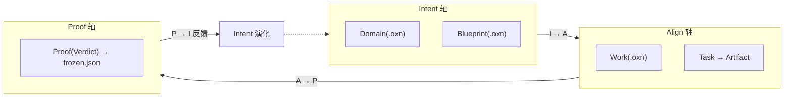

# OpenXenon

[English](./README.en.md) [简体中文](./README.md)

[](https://www.npmjs.com/package/@istuen/openxenon)
[](LICENSE)
[](https://nodejs.org)

## 什么是 OpenXenon

OpenXenon 是一款面向 AI Agent 的轻量级人机协作引擎。
它作为 Skills 注入现有的 AI Agent 工作台（如 Cursor、OpenCode、Codex、Claude Code）中。
它专注于将工程师的意图转化为 AI 可对齐的边界，并严格证明 AI 的工作结果。
OpenXenon 旨在为工程师与 AI 模型的协作，建立更好的**信任基座**。

## 为什么做 OpenXenon

在开始用 AI Agent 编程时，其表现令人惊艳。在出色完成工作之余，确实能让人感受到“数字助手”带来的美妙体验。
但当这位“数字助手”进入深度与长时间的持续开发时，情况开始变化：上下文漂移、擅改工作范围外的代码、甚至虚假完成等意外情况不断冒出。
在耗费大量精力为其纠正与返工后，我开始思考：“如何让 AI 模型能构建真正符合意图的软件工程？”
特别是“数字助手”会越来越聪明，但其底层的概率原理决定了意外状况依然会重复出现。
工程师如何信任 AI 的工作成果，同时又能让其充分释放能力？这正是 OpenXenon 探索的方向。

## 5 分钟上手

### 安装

```bash
npm install -g @istuen/openxenon
```

> [!TIP]
> 仓库源码是 dist/cli.js 的开发基底，**不是**用户安装路径。普通用户请走 `npm install -g` 路径。


### 在项目注入 OpenXenon 空间与 Skills


```bash
# cd youer/project
oxn init --ai opencode
```

### 在 AI Agent 中调用

```
/oxn-proof 验证 dist/index.js 是否存在并导出 handler
```

## AI Agent 集成

`oxn init --ai <agent>` 一步生成对应 Skill，AI 助手即可调用 `oxn` CLI。

| AI Agent        | 初始化命令               | 状态   |
| --------------- | ------------------------ | ------ |
| **OpenCode**    | `oxn init --ai opencode` | ✓ 支持 |
| **Claude Code** | `oxn init --ai claude`   | ✓ 支持 |
| **Codex**       | `oxn init --ai codex`    | ✓ 支持 |
| **Cursor**      | `oxn init --ai cursor`   | ✓ 支持 |


## IAP 范式

| 轴         | 主导者 | 产出                   | 锁定机制                                 |
| ---------- | ------ | ---------------------- | ---------------------------------------- |
| **Intent** | 工程师 | Domain / Blueprint     | `term` / `ban` / `invariant` 锁定边界    |
| **Align**  | AI     | Work / Task / Part     | Blueprint `slot` 锁定路径                |
| **Proof**  | OXN    | Proof（`frozen.json`） | Daemon 阻止假完成，**无 `--force` 绕过** |



## 文档

- 📖 **[完整文档站](./docs/index.md)** — 12 章 + 3 附录，SSOT
- 🟦 **[AI 协作者入口](./docs/zh-cn/llm-prompt.md)** — AI 模型专用协议（**仅 AI 读**）
- 🏛️ **[架构与 L0–L3 宪法](./docs/zh-cn/architecture.md)**
- 🧪 **[OXL DSL 语法](./docs/zh-cn/intent.md)**

## 路线图

| 阶段   | 目标                                                  | 状态               |
| ------ | ----------------------------------------------------- | ------------------ |
| **P0** | Proof 轴独立（`oxn proof` 闭环）                      | ✓ 已完成（v0.1.0） |
| **P1** | Intent 轴技术化（Program Domain + Blueprint）         | ✓ 已完成（v0.1.x） |
| **P2** | Intent 轴业务化（Business Domain + DDD + 沙箱 Probe） | 🔜 进行中（v0.2）   |
| **P3** | Intent 轴资产化（Intent Pool + Hall 研讨厅）          | 📋 规划中           |

详见 [路线图](./docs/zh-cn/roadmap.md)。

## 参与贡献

欢迎通过 [GitHub Issues](https://github.com/istuen/openxenon/issues) 提交 bug 报告，功能建议与交流。

## 许可证

[MIT](./LICENSE)
