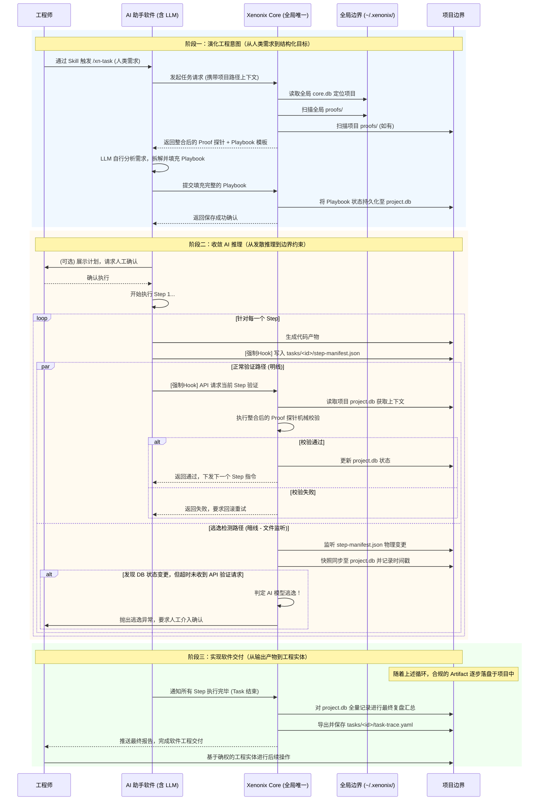

# Xenonix
> 演化工程意图，收敛 AI 推理，实现软件交付。
>
> * 从人类需求到结构化目标
> * 从发散推理到边界约束
> * 从输出产物到工程实体
Xenonix 是一个面向大语言模型的工程化控制引擎。它摒弃了“直接让 AI 写代码”的盲目模式，通过将宏观意图解构、对推理过程施加物理约束、对最终产物进行机械验证，将不可靠的 AI 能力转化为可靠、可追溯的软件实体。
## 快速开始
```bash
# 1. 安装 CLI 工具 (默认部署至 ~/.xenonix/)
curl -fsSL https://xenonix.dev/install | bash
# 2. 拉起全局唯一的后台控制中枢
xn daemon start
# 3. 在当前项目建立物理围栏并注册
xn init
# (随后在 AI 助手中输入 /xn-task 开始工作)
```

## 从源码构建

### 环境要求
- **Bun**: >= 1.0.0
- **pnpm**: >= 8.0.0 (推荐使用 pnpm 作为包管理器)

### 安装步骤

1. **克隆仓库**
```bash
git clone https://github.com/xenonix/xenonix.git
cd xenonix
```

2. **安装依赖**
```bash
pnpm install
```

3. **运行开发模式**
```bash
# 直接运行 CLI（无需编译）
pnpm dev -- --help

# 或运行测试
pnpm test
```

4. **构建可执行文件**
```bash
# 为当前平台构建
pnpm build

# 为所有平台构建
pnpm build:all

# 或分别构建
pnpm build:linux   # Linux x64
pnpm build:macos   # macOS x64
pnpm build:windows # Windows x64
```

5. **运行构建产物**
```bash
./dist/xn --help
```

### 开发脚本

| 命令 | 说明 |
|------|------|
| `pnpm dev` | 以开发模式运行 CLI |
| `pnpm build` | 构建当前平台的可执行文件 |
| `pnpm build:all` | 构建所有平台的可执行文件 |
| `pnpm test` | 运行测试套件 |
| `pnpm test:watch` | 监听模式运行测试 |
| `pnpm typecheck` | TypeScript 类型检查 |
| `pnpm clean` | 清理构建产物和依赖 |

## Skill 系统

Xenonix 提供了一套 Skill 系统，用于指导 AI 助手执行特定操作。Skill 采用 **TypeScript 源码 → Markdown 编译产物** 架构，确保类型安全。

### Skill 架构

```
src/skills/              # Skill TS 源码（类型安全）
├── types.ts             # XenonixSkill 接口定义
├── xn-init.ts           # /xn-init 指令
├── xn-task.ts           # /xn-task 指令
└── ...

src/adapters/            # 适配器
├── opencode.adapter.ts  # 编译到 .opencode/skills/
└── ...

.opencode/skills/        # 编译产物（AI 读取）
├── xn-init/SKILL.md
├── xn-task/SKILL.md
└── ...
```

### 编译 Skill

```bash
# 初始化项目时自动编译
xn init --adapter opencode

# 强制重写所有 Skill
xn init --adapter opencode --compile-force
```

### 动态寻址

所有 Skill 使用 `xn api base` 命令获取 Core 通信地址，避免硬编码：

```bash
# 获取 Core 当前地址
xn api base
# 输出: http://127.0.0.1:8420
```

### 开发新 Skill

详见 [docs/skill-development.md](docs/skill-development.md) 和 [docs/adapter-development.md](docs/adapter-development.md)

## 核心运转机制
Xenonix 的运转完全围绕上述三句话展开，它重新定义了人类、AI 助手与底层引擎之间的协作边界：
### 演化工程意图：从人类需求到结构化目标
工程师在 AI 助手软件中通过 Skill（如输入 `/xn-task`）触发任务并描述宏观需求。此时，Xenonix Core 不越俎代庖去拆解需求，而是作为“武器库”，向下提供当前上下文可用的 `Proof`（验证探针，由全局与项目目录整合而来）和 `Playbook`（执行计划模板）。真正的拆解由 AI 模型自行完成：它分析需求，将模板填充为具体的步骤，然后提交给 Core 保存。这是一种“AI 自主演化 + Core 确权固化”的结构化过程。
### 收敛 AI 推理：从发散推理到边界约束
这是系统最硬核的控制环节。AI 助手在执行每个具体的 `Step` 时，被底层 Prompt 强制要求将进度写入当前任务目录下的 `step-manifest.json`。系统采用“双轨并行”机制对发散的推理进行强制收敛：
* **明线（正常约束）**：AI 完成 Step 后主动通过 API 请求 Core 验证。Core 调用绑定的 `Spec` 规范和 `Proof` 探针进行机械校验，通过后才允许推进下一个 Step。
* **暗线（逃逸兜底）**：Core 绝对不信任 AI 的自觉性。后台的雷达会实时监听项目内 `step-manifest.json` 的物理变更，一旦捕获变更，立即将其快照同步至当前项目的 `project.db` 并打上时间戳。系统比对数据库时间戳，若发现状态已变更，但 AI 超时未通过 API 发起验证请求，Core 会直接判定 **“AI 模型逃逸”**，立刻剥夺其执行权，并抛出异常交由工程师人工确认。这彻底封死了大模型自说自话、绕过验证的可能。
### 实现软件交付：从输出产物到工程实体
软件交付并非最后一步才发生，而是伴随每个 Step 验证通过，合规的 `Artifact`（代码文件、配置等）逐步落盘于项目文件系统中。当所有 Step 执行完毕，Core 会对全量步骤进行最终复盘，从项目的 `project.db` 中抽离记录，输出一份包含所有验证记录的 `task-trace.yaml`。这份“工程案卷”向工程师证明了最终交付的软件实体不是凭空捏造的，而是步步合规、物理确权的工业产物。
## 系统架构：全局/项目双层边界

Xenonix 采用严格的全局与项目双层物理隔离架构。Core 引擎是全局唯一的常驻进程，通过挂载不同项目的上下文来实施控制。

> 详细的架构设计请参阅 [docs/architecture.md](docs/architecture.md)

### 全局物理边界 (`~/.xenonix/`)
全局边界是 Core 引擎的宿主，提供跨项目的基线能力。
```text
~/.xenonix/
├── core.db            # [全局元数据] 注册所有被 init 的项目路径、状态等
├── proofs/            # [全局探针库] 内置的通用验证探针 (如通用 eslint、语法检查等)
└── daemon.sock        # Core 进程的本地通信 Socket
```
### 项目物理边界 (`<your-project>/.xenonix/`)
项目边界是单一工程任务的执行沙箱，状态完全内聚。
```text
<your-project>/
├── .xenonix/
│   ├── project.db     # [项目状态源] 当前项目的唯一真理源 (存储状态机、逃逸时间戳)
│   ├── proofs/        # [项目探针库] (可选) 当前业务特有的验证脚本
│   └── tasks/
│       └── <task_id>/
│           ├── step-manifest.json  # [单向管道] 由 AI 写入，由 Core 监听并同步至 project.db
│           └── task-trace.yaml     # [交付物] 任务完成后由 Core 从 project.db 导出的最终案卷
└── src/               # 你的业务代码 (Artifact 落盘处)
```
## 系统交互流程
以下流程图展示了工程师、AI 助手软件、全局 Core 与项目沙箱在这三个阶段中的完整交互拓扑：

## 数据结构：Playbook 示例
这是一个由 AI 助手拆解并提交给 Core 保存的最小 Playbook 结构，展示了 `Step`、`Spec`、`Proof` 的强绑定关系：
```yaml
task: "实现 RBAC 权限校验"
steps:
  - id: step_1
    name: "定义数据模型"
    spec: "禁止使用 NoSQL，必须使用 Prisma ORM 定义 User 与 Role 的多对多关系表"
    proof: "prisma-validate"  # Core 会优先在项目 proofs/ 查找，找不到则降级到全局 proofs/
  - id: step_2
    name: "实现中间件"
    spec: "必须拦截特定路由，且不可绕过，抛出 403 错误需符合 RFC 规范"
    proof: "eslint-and-test"
```
## Xenonix 术语词典
### 一、 系统角色
| 中文术语        | 英文标识       | 定义                                                                                                   |
| :-------------- | :------------- | :----------------------------------------------------------------------------------------------------- |
| **工程师**      | `Engineer`     | 系统的唯一负熵源。只负责输入宏观需求和最终的异常兜底，不参与底层的代码拼装与过程纠偏。                 |
| **AI 助手软件** | `AI Assistant` | 包含大语言模型的宿主环境（如 IDE 插件或 Web 端）。在 Xenonix 体系中，它被降维为受控的执行器。          |
| **Core 引擎**   | `Xenonix Core` | **全局唯一**的二阶控制中枢。不直接生成代码，负责挂载项目上下文、下发边界约束、执行机械验证、检测逃逸。 |
### 二、 意图演化阶段
| 中文术语     | 英文标识   | 定义                                                                                       |
| :----------- | :--------- | :----------------------------------------------------------------------------------------- |
| **任务**     | `Task`     | 工程师通过 Skill 触发的最宏观的业务目标。会在项目边界内生成唯一的 `task_id`。              |
| **执行计划** | `Playbook` | 由 AI 助手基于 Core 提供的模板，自行拆解并填充生成的结构化执行蓝图，提交给 Core 保存确权。 |
### 三、 推理收敛阶段
| 中文术语     | 英文标识 | 定义                                                                                   |
| :----------- | :------- | :------------------------------------------------------------------------------------- |
| **原子步骤** | `Step`   | Playbook 中的最小执行单元。AI 助手必须以 Step 为粒度推进任务。                         |
| **执行规范** | `Spec`   | 绑定在 Step 上的边界约束条件，规定了 AI 在这一步“必须遵守什么规则、不能生成什么内容”。 |
| **验证探针** | `Proof`  | Core 持有的机械级校验程序。采用“项目优先，全局兜底”的整合策略。                        |
### 四、 交付与追踪阶段
| 中文术语     | 英文标识             | 定义                                                                                                             |
| :----------- | :------------------- | :--------------------------------------------------------------------------------------------------------------- |
| **工程产物** | `Artifact`           | 经历了 Spec 约束且通过 Proof 验证的最终合法输出物（落盘于项目业务目录）。                                        |
| **步骤舱单** | `step-manifest.json` | 位于 `.xenonix/tasks/<id>/` 下。**由 AI 写入、由 Core 监听**的物理文件，作为进度同步到 `project.db` 的单向管道。 |
| **任务轨迹** | `task-trace.yaml`    | 位于 `.xenonix/tasks/<id>/` 下。Task 完成后由 Core 从 `project.db` 导出的链路追踪文件。                          |
### 五、 核心控制机制
| 中文术语     | 英文标识              | 定义                                                                                                                    |
| :----------- | :-------------------- | :---------------------------------------------------------------------------------------------------------------------- |
| **明线验证** | `Active Verification` | AI 主动通过 API 发起的正常校验路径（完成 Step -> 请求 Core -> Proof 校验）。                                            |
| **逃逸检测** | `Escape Detection`    | Core 的暗线兜底机制。监听 JSON 变更同步至项目 `project.db`，若比对发现状态已变更但超时未收到 API 验证请求，则判定逃逸。 |
| **模型逃逸** | `AI Escape`           | AI 助手绕过 Core 的验证网关，陷入发散推理或自说自话的失控状态。一旦触发，Core 会立即熔断任务并上报工程师。              |
---
## Xenonix 指令
```bash
# 主命令：xn (或 xenonix)
```
| CLI 命令                      | 使用场景                                    | 机械行为                                                                                                                                                               |
| :---------------------------- | :------------------------------------------ | :--------------------------------------------------------------------------------------------------------------------------------------------------------------------- |
| **`xn init`**                 | 项目首次接入 Xenonix                        | 1. 在当前目录生成 `.xenonix/` 及 `project.db`。<br>2. 向全局 `core.db` 注册当前项目路径。                                                                              |
| **`xn daemon`**               | 管理全局 Core 引擎的生命周期                | `xn daemon start` / `stop` / `status`。拉起或挂载全局唯一的常驻进程。                                                                                                  |
| **`xn inspect`**              | 怀疑 AI 篡改了状态，需要看最底层的真相      | 直接 `cat` 输出当前任务下的 `step-manifest.json` 原始内容。                                                                                                            |
| **`xn trace`**                | 终端里直接查看案卷，不依赖 AI 解读          | 直接 `cat` 输出当前任务下的 `task-trace.yaml` 原始内容。                                                                                                               |
| **`xn rollback <step_id>`**   | **极其危险但必要**。AI 逻辑崩盘，删垃圾代码 | 1. 读取 `task-trace.yaml` 找到该 Step 产出的 Artifact。<br>2. 执行物理 `rm -rf`。<br>3. 强行回退 `project.db` 及 `step-manifest.json` 状态。<br>*(绝对不能交给 AI 做)* |
| **`xn force-pass <step_id>`** | 极端情况：Proof 探针写错，正常代码无法通过  | 工程师强制修改当前项目的 `project.db` 中该 Step 状态为 `passed`。                                                                                                      |
---
## AI Assistant Skills 词典
在 AI 助手里输入的 `xn-*` 指令，核心特征是：**必须经过 LLM 的理解与转化，再由 LLM 代为向全局 Core 发起 HTTP 请求。**
| Skill 指令       | 阶段映射 | 意图描述                                      | AI 助手被触发后的内部行为                                                                                              |
| :--------------- | :------- | :-------------------------------------------- | :--------------------------------------------------------------------------------------------------------------------- |
| **`/xn-init`**   | 环境准备 | **初始化围栏**。在当前项目植入 Xenonix 基因。 | 1. 向 Core 发起初始化请求。<br>2. Core 建立项目边界并注册至全局。<br>3. AI 提示工程师：围栏已建立。                    |
| **`/xn-task`**   | 演化意图 | **发起任务**。工程师输入宏观需求。            | 1. 截获需求，向 Core 获取全局+项目整合的 `Proof` + 模板。<br>2. LLM 自行拆解填充 Playbook。<br>3. 提交 Core 保存确权。 |
| **`/xn-resume`** | 收敛推理 | **恢复断点**。从中止的步骤继续执行。          | 1. 读取项目内的 `step-manifest.json`。<br>2. 定位失败或未完成的 Step。<br>3. 恢复执行循环。                            |
| **`/xn-status`** | 通用     | **状态体检**。通过 AI 的自然语言了解进度。    | 1. 向 Core 请求当前项目的 `project.db` 状态。<br>2. LLM 将状态转化为人类易读的进度报告。                               |
| **`/xn-stop`**   | 收敛推理 | **人工熔断**。要求 AI 停止一切生成行为。      | 1. AI 立即停止当前 Step 的写入。<br>2. 向 Core 发送强制终止信号，锁定项目状态。                                        |
| **`/xn-trace`**  | 交付实体 | **轨迹取证**。让 AI 帮忙解读交付案卷。        | 1. 向 Core 请求拉取当前任务的 `task-trace.yaml`。<br>2. LLM 总结案卷内容，解释验证得失。                               |
> *(注：AI 助手在执行 `/xn-task` 循环时，还会被底层 Prompt 强制执行两个不可见的内部 Hook：`[xn-update]` 将状态写入项目内的本地 JSON，`[xn-verify]` 主动调用 Core API 请求验证。)*
---
## 技术实现
### 一、 核心引擎层
这是 Xenonix 的大脑，作为全局单例处理跨项目状态调度和 API 服务。
* **运行时：Bun**
    *   **理由**：Xenonix 作为全局常驻的 Daemon，对启动速度和内存占用极度敏感。Bun 基于 JavaScriptCore，冷启动毫秒级，原生打包为单一可执行文件，保持了“无依赖分发”的极客体验。
* **TypeScript (Strict Mode)**
    *   **理由**：**类型即约束**。Xenonix 的本质是对 AI 进行约束，约束的边界本身必须绝对严密。TS 可以让 `Playbook`、`Spec`、`Proof` 的接口在 Core 和 AI 助手（如 Cursor 插件）之间做到**端到端的类型同构**。
### 二、 数据与双层状态持久化层
彻底解决“AI 明线写入”与“Core 暗线判定”的高频并发撕裂风险，同时隔离全局元数据与项目业务状态。
* **全局状态：SQLite (`~/.xenonix/core.db`)**
    *   **职责**：仅存储跨项目的注册表（项目绝对路径、最后一次心跳时间等），不参与任何业务逻辑的推理判定。
* **项目状态：SQLite (开启 WAL 模式的 `<project>/.xenonix/project.db`)**
    *   **职责**：作为单个项目的**唯一状态真理源**。SQLite WAL 模式实现无锁并发读与原子写，所有的状态流转、逃逸判定时间戳、Proof 校验日志均强一致写入此库。
* **管道设计 (JSON -> DB)**
    *   **理由**：为了兼容 LLM 最底层的文件输出能力，系统保留了 `step-manifest.json` 作为单向写入管道。AI 只能写 JSON，Core 通过文件监听捕获变更并灌入当前项目的 `project.db` 进行时间戳比对，彻底杜绝了 AI 篡改底层状态源的可能。
* **驱动层：Bun:sqlite**
    *   **理由**：原生内置 C 级 SQLite 绑定，零 npm 依赖，零拷贝读取，极其硬核。
### 三、 交互与通信层
连接“工程师终端”、“AI 宿主插件”与“全局 Core Daemon”的神经通路。
* **本地服务：Bun.serve**
    *   **理由**：无需引入臃肿的 Web 框架，原生 `Bun.serve` 极致轻量，微秒级路由解析。AI 助手的请求携带隐式的项目路径（CWD），Core 据此动态切换上下文句柄。
* **CLI 构建器：Citty**
    *   **理由**：Unjs 生态下的极简工具，类型推导完美，构建 `xn init`, `xn rollback` 等嵌套子命令手感极佳。
### 四、 Core HTTP API 规范
AI 助手的 Skill 实际上是对以下核心接口的封装调用（默认监听 `127.0.0.1:8420`，通过当前工作目录 CWD 隐式绑定项目）：
| 接口路径                 | 方法 | 对应 Skill    | 核心职责                                                                        |
| :----------------------- | :--- | :------------ | :------------------------------------------------------------------------------ |
| `/api/v1/workspace/init` | POST | `/xn-init`    | 创建项目 `project.db`，并向全局 `core.db` 注册路径。                            |
| `/api/v1/proofs/list`    | GET  | `/xn-task`    | 整合全局 `~/.xenonix/proofs/` 与当前项目 `.xenonix/proofs/`，返回可用探针列表。 |
| `/api/v1/task/submit`    | POST | `/xn-task`    | 接收 AI 填充好的 Playbook 并落盘至当前项目的 `project.db`。                     |
| `/api/v1/step/verify`    | POST | `[xn-verify]` | 接收 AI 的明线校验请求，触发 Proof 探针（优先项目级，降级全局级）。             |
| `/api/v1/task/status`    | GET  | `/xn-status`  | 返回当前项目 `project.db` 中的真实任务状态机。                                  |
| `/api/v1/task/stop`      | POST | `/xn-stop`    | 强制熔断，冻结当前项目的 `project.db` 状态机。                                  |
| `/api/v1/task/trace`     | GET  | `/xn-trace`   | 触发当前项目 DB 数据导出，生成 `task-trace.yaml`。                              |
*(注：工程师使用的 CLI 命令如 `xn rollback`，拥有比 API 更高优先级的本地 `project.db` 直写权限，用于紧急物理救火。)*
### 五、 执行与沙箱层
执行 `Proof` 探针，对 AI 产物进行物理隔离校验。
* **进程控制：Bun.spawn**
    *   **理由**：比 Node.js 的 `child_process` 更底层。极低开销拉起校验子进程，流式精准捕获 Stderr，能在发现红线时纳秒级发送 SIGKILL，防止死循环代码拖垮全局 Core。
* **沙箱机制：OS 级虚拟文件系统**
    *   *(注：此层与语言无关)* 在执行 Proof 前，Core 通过系统调用动态创建隔离环境，将待测的 Artifact 映射进去执行，结束后销毁，保证宿主项目绝对干净。
