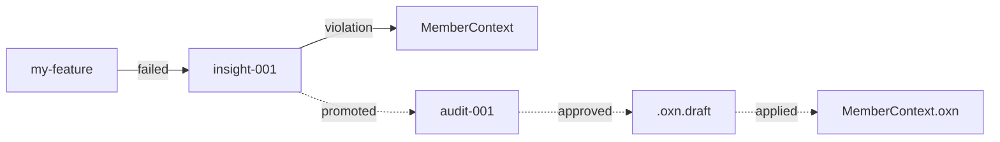

# 涌现层骨架：Insight 工程化 + Hall v0.5 + Infra Ports 扩展

> **主题**：把 Insight 从"收集"升级到"工程化"——`oxn insight apply` 一键应用草案闭环 + 模式库持久化 + Insight 关系图（Mermaid 渲染）+ Hall v0.5 Vue 组件化。同时落地 Infra Ports 三件套（ResourcePort / CachePort / WorkSnapshot），让可观测性 hot path 提速 50-500 倍。
>
> **前提**：~（scheduling 决定）（Insight 收集层 + Hall v0 完整化）。
> **核心 RFC**：[v0.7 Emergence RFC](../../.openxenon/pools/sprints/v0.7-emergence/design/v0.7-emergence-rfc.md) · [v0.7.0 Infra Ports RFC](../../.openxenon/pools/sprints/v0.7-emergence/design/v0.7.0-infra-ports-rfc.md)

## 核心变化

### 1. Insight 审核闭环（`oxn insight apply`）

```bash
$ oxn insight apply insight-2026-11-15-001
# → Reading audit entry ...
# → Asset draft found: .openxenon/assets/domain/MemberContext.oxn.draft
# → Running: oxn domain validate MemberContext
#   → ✓ Invariant added
#   → ✓ planLock recomputed
# → ✓ Insight applied
```

**关键不变量**：
- 仍是**显式**命令（**不**自动触发）
- 仍可单独 `oxn insight approve` 不 apply
- 失败自动回滚（备份 `.bak`）

### 2. 模式库持久化（`.openxenon/pools/insight-patterns/`）

```json
{
  "id": "pattern-2026-11-15-C1",
  "domain": "CodeQualityContext",
  "pattern": "C1: ESM project forbids require()",
  "occurrences": 5,
  "confidence": 0.78,
  "status": "open"
}
```

CLI：`oxn insight patterns list/show/promote/archive`

### 3. Insight 可视化（Mermaid 关系图）

`/hall/insight/<id>/graph` 渲染 Work → Insight → Asset 关系图：



### 4. Hall v0.5 Vue 组件化

| 面板 | 路径 | 职责 |
|---|---|---|
| HealthPanel | `/hall/health/` | 实时 health.json + Probe 通过率 |
| InsightPanel | `/hall/insight/` | 列表 + 详情 + 过滤 |
| InsightGraph | `/hall/insight/<id>/graph` | Mermaid 渲染 |
| HooksPanel | `/hall/hooks/` | events.jsonl 流水 |
| PatternsPanel | `/hall/patterns/` | 模式库浏览（v0.7 新增） |
| AssetsPanel | `/hall/assets/` | Asset 影响图（v0.7 新增） |

**v0.7 唯一新依赖**：`mermaid`（v0.6.x 期间唯一允许的新包）。

### 5. Infra Ports 三件套（ADR-0028）

#### 5.1 ResourcePort（虚拟 FS）

```ts
interface ResourcePort {
  read(path: string): Promise<Buffer>
  list(prefix: string): Promise<string[]>
  exists(path: string): Promise<boolean>
}
```

支持的 backend：
- `fs-resource.ts`（本地 fs 包装）
- `s3-resource.ts`（AWS S3，可选依赖）
- `slack-resource.ts`（Slack 文件，可选依赖）

路径语法：`s3://my-bucket/config.json` 自动路由到 S3 backend。

#### 5.2 CachePort（RAM / Redis 双模式）

```ts
interface CachePort {
  get<T>(key: string): Promise<T | undefined>
  set<T>(key: string, value: T, ttlMs?: number): Promise<void>
}
```

| 操作 | v0.6.x（文件 IO） | v0.7.0（RAM Cache） |
|---|---|---|
| `get probe-stats` | 5-20ms | < 0.1ms |
| 100 Probe 并发 update | 50ms 串行 | 5ms 并行 |

#### 5.3 WorkSnapshot（可序列化全状态）

```bash
oxn work snapshot <work>              # → .openxenon/works/<w>/.snapshot.json
oxn work snapshot <work> --export     # → stdout (Base64)
oxn work restore <work> --from <file> # 从 snapshot 恢复
```

适用场景：CI/CD 跨节点传输 / 远程审计 / Work 状态归档。

### 6. 错误码扩展

```typescript
ExecErrorCode = {
  // v0.6.x 已有 ...
  // v0.7.0 新增：
  OXNI_INSIGHT_DRAFT_NOT_FOUND: 'OXNI_INSIGHT_DRAFT_NOT_FOUND',
  OXNI_INSIGHT_VALIDATE_FAILED: 'OXNI_INSIGHT_VALIDATE_FAILED',
  OXNI_PATTERN_NOT_FOUND: 'OXNI_PATTERN_NOT_FOUND',
  OXNI_PATTERN_ALREADY_PROMOTED: 'OXNI_PATTERN_ALREADY_PROMOTED',
  OXNI_PATTERN_DUPLICATE: 'OXNI_PATTERN_DUPLICATE',
  HALL_RENDER_FAILED: 'HALL_RENDER_FAILED',
}
```

### 7. 三相模型 + Loop 三维观测（ADR-0006 / 0007 · SSOT 已落）

v0.7.0 是 ADR-0006 三相模型（静态结构 → Loop → 静态产物）+ ADR-0007 Loop 行为观测三维度（命令 + 命中规则 + 反复重试）的首个落地版本。详见 [docs/zh-cn/core-concepts.md](../../docs/zh-cn/core-concepts.md) §11-§12。

## 物理布局（本版本新增/修改）

### 新增

```
packages/engine/src/Insight/
├── pattern-library.ts             # 模式库持久化
├── apply-draft.ts                 # Insight 草案应用
├── graph-builder.ts               # L0 关系图构建（DOT 字符串）
└── __tests__/...

packages/engine/src/kernel/contracts/
├── resource-port.ts               # ResourcePort 接口
└── cache-port.ts                  # CachePort 接口

packages/engine/src/infra/
├── resource/                      # ResourcePort 实现 + Router
│   ├── resource-port.ts
│   ├── fs-resource.ts
│   ├── s3-resource.ts (可选)
│   ├── slack-resource.ts (可选)
│   └── __tests__/...
├── cache/                         # CachePort 实现
│   ├── cache-port.ts
│   ├── ram-cache.ts               # 默认
│   └── __tests__/...

packages/engine/src/Work/
├── work-snapshot.ts               # captureWorkSnapshot + restoreWorkSnapshot
└── __tests__/...

packages/cli/src/commands/
├── insight-apply.ts               # oxn insight apply
├── insight-patterns.ts            # oxn insight patterns
├── work-snapshot.ts               # oxn work snapshot
├── work-restore.ts                # oxn work restore
└── __tests__/...

docs/.vitepress/theme/components/
├── HealthPanel.vue
├── InsightPanel.vue
├── InsightGraph.vue
├── HooksPanel.vue
├── PatternsPanel.vue
└── AssetsPanel.vue
```

### 修改

- `package.json` — 新增 `mermaid`（唯一强制新依赖）
- `packages/cli/src/index.ts` — 注册 `insight apply` + `insight patterns` + `work snapshot/restore`
- `packages/engine/src/infra/probes/probe-stats-store.ts` — 集成 CachePort
- `docs/.vitepress/config.ts` — Hall 路由扩展

### 运行时产物

```
.openxenon/pools/insight-patterns/    # v0.7 新增
├── pattern-2026-11-15-C1.json
├── pattern-2026-11-15-C2.json
└── ...
```

## 测试 / 构建结果（目标）

- **typecheck**: 0 errors ✅
- **biome check**: 0 issues
- **测试**: ≥ 2,058 pass（前置版本末 1,996 + 31 emergence + 31 infra-ports）
- **CLI build**: 集成 mermaid 后 ~3.6MB bundled
- **Hall build**: VitePress + Vue 组件正常渲染

## 风险与缓解

| 风险 | 概率 | 影响 | 缓解 |
|---|---|---|---|
| apply 失败导致 Asset 损坏 | 低 | 高 | 备份 `.bak` + 回滚机制 |
| 模式库膨胀 | 中 | 低 | 30 天归档（v0.6.2 策略） |
| Hall Vue 组件构建失败 | 中 | 中 | 降级到 v0.6.5 静态站 |
| Mermaid 渲染性能 | 中 | 低 | 仅 detail 页加载 |
| CachePort 与 disk 数据不一致 | 中 | 中 | 启动 disk-rehydrate + 异步落盘 |
| ResourcePort 远程 IO 慢 | 中 | 中 | Probe-level timeout 30s |

## 本版本不做（明确推迟）

| 功能 | 推迟到 |
|---|---|
| Hall 实时刷新（WebSocket） | v0.8 |
| Hall 按钮触发 CLI | v0.8 |
| Insight 自动 apply | **永不** |
| 模式自动 promote | **永不** |
| ResourcePort 写入操作 | **永不**（只读） |
| Redis Cluster / 多层 Cache | v1.0 |

## 迁移路径（开发者视角）

```bash
# 项目从 v0.6.x 升级到 v0.7.0
bun install
bun run langium:generate  # 如有 OXL grammar 变化
bun run build
oxn --version  # 验证 0.7.0

# 启用 Hall v0.5（默认开启）
bun run docs:dev  # 访问 http://localhost:5173/hall/

# 应用第一个 Insight（手动）
oxn insight list
oxn insight apply insight-XXX
```

## 参考

- [v0.7 Emergence RFC](../../.openxenon/pools/sprints/v0.7-emergence/design/v0.7-emergence-rfc.md) ✅ Approved 2026-07-01
- [v0.7.0 Infra Ports RFC](../../.openxenon/pools/sprints/v0.7-emergence/design/v0.7.0-infra-ports-rfc.md) 📝 Draft
- [v0.7+ Roadmap Overview](../../.openxenon/pools/sprints/v0.7-plus-roadmap/overview.md) §2 v0.7 阶段
- [v0.6.x Roadmap RFC](../../.openxenon/pools/sprints/v0.6.x-observability-roadmap/design/v0.6.x-roadmap-rfc.md) — 前置
- [v0.6.2 Insight Design](../../.openxenon/pools/sprints/v0.6.x-observability-roadmap/design/v0.6.2-insight-design.md) — 基础