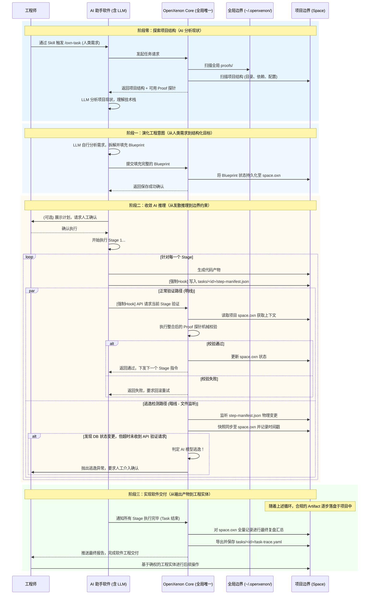

# 3. 完整生命周期

## 交互流程

一次完整的 OpenXenon 运行周期如下：

```
[加载 Blueprint]
       |
       v
[执行当前 Stage，加载边界规则] ---> [将 Prompt 发送给 LLM]
       |
       v
[LLM 返回代码变更]
       |
       v
[Proof 执行 Diff 审计与特征匹配]
       |
       +---> (越界/违规) ---> [熔断丢弃] ---> [记录审计日志] ---> [终止或人工介入]
       |
       +---> (未违规，但业务逻辑受挫/编译失败)
       |         |
       |         v
       |    [触发 Sample 机制] ---> [在临时高隔离边界内生成探索性代码]
       |         |
       |         v
       |    [人工审核或严格沙箱验证] ---> (通过) ---> [固化为新 Stage，回注 Blueprint]
       |                                 |
       |                                 (失败) ---> [丢弃，保持原状]
       |
       +---> (严格通过) ---> [沉淀为 Artifact，安全合入工作区]
       |
       v
[解锁下一 Stage，继承当前 Artifact 状态] ---> 继续流转...
```

## 三种水流

OpenXenon 将复杂的 AI 协作严格切分为三种清晰的水流：

| 水流 | 类型 | 说明 |
|------|------|------|
| **正常流** | 确定性 | AI 严格执行 CANONICAL 状态的 Blueprint，Stage 顺序流转，最终沉淀为 Artifact |
| **偏差流** | 微观自愈 | 触发 Sample。AI 在单个节点边界内探索变体，系统自动校验，风险极低 |
| **演化流** | 宏观涌现 | 触发 Draft。AI 推翻整体规划，以"物理提案"形式上交人类，风险极高，需人类裁决 |

## 适用场景

1. **遗留系统安全重构**：在缺乏测试的老代码库中，通过 Blueprint 路径锁死；遇到历史遗留的奇葩逻辑时，通过 Sample 打补丁
2. **团队工程规范强制落地**：将高级架构师的经验编写为 Blueprint，初级工程师的产出被强制约束在 Blueprint 内
3. **复杂业务流编排**：将涉及多表变更、多服务联调的需求，拆解为 DAG 蓝图，让 AI 在确定的拓扑轨道上精确作业

## 系统交互流程图



## 系统架构：全局/项目双层边界

OpenXenon 采用严格的全局与项目双层物理隔离架构。Core 引擎是全局唯一的常驻进程，通过挂载不同项目的上下文来实施控制。

### 全局物理边界 (`~/.openxenon/`)

```
~/.openxenon/
├── core.oxn            # 全局元数据：注册所有被 init 的项目路径、状态等
├── proofs/            # 全局探针库：内置的通用验证探针
└── daemon.sock        # Core 进程的本地通信 Socket
```

### 项目物理边界 (`<your-project>/.openxenon/`)

```
<your-project>/
├── .openxenon/
│   ├── space.oxn     # 项目状态源：当前项目的唯一真理源
│   ├── proofs/        # 项目探针库（可选）
│   └── tasks/
│       └── <task_id>/
│           ├── step-manifest.json  # 单向管道：AI 写入，Core 监听
│           └── task-trace.yaml     # 交付物：任务完成后的最终案卷
└── src/               # 业务代码 (Artifact 落盘处)
```

> 详细的架构设计请参阅 [docs/architecture.md](../architecture.md)。

## 下一章

下一章将介绍 [CLI 命令参考](./04-cli-ref.md)。