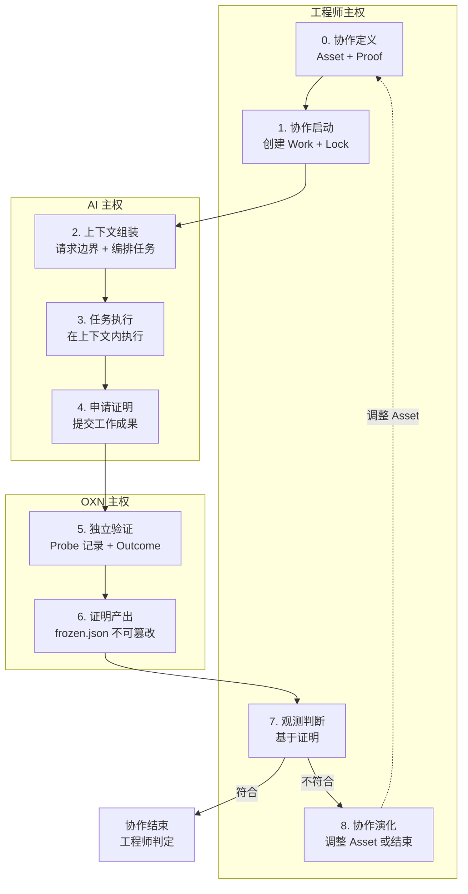
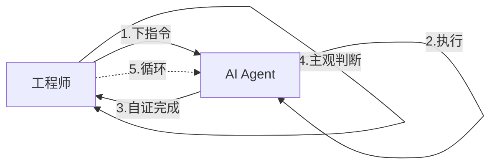
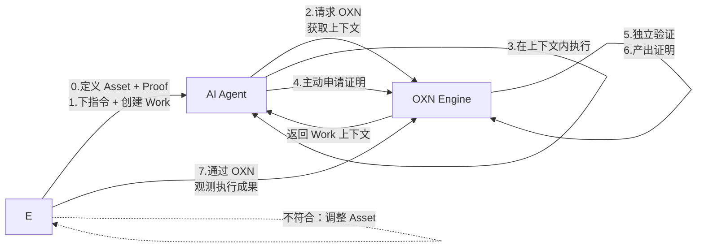

# OpenXenon 协作生命周期

> OpenXenon 是人机协作工具，支撑工程师与 AI Agent 之间的协作链路。
> 本页定义 9 个阶段的完整生命周期。

## 定位说明

OpenXenon 是**人机协作工具**。它不替代工程师与 AI Agent 的直接协作，也不充当协作中介，而是提供**强化 + 可靠**的协作链路支撑。

三方的角色分工：

| 主体 | 角色 |
|---|---|
| 工程师 | 提供协作定义（[Asset](/glossary/zh-cn/asset-terms#asset) + [Proof](/glossary/zh-cn/proof-terms#proof)） |
| AI Agent | 协作记录（[Work](/glossary/zh-cn/core-terms#work)） |
| OXN Engine | 支撑协作链路（工具 + 记录 + 验证） |

- 工程师用 Asset 定义协作边界，用 Proof 定义验证机制
- AI Agent 在 Work 中记录执行过程
- OXN Engine 把 Asset 转换成 Work 上下文，根据上下文检测执行成果

工程师 ↔ AI Agent 的直接协作链路保持不变。OXN 是 AI 在执行过程中"使用"的工具，不是协作中介。

## 9 个阶段概览

## 阶段 0 — 协作定义

**主权**：工程师

工程师用 Asset 定义协作，用 Proof 定义验证机制。Asset 是 OXN 协作链路的"定义层"，描述 AI 工作的边界、约束、可观测指标。

- **工具**：`oxn asset create` / `oxn asset evolve` / `oxn asset archive`
- **产出**：项目资产目录下 `{kind}/<name>.md`（由 `assetRoot` 配置，默认位于项目根目录的隐藏 assets 目录）
- **Asset 5 类**：
  - Domain：业务边界（terms / bans / invariants）
  - Workflow：执行边界（slot DAG + observe Probe）
  - Stack：环境约束（language / runtime / linter / test）
  - Blueprint：组合模板，引用 Domain + Workflow + Stack
  - Roadmap：meta 索引层
- **Proof 范畴**：Probe 目录（`@oxn/probes/*`，15 个 builtin）+ ProbeOutcome 判定策略

## 阶段 1 — 协作启动

**主权**：工程师

工程师下指令给 AI Agent（原协作链路保持），同时用 OXN 创建 Work 把这次协作结构化。

- **工具**：`oxn work create` + `oxn work lock`
- **产出**：
  - `works/<w>/work.md`（协作声明）
  - `works/<w>/.work/birth-cert.json`（Asset 引用快照）
  - `works/<w>/.work/planLock`（协作指纹锁定）
- **关键动作**：
  - 引用 Blueprint（决定哪些 Asset 进入 Work 上下文）
  - Lock 时计算 `planLock`（`workMdHash` + `blueprintsHash` + `tasksHash` + `allHash`）
  - Lock 失败 → IAPError（`OXN_ALIGN_LOCK_HASH_MISMATCH`）

## 阶段 2 — 上下文组装

**主权**：AI Agent

AI Agent **主动请求** OXN Engine 获取 Blueprint 上下文，把获取的边界组装成本次执行的上下文，并编排执行任务。

- **工具**：`oxn work context`
- **产出**：`WorkContextResult`，含：
  - `injectedDomains[].language.{terms,ban,invariant}`（Domain 注入）
  - `allowedLanguage`（聚合后的术语 / 禁令 / 不变量）
  - `taskParts[].name + skillContext`（AI 可见的三层上下文）
  - `stackTools[]`（Stack 工具元数据）
  - `taskParts[].probes[{name,ref}]`（Probe 调用面）
- **信息隐藏**：
  - AI 看到 Probe 的 `name + ref + params`（能不能调用）
  - AI **看不到** Probe 的 `internalRef + inputMap`（不能游戏评判标准）
  - AI **看不到** Probe 的执行结果与判定（probing 是闭盒）
  - frozen.json / state.json 对 AI **不可写**

## 阶段 3 — 任务执行

**主权**：AI Agent

AI Agent 在 Work 上下文内执行。OXN **不干预**（不试图限制 AI），AI 自由生成输出。

- **执行内容**：
  - AI 根据 terms / bans / invariants 约束自己的输出
  - AI 根据 part 的 skillContext 完成具体任务
  - AI 跑命令、改文件、产出工作成果
- **OXN 行为**：
  - 不监督 AI 的每一步动作（post-hoc 审计，不是预防限制）
  - 不实时判定 AI 是否越界（边界判定在阶段 5 跑 Domain invariant）
- **写入权限**：
  - AI 可写 `trace.jsonl`（append-only 事件流）
  - AI **不可写** `state.json` / `frozen.json`

## 阶段 4 — 申请证明

**主权**：AI Agent

AI Agent 把执行成果**主动提交**给 OXN Engine。这是 AI 的"完成报告"动作——AI 不是被动等待 OXN 收集，而是主动申请证明。

- **工具**：`oxn work submit <workName> <taskName>`
- **产出**：
  - `state.json` 状态更新（Engine 写入）
  - `trace.jsonl` 事件追加
  - probeResults 返回给调用方（非终态）/ 写入 task frozen.json（终态）
- **关键原则**：
  - Trace-before-State：trace 先写，state 后写
  - 写权独占：`state.json` 只有 Engine 能写

## 阶段 5 — 独立验证

**主权**：OXN Engine

OXN Engine 通过 Probe 记录执行事实，并对照 Blueprint 的 observe 列表验证。这是 OXN 的"独立验证"动作——不依赖 AI 自报，独立观测。

- **验证机制**：
  - Probe 跑工程师预声明的检查（fs-exists / shell-exec / test-pass / ts-compiles / lint-check 等）
  - `ProbeObservation` → Kernel `judge` → `ProbeOutcome`（COMPLETED / DEVIATED / INCONCLUSIVE）
  - finalize 时跑 Domain `## Invariants` 脚本，DEVIATED 写入 `boundaryViolations`
- **Outcome 三态**：
  - COMPLETED：所有 Probe 完成
  - DEVIATED：有 Probe 偏离
  - INCONCLUSIVE：InterferenceFlag 触发（信号污染）
- **Probe 隔离设计**：
  - Probe 必须在 Blueprint 的 `observe` 数组里（inv-22 / inv-25）
  - AI 看不到 Probe 的评判标准（scheme / expect）
  - Probe 变更追溯（v0.8.1 规划中）—— 当前仅 lock 期 hard-check
- **代码位置**：
  - `submitTaskWithProbes`（`packages/engine/src/Work/dual-state-exec.ts:352`）
  - `judge` 入口（`packages/engine/src/kernel/verdicts/verdict.ts:593`）

## 阶段 6 — 证明产出

**主权**：OXN Engine

OXN Engine 产出不可篡改的证明文书。这是 OXN 的"封存证明"动作——给工程师一份不可篡改的证明记录。

- **产出**：
  - `frozen.json`（Proof-First 流程：`chmod 0o444` + `content_hash` + 签名）
  - `outcome.md`（人类可读的判定报告）
- **不可篡改机制**（Proof-First 流程）：
  - OS 层：`chmod 0o444` 只读
  - 内容层：SHA-256 `content_hash` 自校验
  - 签名层：`signature`，篡改抛 `OXN_CRASH_SIGNATURE_MISMATCH`
- **Work 级 frozen.json 当前弱不可篡改**：仅原子写，未上 `chmod 0o444`（v0.8.1 规划中升级）
- **代码位置**：
  - `infra/frozen/immutable.ts:62-72`
  - `proof-frozen-writer.ts`

## 阶段 7 — 观测判断

**主权**：工程师

工程师**主动通过 OXN** 观测 AI Agent 的执行成果。这是工程师的"审阅证明"动作。

- **工具**：
  - `oxn work status`（查看 Work 当前状态）
  - `oxn proof show`（查看 frozen.json + outcome.md）
  - `oxn work finalize --force --reason`（强制收口）
- **判断依据**：
  - 阶段 6 产出的 frozen.json（不可篡改的证明）
  - outcome.md（人类可读的判定）
  - `boundaryViolations`（Domain invariant 违反点列表）
- **判断结果**：
  - 符合 Asset 边界 → 工程师判定通过
  - 不符合 Asset 边界 → 工程师判断 + 进入阶段 8

## 阶段 8 — 协作演化

**主权**：工程师

基于阶段 7 的判断结果，决定协作如何演化。

- **符合 → 工程师判定通过**：
  - 本次协作结束
  - Asset 不变
- **不符合 → 调整**：
  - `oxn asset evolve` 创建新版本 Asset
  - 旧 Asset 归档保留
  - 新 Work 引用新 Asset
  - 回到阶段 0
- **跨 Work 演化**：
  - Insight 层提供跨 Work 模式识别
  - 工程师基于 Insight 调整 Asset（review / approve 人工闸门）

## 9 阶段速查表

| # | 名称 | 主权 | 工具 | 关键产物 |
|---|---|---|---|---|
| 0 | 协作定义 | 工程师 | `oxn asset create/evolve` | `{assetRoot}/{kind}/<name>.md` |
| 1 | 协作启动 | 工程师 | `oxn work create + lock` | `work.md` + `birth-cert.json` + `planLock` |
| 2 | 上下文组装 | AI | `oxn work context` | `WorkContextResult` |
| 3 | 任务执行 | AI | （AI 自主） | 工作成果 |
| 4 | 申请证明 | AI | `oxn work submit` | `state.json` + `trace.jsonl` + `probeResults` |
| 5 | 独立验证 | OXN | （Engine 内部） | `ProbeOutcome` + `boundaryViolations` |
| 6 | 证明产出 | OXN | （Engine 内部） | `frozen.json` + `outcome.md` |
| 7 | 观测判断 | 工程师 | `oxn work status / proof show` | 工程师判断 |
| 8 | 协作演化 | 工程师 | `oxn asset evolve` 或结束 | 新版 Asset 或结束 |

## 与原协作链路的对比

### 原协作（无 OXN）

**问题**：
- AI Agent **报告虚假**：自证黑箱，无法核实
- AI Agent 可能**执行指令以外**：无边界约束
- 工程师只能**主观判断**：无可信依据

### OXN 强化后

**关键变化**：
- 阶段 0：工程师定义 Asset + Proof（协作定义）
- 阶段 2：AI 主动请求 OXN（不是被动接收上下文）
- 阶段 4：AI 主动申请证明（不是 OXN 主动收集）
- 阶段 5-6：OXN 独立验证 + 产出证明（替代 AI 自证）
- 阶段 7-8：工程师通过 OXN 观测 + 基于证明判断（替代主观判断）

## 演进方向（v0.8.1+ 规划中）

当前 9 阶段描述的是**当前实现**。以下能力在 v0.8.x 后续规划中，按**顶层实体归属**分组：

### E1 Asset 层（协作定义）

| 能力 | 当前状态 | RFC |
|---|---|---|
| Domain 生效范围 | 无路径范围字段 | v0.8.2（待写） |

### E2 Work 层（协作记录）

| 能力 | 当前状态 | RFC |
|---|---|---|
| Probe 变更追溯（AI ↔ 边界问题归因） | 无记录，submit 跳过 lock 校验 | [v0.8.1（合并）](https://github.com/anomalyco/openxenon) |
| Work frozen.json 不可篡改 | 弱（仅原子写） | [v0.8.1（合并）](https://github.com/anomalyco/openxenon) |
| AI 登记预期成果 | `SubmitTaskParams.evidence` 已预留未使用 | v0.8.5+ |

### E3 Engine 层（协作验证）

| 能力 | 当前状态 | RFC |
|---|---|---|
| Probe 体系演进（追溯 + 内外拆 + 目标成果分类） | 追溯无记录 + 4 处泄露 + 分类不全 | [**v0.8.1**](https://github.com/anomalyco/openxenon) |

详见项目 RFC 目录的 `v0.8.1-probe-system-evolution-rfc.md`（合并了原 v0.8.1/v0.8.3/v0.8.4 三份）。

## 下一步

- [IAP 范式与协作通道](./iap-paradigm) — IAP 三阶段范式深入
- [Asset · E1](./asset) — 静态边界详情
- [Work · E2](./work) — 动态协作详情
- [Proof · E3](./proof) — 独立验证记录详情
- [术语表](/glossary/zh-cn/) — 术语查询