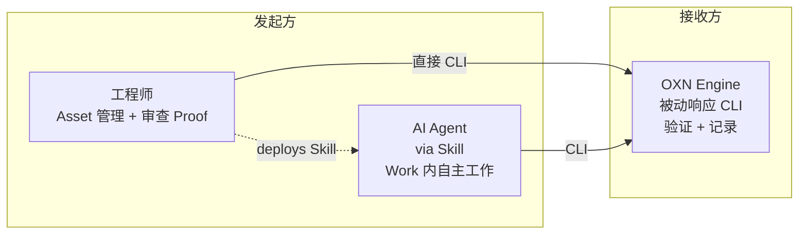
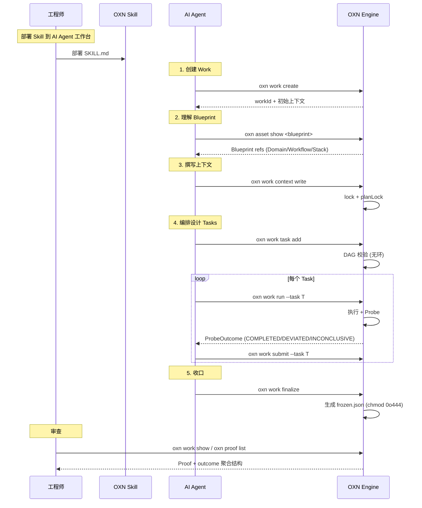

---
redirectFrom:
  - /zh-cn/index.html
title: 介绍
---

# 介绍

> OpenXenon 是工程师定义 AI Agent 协作边界的工具。

## 什么是 OpenXenon

OpenXenon（OXN）是一款面向 AI Agent 的人机协作工具。
它以 Skills 形式注入现有的 AI Agent 工作台(Cursor / OpenCode / Codex / Claude Code),通过**工程师定义 Asset（领域知识结构化）→ 作为 AI Agent 在 Work 约束的协作边界 → 由 Probe 检查产物**的闭环（D25/D27，RFC-0032），让工程师能信任 AI Agent 在边界内的执行。

OXN 不评判“工作是否合格”——判定权归工程师，OXN 只提供 Probe 工具能力（AI 经 CLI 检查产物，结果记 Work trace.jsonl + state.json），让工程师基于事实决策（D27，RFC-0032）。

## 为什么存在

工程师与 AI Agent 的协作天然存在不确定性：AI 基于注意力机制生成输出，同样的输入可能产生不同的输出，且 AI 无法自行证明自己做了什么。

这让工程师与 AI 的直接协作变成不确定性黑箱：AI 执行完成后，工程师不知道实际发生了什么、哪些在目标以内、哪些在目标以外。

OpenXenon 不试图限制 AI（沙箱思路），也不评判 AI 的工作是否合格。它**为 AI Agent 提供验证自身执行的能力**——AI Agent 通过 OXN 提交执行结果，OXN 通过 Probe 自动验证（完成 / 偏离 / 未完成），并记录为不可篡改的验证证据交给工程师审查。

## 三方协作模型

OpenXenon 由**三方**构成，CLI 能力完全对称（同一套 `oxn` 命令，工程师与 AI Agent 都能调用），角色差异在语义层而非能力层：

**三方关系**：

| 方 | 角色 | 典型动作 |
|---|---|---|
| **工程师** | Asset 管理者 + Proof 审查者 | `oxn asset create` / `oxn work create`（手动）/ `oxn work status` |
| **AI Agent** | 工作执行者（OXN 通过 Skill 让其获得 CLI 能力） | `oxn work create` / `oxn work context` / `oxn work run` / `oxn work submit` / `oxn work finalize` |
| **OXN Engine** | 被动接收方（响应 CLI 请求） | 验证 ProbeOutcome + 记录 frozen.json / trace.jsonl |

**关键点**：

1. **CLI 能力对称**：工程师与 AI Agent 都能通过 `oxn` CLI 调用所有命令——`create Work` 工程师可手动做，AI Agent 通过 Skill 也可做
2. **AI Agent 通过 Skill 发起**：工程师部署 OXN Skill 到 AI Agent 工作台 → AI Agent 获得调用 OXN CLI 的能力
3. **OXN 是被动方**：不主动验证、不主动通知——只响应 CLI 请求，工程师主动 `oxn work status` 才看到状态变化

## AI Agent 自主工作回路

AI Agent 获得 Skill 后，在 Work 内可自主工作（OXN 提供 CLI + 边界约束，全程验证记录）：

**回路核心 5 步**：

1. **create**：AI Agent 通过 Skill 创建 Work（也可工程师手动创建用于 onboarding / debug）
2. **read**：读 Blueprint → 理解 Domain（业务术语）/ Workflow（执行边界）/ Stack（实现约束）
3. **write**：撰写 Work Context + 编排 Tasks（Task DAG 无环校验）
4. **execute + 汇报 + react**：每个 Task 走 run → submit 回路，根据 ProbeOutcome 决定下一步（新 Task / 完成 / 调整）
5. **finalize**：所有 Task 完成 → 生成 frozen.json（不可篡改）

OXN 在**每一步**都记录 trace.jsonl + 提供 Probe 验证——AI Agent 的全部执行行为沉淀为可审查证据。

## 边界与证据的语义

- **边界（Asset）**：工程师为 AI 协作定义的环境约束。Asset 一旦创建，OXN 强校验其不被 Work 改写（planLock + content_hash）。AI Agent 在 Asset 边界内自主工作。
- **证据（Proof）**：AI Agent 通过 OXN 走的每一步都被 OXN 验证执行结果并记录为不可篡改的客观事实（frozen.json + trace.jsonl + state.json）。OXN 不评判合格——只提供 outcome 聚合结构（各状态 Probe 数量）让工程师自行判断。

> **软契约**：AI Agent 通过 OXN CLI 走的部分才有证据；不走 = 通道外，工程师自负。这是 OpenXenon 的诚实底线——OXN 不假装能追踪 AI Agent 在通道外的行为。

> **彻底不判**：OXN 验证 AI Agent 的执行结果（ProbeOutcome 三态：COMPLETED / DEVIATED / INCONCLUSIVE），不评判执行内容的好坏。判定权归工程师，基于 outcome 聚合结构（各状态 Probe 数量）自行判定。

## 下一步

- [快速开始](./quickstart) — 5 分钟跑通
- [协作生命周期](./concepts/lifecycle) — 9 阶段完整流程
- [术语表](./concepts/glossary.html) — 术语查询（RFC-0017 单一权威源）
- [IAP 范式与协作通道](./concepts/iap-paradigm) — 范式深入
- [架构总览](../../dev/zh-cn/architecture.html) — 引擎内部
