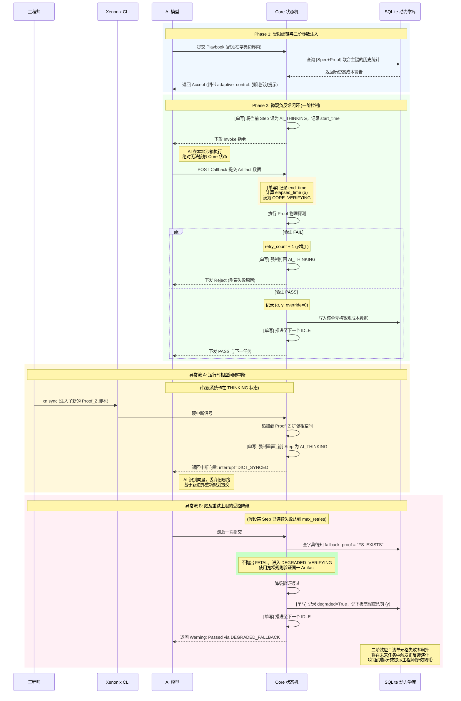

以下是基于《Xenonix 白皮书 v2.0》提炼的核心架构决策记录（ADR），以及完全契合该理论体系的架构设计与生命周期图。
---
# Xenonix 架构决策记录 (ADR)
## ADR-001: 状态存储与通信协议的物理剥离
* **背景**：传统异步 Agent 架构依赖共享文件系统（如共同读写一个 `manifest.json`）进行状态同步，存在严重的竞态条件风险和跨平台锁失效问题。
* **决策**：彻底摒弃文件轮询。采用**“SQLite 单写者 + JSON 线格式”**架构。Core 进程独占 SQLite 写锁，作为系统唯一真相来源；JSON 仅作为内存/网络中的通信载荷，不落盘作为共享状态。
* **后果**：彻底消除了状态失步的可能。AI 无法越权篡改系统状态，Core 的控制权在操作系统层面得到绝对物理保障。
## ADR-002: 相空间边界约束
* **背景**：LLM 的规划能力具有无限发散性，直接将其生成的 DAG 交由底层执行，必然导致不可控的“幻觉蔓延”。
* **决策**：引入**“证明字典”**机制。AI 不拥有无限制的规划权，其拆分的每一个 Step，必须能被 Core 当前已注册的 Proof Type 所度量（如 `AST_CHECK`, `EXEC_EXIT_ZERO`）。
* **后果**：将无限的 AI 概率空间，强制压缩到 Core 物理可观测的有限相空间内。从源头上杜绝了“无法验证的黑盒步骤”。
## ADR-003: 确定性物理度量衡替代黑盒指标
* **背景**：系统需要基于历史数据演化，但 Core 无法感知 AI 模型内部的 Token 消耗（云厂商黑盒），无法建立准确的成本函数。
* **决策**：抛弃 Token 统计，采用基于物理挂钟时间的确定性效用函数：$Total Cost = \alpha \times Elapsed\_Seconds + \beta \times Override\_Flag + \gamma \times Retry\_Count$。以 `[Spec 标签] + [Proof Type]` 为联合主键建立统计单元格。
* **后果**：系统的演化动力建立在绝对客观、Core 可独立测量的物理量之上，使得二阶反馈回路具备了严谨的数学基础。
## ADR-004: 运行时相空间扩张与受控降级
* **背景**：系统在执行中可能遇到字典缺失（需加新规则）或持续失败（直接熔断太粗暴）的非标状态。
* **决策**：
  1. **扩张**：工程师通过 `/xn-sync` 触发硬中断，Core 强制重置状态机，注入 `DICT_SYNCED` 向量强制 AI 基于新字典重规划。
  2. **降级**：字典中前置定义 `fallback_proof`。重试耗尽时，Core 自动切换宽松规则验证，带 `degraded=True` 标签放行，但记下极高的 $\gamma$ 成本以触发未来演化。
* **后果**：系统具备了“不死机”的工业容错能力，同时确保所有的“妥协”都被精确量化，用于未来的自我优化。
---
# 架构设计与生命周期图
## 1. 系统架构设计图 (物理边界与控制流)
此图展示了 Xenonix 各组件的物理部署关系，重点突出了“单写者原则”、“相空间边界”以及“二阶数据库”的拓扑位置。
```mermaid
graph TD
    subgraph "总师层 (系统相空间扩张源)"
        ENG((工程师))
        CLI[Xenonix CLI]
    end
    subgraph "控制层"
        subgraph Core_Engine["Xenonix Core 引擎 (绝对单写者)"]
            direction TB
            CTRL{状态机控制器<br>IDLE/THINKING/VERIFYING}
            DICT{{证明字典<br>Proof Dictionary<br>(相空间物理边界)}}
            PROBE[Proof 执行器<br>(物理探测器)]
        end
        SQLITE[(SQLite 状态机与动力学库<br>微观: 当前Step/State<br>宏观: 联合主键历史统计)]
    end
    subgraph "执行层"
        AI((AI 模型<br>受控效应器))
    end
    subgraph "审计层 (只读导出)"
        LOG[((Trace YML 文件案卷<br>供人类/外部系统阅读))]
    end
    %% === 交互流定义 ===
    
    %% 总师控制流
    ENG -->|"1. 注册新 Proof 脚本"| CLI
    CLI -->|"2. /xn-sync 硬中断"| DICT
    
    %% 相空间注入
    DICT -.->|"3. 下发边界约束"| AI
    %% 标准协议通信流 (无文件轮询)
    AI -->|"4. POST 提交 Playbook/Step 数据 (JSON线格式)"| CTRL
    CTRL -->|"5. 响应状态与自适应参数"| AI
    
    %% 内部状态转移与探测
    CTRL <-->|"6. 状态翻转与指令下发"| PROBE
    PROBE -->|"7. 物理探测 Artifact"| PROBE
    
    %% 底层数据沉淀
    CTRL <-->|"8. 唯一读写通道"| SQLITE
    
    %% 审计输出
    SQLITE -->|"9. 任务结束导出快照"| LOG
    %% 人工覆写穿透
    ENG -->|"10. /xn override 穿透指令"| CLI
    CLI -->|"11. 强制状态翻转"| CTRL
    %% 样式强化
    style SQLITE fill:#ffeaa7,stroke:#d35400,stroke-width:4px
    style DICT fill:#dfe6e9,stroke:#2980b9,stroke-width:3px,stroke-dasharray: 5 5
    style CTRL fill:#fab1a0,stroke:#d63031,stroke-width:3px
    
    classDef aiBorder fill:#ffffff,stroke:#636e72,stroke-width:2px
    class AI aiBorder
    
    classDef logBorder fill:#f5f5f5,stroke:#b2bec3,stroke-dasharray: 10 5
    class LOG logBorder
```
---
## 2. 确定性生命周期图 (含异常流与动力学采样)
此图详尽展示了在“单写者”约束下，一个 Step 从执行到统计的完整微观生命周期，包含了 `/xn-sync` 中断与 `Fallback` 降级两条关键异常路径。

