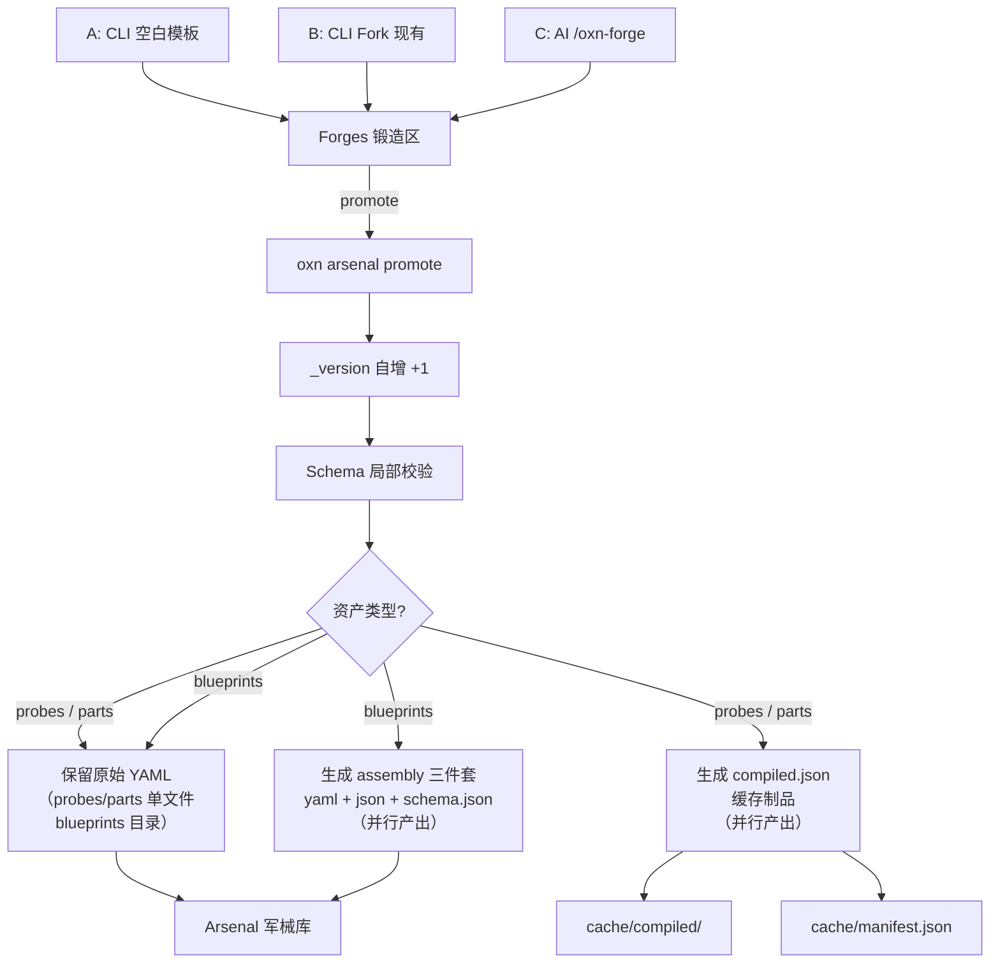
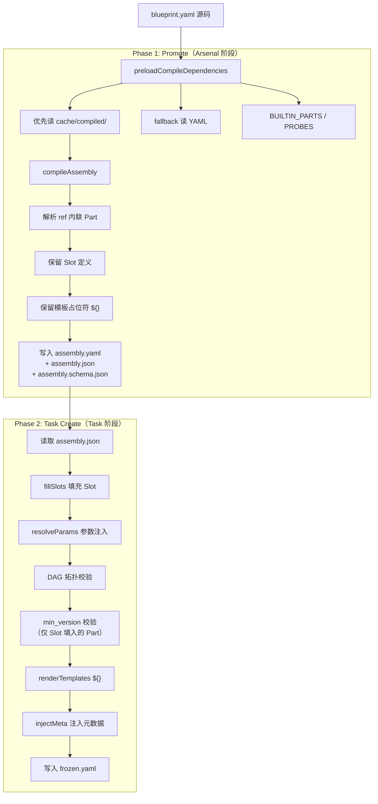
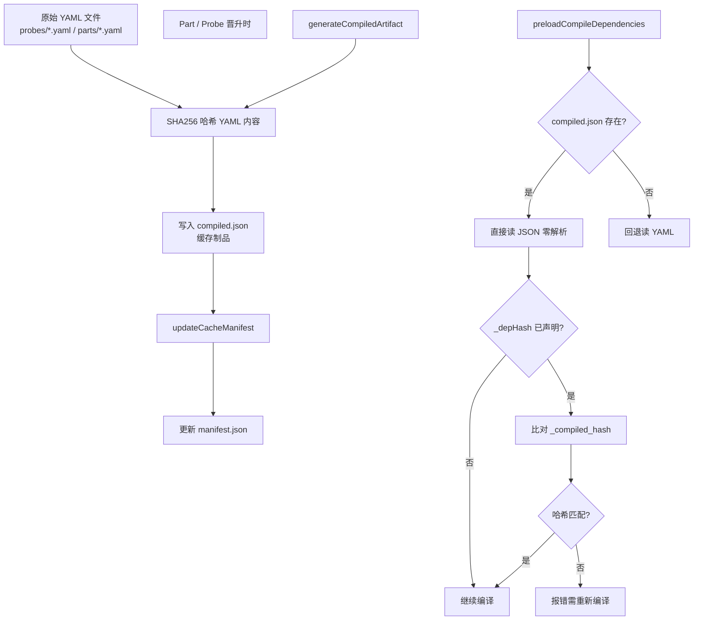

# Arsenal 资产机制

## 1. 概述

Arsenal（军械库）是 OpenXenon 的资产仓库，存储工程师定义的结构化验证标准。资产通过 **Forge（锻造）→ Promote（晋升）** 生命周期从草稿转为正式版，最终由 **Compiler（编译器）** 将其平铺为可执行的 Frozen 制品。

三层资产层级：

```text
L3 Blueprint（蓝图）─── 编排层，组装 Parts + 声明 Slots
L2 Part（零件）──────── 封装层，组合 Probes + 定义 props
L1 Probe（探针）─────── 原子层，纯验证执行器
```

---

## 2. Forge → Arsenal 流转机制

### 2.1 三种 Forge 方式

| 方式 | 路径 | 说明 |
|------|------|------|
| **A. CLI 空白模板** | 工程师通过 CLI 创建空白模板 YAML，手动填入信息后 promote | `oxn forge probe --save '<yaml>' --name my-check` |
| **B. CLI Fork 现有** | 从 Arsenal 中 Fork 已有资产为新 YAML，修改后 promote | `oxn arsenal fork part git-commit --name git-commit-jira` |
| **C. AI /oxn-forge** | 通过 AI 助手的 `/oxn-forge` Skill，由 AI 代替 A、B 完成 Forge | `/oxn-forge` |

### 2.2 流转图



> **compiled.json 说明**：不是产出 probes/parts 单文件（这些在 forge + promote 后已作为原始 YAML 存在），而是对原始 YAML 的**预编译缓存制品**——省去后续编译时的 YAML 解析 + Zod 校验开销。compiled.json 与原始 YAML 是并行产出关系，非二选一。

### 2.3 流转阶段说明

| 阶段 | 命令 | 作用 |
|------|------|------|
| **Forge** | `oxn forge --save` / `oxn arsenal fork` / `/oxn-forge` | 创建 Draft 草稿到 `forges/` 目录 |
| **Promote** | `oxn arsenal promote` | Draft → Canonical，`_version` 自增，生成编译制品 |
| **Fork** | `oxn arsenal fork` | 复制已有 Part 为新变体，`_forked_from` 标注来源与版本（如 `git-commit@2`） |
| **Extract** | `oxn arsenal extract` | 从已执行 Task 的 frozen.yaml 中提取历史版本 Part，`_extracted_from` 标注来源 Task |
| **List** | `oxn arsenal list` | 查看可用资产 |
| **Inspect** | `oxn arsenal inspect` | 查看单个资产内容 |

---

## 3. Blueprint / Part / Probe YAML 机制

```mermaid
flowchart LR
    PR1["Probe props: 参数名 + 类型"]
    PR2["Probe required 无默认值<br>optional 可有安全默认值"]
    PA1["Part props: 对外接收配置"]
    PA2["Part 含 default 可选填"]
    PA3["Part required 由上层传入"]
    PA4["Part 调用处用 params 传给 Probe"]
    BL1["Blueprint props: 对外接收参数"]
    BL2["Blueprint props.default 全局默认值"]
    BL3["parts[].params: 各 Part 显式注入"]
    BL4["Task 创建时填充模板占位符"]

    PR1 --> PR2
    PR2 --> PA1
    PA1 --> PA2 --> PA3
    PA3 --> PA4
    PA4 --> BL1
    BL1 --> BL2 --> BL3 --> BL4
```



### 三层 props/params 区分

| 层 | 文件 | props（对外声明） | params（对内注入） |
|----|------|-------------------|-------------------|
| **Probe** | `probes/<name>.yaml` | 参数名、类型；required 禁止默认值，optional 可有安全默认值（等同 schema，纯类型声明） | 不存在——Part 调用时通过 `probes[].params` 显式传入 |
| **Part** | `parts/<name>.yaml` | properties、required、default | 不存在于 Part 文件——由 Blueprint 的 `parts[].params` 调用处注入 |
| **Blueprint** | `blueprints/<name>/blueprint.yaml` | 参数名、default、required（顶级字段，对外声明） | 仅存在于 `parts[].params` 内部，不存在 Blueprint 顶级 `params` |

### Blueprint 中 params 的位置

Params 不是 Blueprint 的顶级字段，而是嵌套在 `parts[]` 中每个 Part 引用上：

```yaml
# blueprint.yaml
props:                        # ← 顶级字段，对外声明 + 全局默认值
  feature_name:
    required: true            # Task 必须通过 --param 提供
  debug:                      # 全局默认值在 props 中声明
    default: false
parts:
  - id: commit
    ref: git-commit
    params:                   # ← params 在 parts[] 内部，该 Part 的显式注入值
      feature_ref: "${feature_name}"
      debug_mode: "${debug}"  # 需要就显式映射，不需要就不写
```

### 参数覆盖优先级

```text
Task --param > parts[].params（局部显式注入） > Part props default（零件默认值）
```

> 不存在 Blueprint 顶级 params。所有对内注入必须通过 `parts[].params` 显式映射。全局默认值通过 `props.default` 声明，再由 `parts[].params` 显式引用。

---

## 4. 编译流程

编译分为两个阶段，frozen 基于 assembly 编译而非源码：

### 4.1 两阶段编译流



> **关键设计**：Frozen 从 assembly.json 编译，不再重新解析 YAML 或内联 Part。Phase 2 不需要 `preloadCompileDependencies`。
>
> **Phase 2 校验清单**：fillSlots（required Slot 已填）→ resolveParams（required props 有值）→ DAG（无循环）→ min_version（仅校验 Slot 填入的 Part，已内联的 Part 不校验）→ renderTemplates（所有 `${}` 已替换）。
>
> **`_depHash` 仅在 Phase 1 校验**，Phase 2 不校验。assembly.json 是自包含契约——内联的 Part 数据就是真相源，不关心本地 Arsenal 中的 Part 是否更新。如果用户想用新版 Part，应回到 Phase 1 重新 Promote。

### 4.2 编译产物对照

| 产物 | 位置 | 说明 |
|------|------|------|
| `blueprint.yaml` | Blueprint 目录 | 设计稿：ref 引用 Part + Slot 占位 + `${}` 模板 |
| `blueprint.assembly.yaml` | Blueprint 目录 | 预制品 YAML：内联 Part/Probe，保留 Slot+模板。**本地查阅视图**（供工程师 Git diff 与调试审查） |
| `blueprint.assembly.json` | Blueprint 目录 | 预制品 JSON：assembly 的 JSON 等价。**分享与执行契约**（供跨环境传输、校验与 Frozen 编译） |
| `blueprint.assembly.schema.json` | Blueprint 目录 | 预制品的 Zod Schema 导出，供第三方校验和 IDE 集成 |
| `blueprint.frozen.yaml` | Task 目录 | 成品：全内联 + Slot 已解析 + `${}` 已渲染 + `_xenon_meta`，唯一真相源 |

---

## 5. 编译缓存机制

> compiled.json 是对已存在的原始 YAML 文件（probes/*.yaml、parts/*.yaml）的预编译缓存，不是产出原始文件本身。`cache/` 目录可随时删除，promote 会重建。

### 5.1 缓存生成与消费



### 5.2 缓存收益

| 对比 | 每次 YAML 解析 | compiled.json 缓存 |
|------|---------------|-------------------|
| L1 YAML 解析 | 每次 L3 编译都做 | **0 次** |
| L1 Zod 校验 | 每次 L3 编译都做 | **0 次**（已在 promote 时验证） |
| L2 被 N 个 L3 引用 | Zod N 次 | Zod **0 次** |

### 5.3 _depHash 计算范围

```text
_depHash = SHA256( 所有依赖的 Part/Probe 的 compiled.json 内容拼接 )
```

当任意依赖的 Part/Probe 升级（`_version` 变化，hash 不匹配），强制重新编译 Assembly。

### 5.4 Frozen 缓存说明

`cache/compile/` 存储 L3 的 frozen 缓存。当同一 Blueprint + 同一组 params 复用同一 Task 时可直接使用，避免重复编译。Task 目录下的 `blueprint.frozen.yaml` 是最终产物，cache 中的 frozen 是编译中间缓存，两者共存但用途不同。

---

## 6. 新概念术语表

| 术语 | 位置 | 含义 |
|------|------|------|
| `_version` | Part / Blueprint 顶级字段 | 整数递增版本号，promote 时自增，用于 `min_version` 校验 |
| `min_version` | Part 调用（`parts[].min_version`） | Blueprint 声明该 Part 的最低版本要求，编译时 `_version < min_version` 则报错 |
| `_forked_from` | Part 定义 | 标注 Fork 来源与版本（如 `git-commit@2`），纯标注字段 |
| `_extracted_from` | Part 定义（Extract 产出） | 标注提取来源 Task ID（如 `task-001`），纯标注字段 |
| `_depHash` | Part 调用（Phase 1 Promote 时写入 assembly） | Blueprint 锁定依赖的具体 compiled 版本。仅在 Phase 1 校验：编译 Assembly 时比对 `_compiled_hash`，不匹配则报错要求重新编译。Phase 2 不校验（assembly.json 自包含） |
| `_compiled_hash` | compiled.json 顶级字段 | promote 时对原始 YAML 内容计算的 SHA256 截断值（12 位），`_depHash` 校验的比对源 |
| `injectMeta` | Frozen 编译（编译器函数，Phase 2） | 在 Frozen 编译的最后阶段，为每个 Part 和 Probe 注入 `_xenon_meta`（含来源 ref、frozen_at 时间戳、content_hash），用于运行时追溯和完整性校验 |

---

## 7. 目录结构总览

```text
.openxenon/
├── arsenals/                              # 正式资产库
│   ├── probes/                            # L1 Probe 定义（单文件）
│   │   ├── fs-exists.yaml
│   │   ├── fs-match.yaml
│   │   └── shell-exec.yaml
│   ├── parts/                             # L2 Part 定义（单文件）
│   │   ├── git-commit.yaml
│   │   ├── create-branch.yaml
│   │   └── develop-feature.yaml
│   └── blueprints/                        # L3 Blueprint 目录
│       └── feature-pipeline/
│           ├── blueprint.yaml             # 设计稿（含 ref/slot）
│           ├── blueprint.assembly.yaml    # 预制品 YAML（本地查阅）
│           ├── blueprint.assembly.json    # 预制品 JSON（分享契约）
│           ├── blueprint.assembly.schema.json  # 预制品 Schema
│           └── README.md
│
├── forges/                                # Forge 锻造区
│   ├── probes/                            # 草稿 Probe
│   ├── parts/                             # 草稿 Part
│   └── blueprints/                        # 草稿 Blueprint
│       └── my-blueprint/
│           ├── blueprint.yaml
│           ├── parts/                     # import unpack 产出（分享包解包后的 Part）
│           └── probes/                    # import unpack 产出（分享包解包后的 Probe）
│
├── cache/                                 # 编译缓存（可随时删除，promote 会重建）
│   ├── compiled/                          # L1/L2 预编译 JSON
│   │   ├── probes/<hash>.compiled.json
│   │   └── parts/<hash>.compiled.json
│   ├── compile/                           # L3 frozen 编译中间缓存
│   │   └── <l3-hash>.frozen.yaml
│   └── manifest.json                      # 全局缓存清单
│
└── tasks/                                 # Task 执行记录
    └── task-001/
        ├── blueprint.yaml                 # 复制的设计稿（填充 Slot）
        ├── blueprint.frozen.yaml          # 成品（全内联，执行真相源）
        ├── state.json
        └── task-trace.yaml
```

---

## 8. 新增功能影响总结

| 功能 | 影响 | 实施轮 |
|------|------|--------|
| **props/params 统一命名** | 消除 `params_schema`/`parameters` 歧义，三层语义一致 | 1 |
| **Probe required 禁止默认值** | 验证目标参数（command/pattern/path）必须由 Part 显式传入，optional 可有安全默认值（timeout/shell/workdir） | 1 |
| **Blueprint props 字段** | Blueprint 可声明对外参数（含 default），对内通过 `parts[].params` 显式注入 | 1 |
| **删除 Blueprint 顶级 params** | 所有对内注入必须通过 `parts[].params` 显式映射，防止隐式魔法穿透 | 1 |
| **模板渲染 `${}` 语法** | 覆盖 action 指令 + probe params | 1 |
| **resolveParams** | Part 默认值自动填充 + 必填校验 | 1 |
| **compiled.json** | L1/L2 预编译为 JSON，省去 YAML 解析 + Zod 校验 | 2 |
| **_depHash 校验（仅 Phase 1）** | Promote 时防止缓存漂移；Phase 2 不校验，保护 assembly.json 的独立可执行性 | 2 |
| **assembly 三件套** | yaml（本地查阅）+ json（分享契约）+ schema.json（跨语言校验） | 2 |
| **Phase 2 从 assembly.json 编译** | Frozen 编译不再需要 preloadCompileDependencies，仅做 Slot 填充 + 模板渲染 + DAG 校验 | 2 |
| **manifest.json** | 全局缓存索引，追踪所有 compiled 制品的 hash | 2 |
